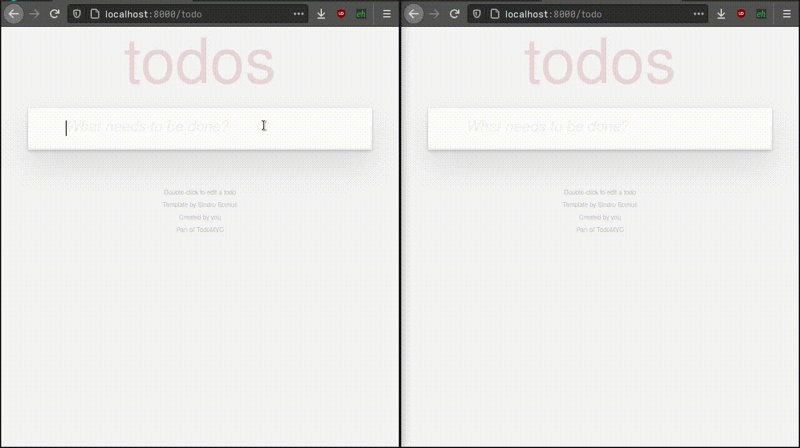

# Wireview - Django를 위한 Phoenix LiveView

Wireview는 Django Channels를 사용하여 실시간 서버 렌더링 인터랙티브 UI를 구축할 수 있게 해주는 라이브러리입니다. Phoenix Framework의 LiveView와 유사합니다.



## 무엇이 포함되어 있나요?

VueJS나 ReactJS를 대체하는 것은 아니지만, Django의 모든 잠재력을 활용하여 인터랙티브한 프론트엔드를 만들 수 있습니다. 모든 것이 서버 사이드에서 렌더링되므로, 첫 번째 요청에서 의미 있는 정보가 포함된 인터페이스가 제공됩니다. Django 템플릿과 ORM의 모든 기능을 컴포넌트에서 직접 사용하고, 이벤트 구독을 통해 실시간으로 인터페이스를 업데이트할 수 있습니다.

**주요 기능:**
- 실시간 업데이트가 가능한 서버 사이드 렌더링 컴포넌트
- 자동 검증이 포함된 Pydantic 기반 상태 관리
- Django Channels를 통한 WebSocket 통신
- 효율적인 대역폭 사용을 위한 HTML diff
- 자동 UI 업데이트를 위한 모델 구독
- 대규모 리스트를 효율적으로 처리하는 Streams API
- 온라인 사용자 및 타이핑 표시를 위한 Presence 추적
- 진행률 추적이 가능한 파일 업로드

## django-reactor 대비 개선 사항

Wireview는 [django-reactor](https://github.com/edelvalle/reactor)의 현대적인 진화 버전으로, 다음과 같은 중요한 개선 사항이 있습니다:

### 새로운 기능

| 기능 | reactor | wireview | 설명 |
|------|---------|----------|------|
| **Streams API** | - | ✅ | `stream()`, `stream_insert()`, `stream_delete()`로 메모리 효율적인 대규모 리스트 처리 |
| **Presence API** | - | ✅ | `PresenceMixin`, `PresenceTrackerMixin`으로 실시간 사용자 추적 및 타이핑 표시 |
| **파일 업로드** | - | ✅ | 진행률 추적, 매직 바이트 검증이 포함된 청크 업로드 |
| **AsyncResult** | - | ✅ | 비동기 작업을 위한 로딩/성공/에러 상태 관리 |
| **JS 명령어** | - | ✅ | `JS()` 빌더로 Phoenix LiveView.JS 스타일의 클라이언트 사이드 명령어 |
| **테스트 유틸리티** | - | ✅ | WebSocket 없이 쉽게 컴포넌트 테스트를 위한 `mount()` 유틸리티 |
| **디버그 도구** | - | ✅ | `wireview.debug`로 브라우저 콘솔 디버깅 |

### 아키텍처 개선

| 항목 | reactor | wireview |
|------|---------|----------|
| **Pydantic** | v1 (레거시) | v2 (최신) |
| **DOM Morphing** | morphdom | idiomorph (더 나은 속성 보존) |
| **Python** | ≥3.9 | ≥3.10 |
| **Django** | 3.2+ | 4.2, 5.0, 5.1, 6.0 |
| **모듈 구조** | 플랫 | 체계적 (`core/`, `features/`) |

### 새로운 컴포넌트 메서드

```python
# 라이프사이클
async def leaving(self):
    """컴포넌트 연결 해제 시 호출 - 정리 훅"""

# UI 제어
await self.scroll_into_view(element_id, behavior="smooth")
await self.push_js(JS().set_value("input", ""))

# Streams
await self.stream("items", items)
await self.stream_insert("items", item, at=0)
await self.stream_delete("items", item_id)

# Presence
await self.presence_join()
await self.presence_set_typing(True)

# 비동기 로딩
self.data = await self.assign_async(fetch_data())
```

### reactor에서 마이그레이션

대부분의 reactor 컴포넌트는 최소한의 변경으로 작동합니다:

```python
# reactor
from reactor.component import Component

class XCounter(Component):
    _subscriptions = {"counter"}

# wireview (동일한 API)
from wireview.component import Component

class XCounter(Component):
    _subscriptions = {"counter"}
```

주요 차이점:
- 패키지 이름: `reactor` → `wireview`
- 설정 접두사: `REACTOR_*` → `WIREVIEW` dict
- 템플릿 태그: `` → ``

## 목차

- [django-reactor 대비 개선 사항](#django-reactor-대비-개선-사항)
- [설치 및 설정](#설치-및-설정)
- [빠른 시작](#빠른-시작)
- [컴포넌트 라이프사이클](#컴포넌트-라이프사이클)
- [이벤트 바인딩](#이벤트-바인딩)
- [URL 상태 관리](#url-상태-관리)
- [모델 구독](#모델-구독)
- [Streams API](#streams-api)
- [Presence API](#presence-api)
- [파일 업로드](#파일-업로드)
- [AsyncResult](#asyncresult와-비동기-작업)
- [JS 명령어 빌더](#js-명령어-빌더)
- [컴포넌트 API 레퍼런스](#컴포넌트-api-레퍼런스)
- [템플릿 태그 레퍼런스](#템플릿-태그-레퍼런스)
- [JavaScript API](#프론트엔드-api)
- [테스트](#컴포넌트-테스트)
- [디버그 도구](#디버그-도구)
- [설정](#설정)

## 설치 및 설정

Wireview는 Python ≥3.10과 Django ≥4.2가 필요합니다 (Django 4.2, 5.0, 5.1, 6.0 지원).

```bash
pip install django-wireview
```

Wireview는 `django-channels`를 사용합니다. 기본적으로 Channels는 실제 브로드캐스팅을 지원하지 않는 InMemory 채널 레이어를 사용합니다. 프로덕션 환경에서는 Redis를 사용하세요: [Channel Layers](https://channels.readthedocs.io/en/latest/topics/channel_layers.html)

Django 애플리케이션보다 먼저 `wireview`와 `channels`를 `INSTALLED_APPS`에 추가하세요:

```python
INSTALLED_APPS = [
    'wireview',
    'channels',
    ...
]

ASGI_APPLICATION = 'project_name.asgi.application'
```

`project_name/asgi.py`를 수정하세요:

```python
import os
os.environ.setdefault('DJANGO_SETTINGS_MODULE', 'project_name.settings')

import django
django.setup()

from channels.auth import AuthMiddlewareStack
from channels.routing import ProtocolTypeRouter, URLRouter
from django.core.asgi import get_asgi_application
from wireview.urls import websocket_urlpatterns

application = ProtocolTypeRouter({
    'http': get_asgi_application(),
    'websocket': AuthMiddlewareStack(URLRouter(websocket_urlpatterns))
})
```

템플릿에 wireview JavaScript를 포함하세요:

```html

<!doctype html>
<html>
    <head>
        
    </head>
    ...
</html>
```

## 빠른 시작

`x-counter.html` 템플릿을 생성하세요:

```html

<div >
  {{ amount }}
  <button >+</button>
  <button >-</button>
  <button >reset</button>
</div>
```

`live.py`에 컴포넌트를 생성하세요:

```python
from wireview.component import Component


class XCounter(Component):
    _template_name = 'x-counter.html'

    amount: int = 0

    async def inc(self):
        self.amount += 1

    async def dec(self):
        self.amount -= 1

    async def set_to(self, amount: int):
        self.amount = amount
```

뷰 템플릿에서 컴포넌트를 렌더링하세요:

```html

<!doctype html>
<html>
    <head>
        
    </head>
    <body>
        
        
    </body>
</html>
```

## 컴포넌트 라이프사이클

### 초기화 및 렌더링

컴포넌트는 템플릿에 포함될 때 초기화됩니다:

```html

```

파라미터는 컴포넌트 인스턴스를 반환하는 `Component.new()`에 전달됩니다.

### 조인 (Joins)

컴포넌트가 프론트엔드에 도달하면 WebSocket을 통해 백엔드에 "조인"합니다. 직렬화된 상태가 백엔드로 전송되고, 백엔드는 컴포넌트를 재구성하고 `Component.joined()`를 호출합니다.

```python
class ChatRoom(Component):
    async def joined(self):
        # 컴포넌트가 WebSocket으로 연결될 때 호출됨
        await self.broadcast(f"room.{self.room_id}", action="joined", user=self.username)
```

### 퇴장 (Leaving)

컴포넌트가 파괴되거나 WebSocket 연결이 닫히면 `Component.leaving()`이 호출됩니다. 정리 작업에 사용하세요:

```python
class ChatRoom(Component):
    async def leaving(self):
        # 컴포넌트 연결이 해제될 때 호출됨
        await self.broadcast(f"room.{self.room_id}", action="left", user=self.username)
```

### 사용자 이벤트

조인 후 컴포넌트는 `` 템플릿 태그를 통해 사용자 이벤트를 받을 수 있습니다. 이벤트는 백엔드로 전송되고, 핸들러가 실행되며, 컴포넌트가 다시 렌더링됩니다.

### 모델 구독

컴포넌트는 모델 변경을 구독할 수 있습니다. 변경이 발생하면 `Component.mutation()`이 호출됩니다:

```python
class TodoList(Component):
    _subscriptions = {"todo-item"}  # todo 아이템 변경 구독

    async def mutation(self, channel: str, action: ModelAction, instance):
        # 구독한 모델이 변경될 때 호출됨
        self.items = await self.load_items()
```

### 알림

임의의 메시지에는 `broadcast()`와 `notification()`을 사용하세요:

```python
# 발신자
await self.broadcast("chat.room.1", message="Hello!", sender=self.username)

# 수신자 ("chat.room.1" 구독 중)
async def notification(self, channel: str, **kwargs):
    message = kwargs.get("message")
    sender = kwargs.get("sender")
```

## 이벤트 바인딩

### 기본 문법

```html

```

예제:

```html
<button >+1</button>
<button >+5</button>
<button >제출</button>
<input >
<input >
```

### 사용 가능한 수정자

| 수정자 | 설명 |
|--------|------|
| `prevent` | `event.preventDefault()` 호출 |
| `stop` | `event.stopPropagation()` 호출 |
| `ctrl`, `alt`, `shift`, `meta` | 수정 키 필요 |
| `debounce.<ms>` | 이벤트 디바운스 (예: `debounce.300`) |
| `throttle.<ms>` | 이벤트 쓰로틀 (예: `throttle.100`) |
| `enter`, `tab`, `delete`, `backspace`, `space` | 키 별칭 |
| `up`, `down`, `left`, `right` | 화살표 키 별칭 |
| `key.<keycode>` | 특정 키 (예: `key.escape`) |
| `inlinejs` | 핸들러를 리터럴 JavaScript로 처리 |

### 암시적 인자

컴포넌트 내의 폼 입력은 자동으로 인자로 전송됩니다:

```html
<div >
  <input name="query">
  <button >검색</button>
</div>
```

```python
async def search(self, query: str):
    self.results = await self.do_search(query)
```

## URL 상태 관리

URL 쿼리 문자열에 컴포넌트 상태를 저장하세요:

```python
class SearchList(Component):
    query: str = ""

    @classmethod
    def new(cls, wire, **kwargs):
        kwargs.setdefault("query", wire.params.get("query", ""))
        return cls(wire=wire, **kwargs)

    async def filter_results(self, query: str):
        self.query = query
        self.wire.params["query"] = query  # URL 업데이트
```

복잡한 값에는 `.json` 접미사를 사용하세요:

```python
class TreeView(Component):
    @classmethod
    def new(cls, wire, id: str, **kwargs):
        kwargs["expanded"] = id in wire.params.get("expanded.json", [])
        return cls(wire=wire, id=id, **kwargs)

    async def toggle_expanded(self):
        self.expanded = not self.expanded
        expanded = self.wire.params.setdefault("expanded.json", [])
        if self.expanded:
            expanded.append(self.id)
        elif self.id in expanded:
            expanded.remove(self.id)
```

## 모델 구독

자동 UI 업데이트를 위해 Django 모델 변경을 구독하세요:

```python
class TodoList(Component):
    _subscriptions = {"todo-item"}

    async def mutation(self, channel: str, action: ModelAction, instance):
        if action == ModelAction.CREATED:
            self.items.append(instance)
        elif action == ModelAction.DELETED:
            self.items = [i for i in self.items if i.id != instance.id]
```

설정에서 자동 브로드캐스트를 활성화하세요:

```python
WIREVIEW = {
    "AUTO_BROADCAST": AutoBroadcast(
        model=True,      # 모델 변경 시 브로드캐스트
        model_pk=True,   # 채널 이름에 PK 포함
    ),
}
```

## Streams API

Streams는 아이템을 개별적으로 렌더링하고 증분 업데이트를 전송하여 대규모 리스트를 메모리 효율적으로 처리합니다.

### 기본 사용법

스트림 컨테이너가 있는 템플릿:

```html

<div >
  <ul wire-stream="messages">
    
      
    
  </ul>
</div>
```

아이템 템플릿 (`chat/message_item.html`):

```html
<li id="messages-{{ message.pk }}">
  <strong>{{ message.sender }}:</strong> {{ message.text }}
</li>
```

컴포넌트:

```python
class MessageList(Component):
    _template_name = "chat/message_list.html"
    messages: list = []

    async def joined(self):
        # 스트림으로 초기 로드
        messages = await Message.objects.order_by('-created')[:50]
        await self.stream("messages", reversed(messages))

    async def add_message(self, text: str):
        message = await Message.objects.acreate(sender=self.user, text=text)
        await self.stream_insert("messages", message, at=-1)  # 끝에 추가
        await self.scroll_into_view(f"messages-{message.pk}")

    async def delete_message(self, message_id: int):
        await Message.objects.filter(id=message_id).adelete()
        await self.stream_delete("messages", message_id)
```

### Stream 메서드

| 메서드 | 설명 |
|--------|------|
| `stream(name, items)` | 스트림 초기화/리셋 |
| `stream_insert(name, item, at=-1)` | 아이템 삽입 (-1=끝, 0=처음, n=인덱스) |
| `stream_delete(name, dom_id)` | DOM ID 또는 PK로 아이템 삭제 |

### DOM ID 규칙

기본적으로 DOM ID는 `{stream_name}-{item.pk}` 패턴을 따릅니다. 커스텀 ID 함수:

```python
await self.stream("items", items, dom_id=lambda item: f"item-{item.uuid}")
```

### 커스텀 아이템 템플릿

```python
await self.stream_insert("messages", message, template="chat/special_message.html")
```

## Presence API

온라인 사용자와 타이핑 표시를 실시간으로 추적합니다.

### PresenceMixin (프로듀서)

자신의 프레즌스를 브로드캐스트하는 컴포넌트용:

```python
from wireview.component import Component
from wireview.features.presence import PresenceMixin


class ChatInput(PresenceMixin, Component):
    _template_name = "chat/input.html"
    room_id: int
    username: str

    def _presence_topic(self) -> str:
        return f"room.{self.room_id}"

    def _presence_user_id(self) -> str:
        return str(self.user_id)

    def _presence_username(self) -> str:
        return self.username

    async def joined(self):
        await self.presence_join()

    async def leaving(self):
        await self.presence_leave()

    async def on_typing(self):
        await self.presence_set_typing(True)  # 3초 후 자동 해제
```

### PresenceTrackerMixin (컨슈머)

다른 사용자의 프레즌스를 표시하는 컴포넌트용:

```python
from wireview.features.presence import PresenceTrackerMixin


class OnlineUsers(PresenceTrackerMixin, Component):
    _template_name = "chat/online_users.html"
    room_id: int
    username: str

    def _presence_topic(self) -> str:
        return f"room.{self.room_id}"

    def _presence_my_user_id(self) -> str:
        return str(self.user_id)

    @property
    def _subscriptions(self):
        return {self._presence_channel()}

    async def joined(self):
        await self.presence_track_self(username=self.username)
```

템플릿:

```html

<div >
  <h3>온라인 ({{ this.presence_online_count }})</h3>
  <ul>
    
      <li>
        {{ user.username }}
        <span class="typing">입력 중...</span>
      </li>
    
  </ul>
</div>
```

### Presence 속성

| 속성 | 설명 |
|------|------|
| `presence_users` | 모든 추적된 사용자 목록 |
| `presence_online_count` | 온라인 사용자 수 |
| `presence_typing_users` | 현재 타이핑 중인 사용자 목록 |

### 설정

```python
from wireview.features.presence import PresenceConfig

class MyComponent(PresenceMixin, Component):
    _presence_config = PresenceConfig(
        typing_timeout=3.0,     # 타이핑 자동 해제까지 초
        sync_on_join=True,      # 조인 시 다른 사용자에게 동기화 요청
        channel_prefix="presence",
    )
```

## 파일 업로드

진행률 추적과 검증이 포함된 파일 업로드를 처리합니다.

### 기본 설정

```python
from wireview.component import Component
from wireview.features.uploads import UploadConfig


class FileUploader(Component):
    _template_name = "uploader.html"

    async def joined(self):
        self.allow_upload(UploadConfig(
            name="avatar",
            accept=[".jpg", ".png", ".gif"],
            max_file_size=5 * 1024 * 1024,  # 5MB
            max_entries=1,
        ))

    async def save_avatar(self):
        for upload in self.consume_uploads("avatar"):
            path = await upload.save_to("avatars/", filename=f"{self.user_id}.jpg")
            self.avatar_url = path
```

템플릿:

```html

<div >
  <input type="file" wire-upload="avatar" accept=".jpg,.png,.gif">

  
    <div class="upload-entry">
      {{ entry.client_name }} - {{ entry.progress }}%
      
        <span class="error">{{ entry.errors|join:", " }}</span>
      
    </div>
  

  <button >저장</button>
</div>
```

### UploadConfig 옵션

| 옵션 | 기본값 | 설명 |
|------|--------|------|
| `name` | 필수 | 업로드 필드 식별자 |
| `accept` | `[]` | 허용된 확장자 (예: `[".jpg", ".png"]`) |
| `max_entries` | `1` | 최대 동시 업로드 수 |
| `max_file_size` | `10MB` | 최대 파일 크기 (바이트) |
| `chunk_size` | `64KB` | 업로드 청크 크기 |
| `auto_upload` | `True` | 선택 시 즉시 업로드 시작 |

### ConsumedUpload 메서드

| 메서드 | 설명 |
|--------|------|
| `read()` | 전체 파일을 메모리로 읽기 |
| `open(mode="rb")` | 파일 핸들 열기 |
| `save_to(directory, filename=None)` | Django 스토리지에 저장 |
| `name` | 원본 파일명 |
| `size` | 파일 크기 (바이트) |
| `content_type` | MIME 타입 |

### 보안

Wireview는 확장자 위조를 방지하기 위해 저장 전에 파일 시그니처(매직 바이트)를 검증합니다.

## AsyncResult와 비동기 작업

로딩/에러 상태와 함께 비동기 데이터 로딩을 처리합니다:

```python
from wireview import Component, AsyncResult


class Dashboard(Component):
    _template_name = "dashboard.html"
    stats: AsyncResult = None

    async def joined(self):
        self.stats = await self.assign_async(self.load_stats())

    async def load_stats(self):
        return await Stats.objects.aget()
```

템플릿:

```html

  <div class="spinner">로딩 중...</div>

  <div>총계: {{ stats.result.total }}</div>

  <div class="error">{{ stats.error_message }}</div>

```

### AsyncResult 속성

| 속성 | 설명 |
|------|------|
| `loading` | 작업 진행 중이면 True |
| `ok` | 작업 성공이면 True |
| `failed` | 작업 실패면 True |
| `done` | 완료되면 True (성공 또는 실패) |
| `result` | 결과 값 (성공 시) |
| `error` | 예외 (실패 시) |
| `error_message` | 에러의 문자열 표현 |

### AsyncResult 메서드

| 메서드 | 설명 |
|--------|------|
| `map(func)` | 결과 값 변환 |
| `get_or(default)` | 결과 또는 기본값 가져오기 |
| `get_or_raise()` | 결과 가져오기 또는 에러 발생 |

## JS 명령어 빌더

서버 왕복 없이 실행되는 클라이언트 사이드 명령어를 빌드합니다:

```python
from wireview import JS

# 템플릿에서
<button >모달 토글</button>

# 명령어 체이닝
<button >
  저장
</button>

# 트랜지션과 함께
<div ></div>
```

### 서버에서 JS 푸시

이벤트 핸들러에서 JS 명령어 전송:

```python
async def clear_input(self):
    await self.push_js(JS().set_value("input[name=search]", ""))
```

### 사용 가능한 명령어

**표시:**
- `show(selector, transition=None, display=None)`
- `hide(selector, transition=None)`
- `toggle(selector, show=None, hide=None)`

**CSS 클래스:**
- `add_class(selector, classes, transition=None)`
- `remove_class(selector, classes, transition=None)`
- `toggle_class(selector, classes, transition=None)`

**속성:**
- `set_attr(selector, attr, value)`
- `remove_attr(selector, attr)`
- `set_value(selector, value)` - 입력 값 설정

**포커스:**
- `focus(selector)`
- `focus_first(selector, input_only=False)`

**트랜지션:**
- `transition(selector, classes, time=None)`

**서버 통신:**
- `push(event, value=None, target=None)` - 서버로 이벤트 전송

**네비게이션:**
- `navigate(url, replace=False)`
- `dispatch(event, to=None, detail=None, bubbles=True)`

### 로딩 클래스

서버 요청 중 다음 클래스가 자동으로 추가됩니다:

| 클래스 | 설명 |
|--------|------|
| `wireview-loading` | 모든 요청 중에 추가 |
| `wireview-click-loading` | 클릭 이벤트에 추가 |
| `wireview-submit-loading` | 제출 이벤트에 추가 |

```css
.wireview-loading {
  opacity: 0.5;
  pointer-events: none;
}
```

## 컴포넌트 API 레퍼런스

### 클래스 속성

| 속성 | 기본값 | 설명 |
|------|--------|------|
| `_template_name` | 필수 | 템플릿 경로 |
| `_exclude_fields` | `{"user", "wire"}` | 직렬화에서 제외할 필드 |
| `_subscriptions` | `set()` | 구독할 채널 |

### 라이프사이클 메서드

| 메서드 | 설명 |
|--------|------|
| `new(cls, wire, **kwargs)` | 인스턴스 생성 클래스 메서드 |
| `joined()` | 컴포넌트가 WebSocket으로 연결될 때 호출 |
| `leaving()` | 컴포넌트 연결이 해제될 때 호출 |
| `mutation(channel, action, instance)` | 모델 변경 시 호출 |
| `notification(channel, **kwargs)` | 브로드캐스트 메시지 시 호출 |

### 렌더 제어

| 메서드 | 설명 |
|--------|------|
| `skip_render()` | 다음 렌더 사이클 건너뛰기 |
| `send_render()` | 즉시 렌더 강제 |
| `force_render()` | 다시 렌더링 표시 |
| `freeze()` | 모든 향후 렌더 방지 |

### 액션

| 메서드 | 설명 |
|--------|------|
| `destroy()` | 인터페이스에서 컴포넌트 제거 |
| `focus_on(selector)` | 요소에 포커스 |
| `scroll_into_view(element_id, behavior="auto", block="start", inline="nearest")` | 요소를 뷰로 스크롤 |
| `push_js(js)` | 클라이언트에서 JS 명령어 실행 |
| `dom(action, id, component_or_template, **kwargs)` | DOM 조작 |
| `deffer(func, *args, **kwargs)` | 함수 실행 지연 |

### 브로드캐스팅

| 메서드 | 설명 |
|--------|------|
| `broadcast(channel, **kwargs)` | 채널로 메시지 전송 (`joined()`에서 큐잉) |
| `abroadcast(channel, **kwargs)` | 즉시 메시지 전송 (비동기) |

### 네비게이션

| 메서드 | 설명 |
|--------|------|
| `wire.redirect_to(url, **kwargs)` | 네비게이트하고 새 페이지 가져오기 |
| `wire.replace_to(url, **kwargs)` | 현재 URL 교체 |
| `wire.push_to(url, **kwargs)` | 가져오기 없이 URL 푸시 |

### Streams

| 메서드 | 설명 |
|--------|------|
| `stream(name, items, template=None, dom_id=None)` | 스트림 초기화/리셋 |
| `stream_insert(name, item, at=-1, template=None, dom_id=None)` | 아이템 삽입 |
| `stream_delete(name, dom_id)` | 아이템 삭제 |

### Uploads

| 메서드 | 설명 |
|--------|------|
| `allow_upload(config)` | 업로드 설정 등록 |
| `consume_uploads(name)` | 완료된 업로드 가져오기 |
| `cancel_upload(name, ref)` | 업로드 취소 |

## 템플릿 태그 레퍼런스

```html

```

| 태그 | 설명 |
|------|------|
| `` | 필요한 JavaScript 포함 (~10KB 압축) |
| `` | 컴포넌트 렌더링 |
| `` | 이벤트 핸들러 바인딩 |
| `` | 루트 요소에 컴포넌트 속성 추가 |
| `` | 조건부 속성 |
| `` | 조건부 CSS 클래스 |

## 프론트엔드 API

```javascript
// 컴포넌트에 이벤트 전송
wireview.send(element, 'handler_name', {arg1: value1})

// 디바운스/쓰로틀
wireview.debounce(300)(fn)
wireview.throttle(100)(fn)

// JS 명령어 실행
wireview.exec(element, commands)

// 디버그 유틸리티
wireview.debug.enable()
wireview.debug.disable()
wireview.debug.status()
```

## 컴포넌트 테스트

WebSocket 없이 컴포넌트 테스트:

```python
import pytest
from wireview.testing import mount


@pytest.mark.asyncio
async def test_counter_increment():
    view = await mount(Counter, count=0)
    await view.call("increment", amount=5)
    assert view.component.count == 5
    assert len(view.sent_messages) > 0


@pytest.mark.asyncio
async def test_redirect():
    view = await mount(MyComponent)
    await view.call("do_redirect", url="/dashboard")
    assert view.redirected_to == "/dashboard"
    assert view.is_frozen
```

### 테스트 API

| 메서드/속성 | 설명 |
|-------------|------|
| `mount(ComponentClass, **kwargs)` | 테스트용 컴포넌트 마운트 |
| `view.component` | 컴포넌트 인스턴스 접근 |
| `view.call(handler, **kwargs)` | 이벤트 핸들러 호출 |
| `view.sent_messages` | 전송될 메시지들 |
| `view.redirected_to` | 리다이렉트 URL (있는 경우) |
| `view.is_frozen` | 컴포넌트 동결 여부 |
| `view.clear_messages()` | 전송 메시지 초기화 |

## 디버그 도구

```javascript
// 디버그 로깅 활성화
wireview.debug.enable()

// 디버그 로깅 비활성화
wireview.debug.disable()

// 네트워크 지연 시뮬레이션
wireview.debug.latency(500)  // 500ms 지연

// 연결 상태 표시
wireview.debug.status()

// 모든 컴포넌트 나열
wireview.debug.components()

// 특정 컴포넌트 가져오기
wireview.debug.component("rx-123")
```

## 설정

```python
from wireview.schemas import AutoBroadcast

WIREVIEW = {
    "TRANSPILER_CACHE_SIZE": 1024,    # 이벤트 핸들러 캐시 크기
    "USE_HTML_DIFF": True,            # HTML diff 활성화
    "USE_HMIN": False,                # django-hmin 압축 사용
    "BOOST_PAGES": False,             # 클라이언트 사이드 네비게이션 활성화
    "AUTO_BROADCAST": AutoBroadcast(
        model=False,       # 모델 변경 시 브로드캐스트
        model_pk=False,    # 채널에 PK 포함
        related=False,     # 관련 모델 변경 브로드캐스트
        m2m=False,         # M2M 변경 브로드캐스트
        senders=set(),     # 자동 브로드캐스트할 모델
    ),
}
```

## 문서

- [아키텍처](docs/ARCHITECTURE.md) - 내부 설계 및 패턴
- [튜토리얼](docs/tutorials/) - 단계별 가이드
- [로드맵](docs/ROADMAP.md) - 향후 개발 계획

## 개발 및 기여

```bash
git clone git@github.com:itda-work/django-wireview.git
cd django-wireview
make install
make test
```

테스트 서버 실행:

```bash
cd tests
python manage.py runserver
```

## 라이선스

MIT 라이선스 - 자세한 내용은 [LICENSE](LICENSE)를 참조하세요.
