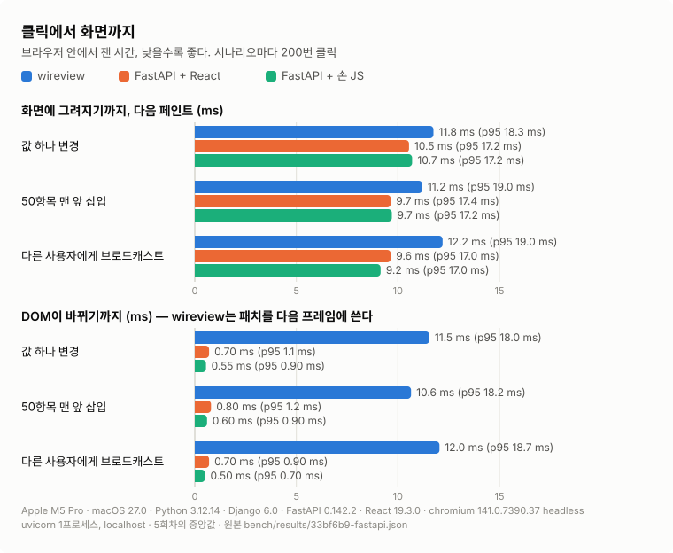
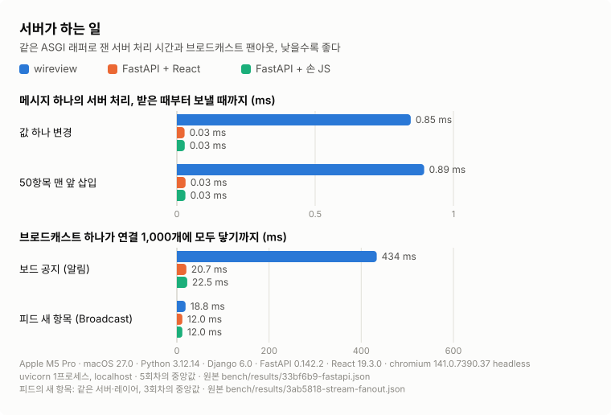
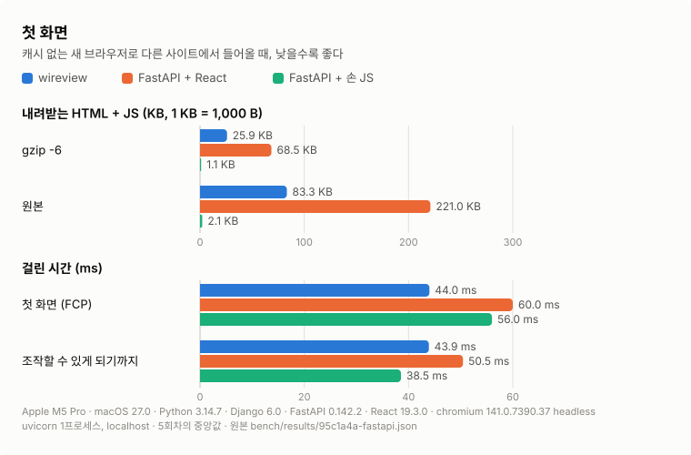
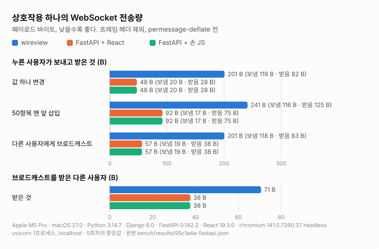
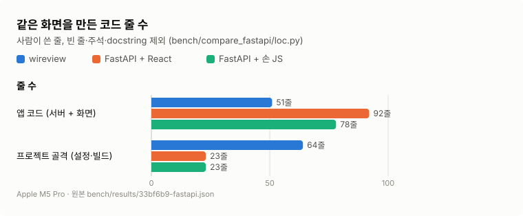
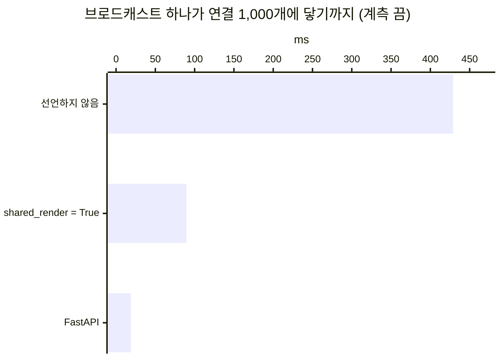
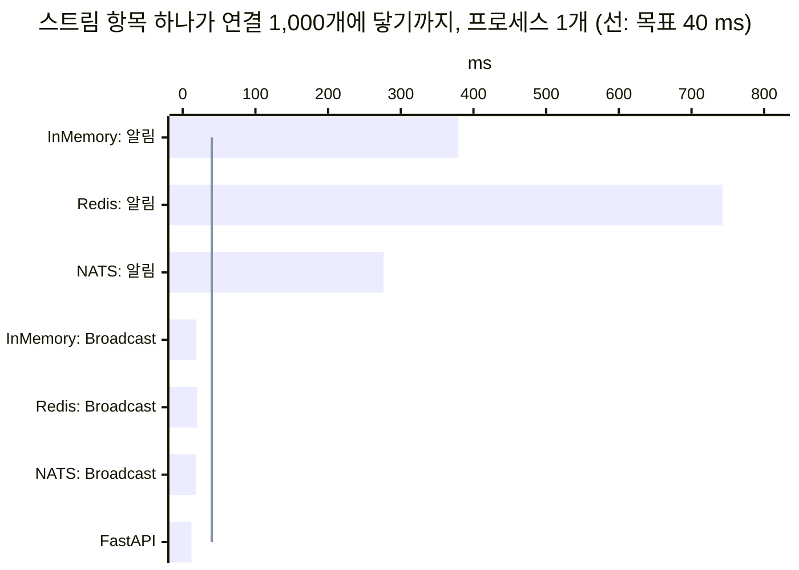

# 성능 가이드

wireview 앱이 느릴 때 어디를 볼지 정리했다. async/sync 전환이 왜 생기고 어떻게 찾는지, 피하는 코드, 튜닝할 설정,
재는 방법과 증상별 해결책 순서다.

## async/sync 전환 이해하기

### 문제

Django Channels는 async 컨텍스트에서 돌지만 Django 템플릿과 ORM은 동기다. 그래서 전환이 생긴다.

```
ASYNC (Consumer)
  → sync_to_async (템플릿 렌더)
    → SYNC (Django 템플릿)
```

전환이 중첩되면 성능이 나빠진다.

```
ASYNC (Consumer)
  → sync_to_async
    → SYNC (렌더)
      → async_to_sync (async 프로퍼티)  # 추가 비용!
        → ASYNC (프로퍼티 코루틴)
```

`async_to_sync` 호출마다 이벤트 루프가 새로 만들어지고, 대략 0.5~2ms가 붙는다.

### 지금의 동작

wireview는 동기 컨텍스트로 들어가기 **전에** async 프로퍼티를 먼저 해소한다.

```
ASYNC (Consumer)
  → async 프로퍼티를 await  # 직접 await, 추가 비용 없음
  → sync_to_async (템플릿 렌더)
    → SYNC (Django 템플릿)  # 컨텍스트는 이미 해소됨
```

## 문제를 찾아내기

### 전환 추적 켜기

개발 중에는 감지를 켜 둔다.

```python
# settings.py
WIREVIEW = {
    "DEBUG_SYNC_TRANSITIONS": True,
    "DEBUG_SYNC_TRANSITIONS_WARNING_THRESHOLD": 2,  # 깊이 2 초과면 경고
    "DEBUG_SYNC_TRANSITIONS_ERROR_THRESHOLD": 3,    # 깊이 3 초과면 오류
}
```

중첩 전환이 감지되면 이런 경고가 남는다.

```
WARNING wireview.sync_detector: Nested sync context detected (total depth=3)
at _run_coro. This may cause performance degradation.
```

### 운영에서는 끈다

```python
WIREVIEW = {
    "DEBUG_SYNC_TRANSITIONS": False,  # 꺼 두면 비용 0
}
```

### N+1 찾기

렌더가 낸 쿼리를 템플릿 줄과 property로 나눠 본다. `DEBUG`에서는 기본으로 켜져 있고(`DEBUG_RENDER_QUERIES`),
로거 `wireview.queries`의 레벨을 `DEBUG`로 두면 렌더·핸들러·작업마다 한 덩어리가 남는다. 같은 줄에서 같은 SQL이
세 번 이상 돌면 `WARNING`이다.

```text
WARNING wireview.queries render Shelf#shelf (join): 12 queries, 1 repeated
  shelf/child.html:9  {{ }}                           3×  SELECT … FROM "quiz_question" WHERE … <- repeated
```

그 줄의 관계를 `select_related()`·`prefetch_related()`로 미리 읽고(아래 3), 테스트에 `view.queries()`의
`assert_no_repeats()`를 둬 되돌아오지 않게 한다. property의 쿼리는 줄이 아니라 `property <이름>`으로 나온다 —
렌더는 템플릿이 쓰지 않는 property도 읽는다. 자세한 것은 [렌더의 SQL 찾기](./features/render-queries.md).

## 권장 사항

### 1. 데이터는 `joined()`에서 미리 읽는다

async 프로퍼티 대신 라이프사이클 메서드에서 읽는다.

```python
# 나쁨: 렌더 중에 접근하는 async 프로퍼티
class UserProfile(Component):
    @property
    async def recent_posts(self):
        return [post async for post in Post.objects.filter(user=self.user)[:5]]

# 좋음: joined()에서 미리 읽는다
class UserProfile(Component):
    posts: list[Post] = []  # 서명 상태에는 pk 목록만 실린다

    async def joined(self):
        self.posts = [post async for post in Post.objects.filter(user=self.user)[:5]]
```

### 2. 컴포넌트 안에서는 `abroadcast()`를 쓴다

async 컨텍스트에서는 async 함수를 쓴다.

```python
# 나쁨: 내부적으로 async_to_sync를 쓴다
from wireview import broadcast

class ChatRoom(Component):
    async def send_message(self, text: str):
        # async에서 부르면 중첩 전환이 생긴다
        broadcast("chat_room_1", message=text)

# 좋음: 순수 async, 전환 없음
from wireview import abroadcast

class ChatRoom(Component):
    async def send_message(self, text: str):
        await abroadcast("chat_room_1", message=text)
```

### 3. 데이터베이스 질의를 묶는다

`sync_to_async` 호출 횟수 자체를 줄인다.

```python
# 나쁨: sync_to_async를 여러 번
async def joined(self):
    profile = await sync_to_async(Profile.objects.get)(user=self.user)
    self.posts = await sync_to_async(list)(profile.posts.all())
    self.comments = await sync_to_async(list)(profile.comments.all())

# 좋음: 한 번의 전환 안에서 전부 읽는다
async def joined(self):
    @sync_to_async
    def load_profile_data():
        profile = Profile.objects.prefetch_related("posts", "comments").get(user=self.user)
        return list(profile.posts.all()), list(profile.comments.all())

    self.posts, self.comments = await load_profile_data()
```

### 4. 큰 리스트에는 Streams를 쓴다

리스트 전체를 다시 렌더하지 않는다.

```python
class ItemList(Component):
    # 항목은 상태 필드에 두지 않는다. 스트림으로 보낸 항목은 클라이언트 DOM에만 있다
    async def add_item(self, name: str):
        item = await Item.objects.acreate(name=name)
        # 리스트 전체가 아니라 새 항목만 보낸다
        await self.stream_insert("items", item, at=0)
```

### 5. 필요 없는 렌더를 건너뛴다

```python
class Counter(Component):
    count: int = 0

    async def increment_silent(self):
        self.count += 1
        # UI를 갱신할 필요가 없으면 렌더를 건너뛴다
        self.skip_render()
```

### 6. 모두에게 같은 항목이면 `Broadcast`로 보낸다

피드·채팅·알림 목록에 들어오는 항목처럼 모두가 같은 HTML을 받는 것은 알림으로 연결마다 `stream_insert()`하지 말고
[`Broadcast`](./features/broadcast.md)로 보낸다. 항목을 발행하는 곳에서 한 번 렌더하고, 연결마다는 컴포넌트 id만 끼워
쓴다. 측정값은 아래 [스트림 항목 하나를 많은 연결에](#스트림-항목-하나를-많은-연결에)에 있다.

### 7. 모두가 같은 화면을 보면 렌더를 공유한다

공지판·현황판처럼 많은 사람이 같은 컴포넌트를 같은 상태로 보고, 그 렌더가 보는 사람을 읽지 않으면
`Meta.shared_render = True`를 선언한다. 같은 브로드캐스트를 받은 연결들이 렌더를 한 번만 하고 함께 쓴다.
고정 `id=`를 줘야 공유된다. 선언이 틀리면 남의 화면이 가므로 [shared_render](./features/shared-render.md)의
"언제 쓰면 안 되는가"를 먼저 읽는다. 측정값은 아래 [브로드캐스트를 많은 연결이 받을 때](#브로드캐스트를-많은-연결이-받을-때)에 있다.

## 튜닝

### HTML diff 설정

> 부분 diff는 `render_with_markers()`가 남기는 주석 마커에 의존한다. HTML 압축기로 주석을 지우면 부분 diff가
> 꺼져 바뀔 때마다 HTML 전체가 나간다. 그래서 django-hmin 연동(`USE_HMIN`)은 #100에서 없앴다. diff 형식과 실측
> 페이로드는 [features/html-diff.md](./features/html-diff.md)에 있다.
>
> WebSocket 압축(permessage-deflate)은 **기본으로 끄기를 권한다**([배포 가이드](./DEPLOYMENT.md#권장-uvicorn--uvloop)).
> 연결마다 zlib 컨텍스트로 약 159KB를 들고, 작은 diff는 16% 남짓밖에 줄지 않는다. 첫 렌더나 스트림이 큰 HTML을
> 자주 보내는 앱만 켜고, 켜기 전에 메모리와 전송량을 둘 다 잰다.

### 템플릿

1. **템플릿을 잘게 나눈다.** 작을수록 렌더가 빠르다
2. **복잡한 템플릿 로직을 피한다.** Python 쪽으로 옮긴다
3. **템플릿 컴파일 캐시는 Django가 기본으로 한다**

### 데이터베이스

1. **`select_related()`·`prefetch_related()`를 쓴다**
2. **필터에 쓰는 필드에 인덱스를 건다**
3. **커넥션 풀링을 쓴다** (`CONN_MAX_AGE`)

### 채널 레이어

```python
CHANNEL_LAYERS = {
    "default": {
        "BACKEND": "channels_redis.core.RedisChannelLayer",
        "CONFIG": {
            "hosts": [("redis", 6379)],
            "capacity": 1500,      # 메모리에 둘 최대 메시지 수
            "expiry": 10,          # 메시지 만료(초)
        },
    },
}
```

## 프로파일링

### Django Debug Toolbar

개발 환경에 설치한다.

```python
if DEBUG:
    INSTALLED_APPS += ["debug_toolbar"]
    MIDDLEWARE = ["debug_toolbar.middleware.DebugToolbarMiddleware"] + MIDDLEWARE
```

### 직접 재기

렌더·diff·이벤트 핸들러의 소요 시간은 옵트인 telemetry 시그널로 받는다. 컴포넌트를 오버라이드할 필요가 없다.
렌더 경로는 `Component`가 아니라 컨슈머와 `WireviewMeta`에 있어서, 컴포넌트에 메서드를 덮어써도 불리지 않는다.

```python
# settings.py
WIREVIEW = {"TELEMETRY": True}
```

```python
# myapp/telemetry_receivers.py (AppConfig.ready()에서 import한다)
import logging

from django.dispatch import receiver

from wireview import telemetry

log = logging.getLogger("wireview.profiling")


@receiver(telemetry.component_rendered)
def log_slow_renders(sender, component_name, duration_ms, **kwargs):
    if duration_ms > 100:  # 느린 렌더만 기록한다
        log.warning("Slow render: %s took %.1fms", component_name, duration_ms)
```

시그널과 인자 목록은 [features/telemetry.md](features/telemetry.md).

### py-spy

```bash
py-spy record -o profile.svg --pid <PID>
```

## 벤치마크

> 짐작하지 말고 잰다. `make bench`가 `bench/`의 인프로세스·WebSocket 벤치마크를 돌리고,
> `make bench-compare BASE=<ref>`가 과거 커밋을 현재 트리 옆에서 함께 잰다.
> 사용법과 해석은 [bench/README.md](../bench/README.md).

### 측정값

#### FastAPI와 비교

README의 "숫자"가 싣는 차트와 숫자의 출처다. 같은 작은 화면을 wireview와 FastAPI로 한 번씩 만들어 같은 조건에서
쟀다(#174). 화면에는 공유 값 하나, 항목 50개의 피드(맨 앞에 넣으면 맨 뒤가 빠진다), 모든 사용자에게 가는 알림이 있다.
FastAPI 쪽은 WebSocket 엔드포인트 하나에 클라이언트를 둘 둔다. 하나는 생태계의 전형인 React(Vite 프로덕션 빌드)이고,
다른 하나는 JS 크기의 하한인 프레임워크 없는 손 JS다. 구현, 지표의 정의, 공정성 규칙과 재현 방법은
[bench/README.md](../bench/README.md#fastapi와-비교)에 있다.











| 지표 | wireview | FastAPI + React | FastAPI + 손 JS |
|------|---:|---:|---:|
| 값 하나 변경: 클릭→페인트 | 11.8 ms (p95 18.3 ms, 회차 11.6~12.1 ms) | 10.5 ms (p95 17.2 ms, 회차 10.3~10.8 ms) | 10.7 ms (p95 17.2 ms, 회차 10.1~10.9 ms) |
| 값 하나 변경: 클릭→DOM | 11.5 ms (p95 18.0 ms, 회차 11.3~11.9 ms) | 0.70 ms (p95 1.1 ms, 회차 0.60~0.90 ms) | 0.55 ms (p95 0.90 ms, 회차 0.50~0.60 ms) |
| 값 하나 변경: 서버 처리 | 0.85 ms (p95 1.6 ms, 회차 0.81~0.85 ms) | 0.03 ms (p95 0.05 ms, 회차 0.02~0.04 ms) | 0.03 ms (p95 0.06 ms, 회차 0.02~0.03 ms) |
| 값 하나 변경: 보냄 / 받음 | 119 B / 82 B | 20 B / 28 B | 20 B / 28 B |
| 50항목 맨 앞 삽입: 클릭→페인트 | 11.2 ms (p95 19.0 ms, 회차 10.6~12.0 ms) | 9.7 ms (p95 17.4 ms, 회차 9.0~10.1 ms) | 9.7 ms (p95 17.2 ms, 회차 9.5~9.8 ms) |
| 50항목 맨 앞 삽입: 클릭→DOM | 10.6 ms (p95 18.2 ms, 회차 10.3~11.5 ms) | 0.80 ms (p95 1.2 ms, 회차 0.70~0.90 ms) | 0.60 ms (p95 0.90 ms, 회차 0.50~0.60 ms) |
| 50항목 맨 앞 삽입: 서버 처리 | 0.89 ms (p95 1.7 ms, 회차 0.86~1.4 ms) | 0.03 ms (p95 0.05 ms, 회차 0.03~0.04 ms) | 0.03 ms (p95 0.06 ms, 회차 0.03~0.04 ms) |
| 50항목 맨 앞 삽입: 보냄 / 받음 | 116 B / 125 B | 17 B / 75 B | 17 B / 75 B |
| 다른 사용자에게 브로드캐스트: 클릭→페인트 | 12.2 ms (p95 19.0 ms, 회차 11.9~12.8 ms) | 9.6 ms (p95 17.0 ms, 회차 8.4~10.4 ms) | 9.2 ms (p95 17.0 ms, 회차 8.8~9.6 ms) |
| 다른 사용자에게 브로드캐스트: 클릭→DOM | 12.0 ms (p95 18.7 ms, 회차 11.7~12.6 ms) | 0.70 ms (p95 0.90 ms, 회차 0.50~0.70 ms) | 0.50 ms (p95 0.70 ms, 회차 0.40~0.60 ms) |
| 다른 사용자에게 브로드캐스트: 보냄 / 받음 | 118 B / 83 B | 19 B / 38 B | 19 B / 38 B |
| 브로드캐스트: 다른 사용자가 받음 | 71 B | 38 B | 38 B |
| 보드의 공지 팬아웃 (연결 1,000개) | 434 ms (회차 418~459 ms) | 20.7 ms (회차 15.2~32.3 ms) | 22.5 ms (회차 20.8~27.5 ms) |
| 피드의 새 항목 팬아웃 (연결 1,000개, 3회차) | Broadcast 18.8 ms (회차 18.0~19.7 ms), 알림 379 ms (회차 368~385 ms) | 12.0 ms (회차 11.4~12.2 ms) | 12.0 ms (회차 11.4~12.2 ms) |
| 첫 화면: HTML (gzip / 원본) | 0.9 KB / 3.4 KB | 0.2 KB / 0.2 KB | 0.2 KB / 0.2 KB |
| 첫 화면: JS (gzip / 원본) | 25.0 KB / 79.9 KB | 68.3 KB / 220.7 KB | 0.9 KB / 1.9 KB |
| 첫 화면: WebSocket 보냄 / 받음 | 304 B / 2,162 B | 0 B / 2,419 B | 0 B / 2,419 B |
| 첫 화면: FCP | 44.0 ms (p95 48.0 ms, 회차 44.0~44.0 ms) | 64.0 ms (p95 76.0 ms, 회차 64.0~68.0 ms) | 60.0 ms (p95 64.0 ms, 회차 56.0~62.0 ms) |
| 첫 화면: 목록이 DOM에 | 35.2 ms (p95 36.1 ms, 회차 34.4~35.5 ms) | 51.6 ms (p95 58.7 ms, 회차 50.8~56.3 ms) | 41.0 ms (p95 46.1 ms, 회차 39.1~45.4 ms) |
| 첫 화면: 조작 가능 | 44.4 ms (p95 47.0 ms, 회차 43.6~45.0 ms) | 51.6 ms (p95 58.7 ms, 회차 50.8~56.3 ms) | 41.0 ms (p95 46.1 ms, 회차 39.1~45.4 ms) |
| 코드 줄 수: 앱 / 골격 | 51 / 64 | 92 / 23 | 78 / 23 |

모든 값은 5회차 각각의 중앙값을 다시 중앙값으로 모은 것이다. 시나리오마다 회차당 200번 클릭했고(워밍업 20번 뒤),
첫 화면은 회차당 20번 로드했다(워밍업 3번 뒤). 원본은 `bench/results/33bf6b9-fastapi.json`이고, 측정 환경은 그 파일의
`environment`에 있다: Apple M5 Pro(18코어), macOS 27.0, Python 3.12.14, Django 6.0, channels 4.3.2,
FastAPI 0.142.2, uvicorn 0.38.0, websockets 15.0.1, React 19.3.0, Vite 8.3.2, Chromium 141 headless.
측정 동안 load average는 4~5였다.

"피드의 새 항목 팬아웃" 행만 다른 측정이다. 보드의 공지는 필드를 바꾸므로 렌더로만 보낼 수 있다. 연결마다 렌더하지
않는 경로([`Broadcast`](./features/broadcast.md))는 스트림 항목·훅 이벤트·JS 명령만 보낸다. 그래서 같은 서버·레이어(uvicorn
1프로세스, InMemory)에서 항목 `<li>` 하나를 피드에 넣는 측정(아래 "스트림 항목 하나를 많은 연결에", 3회차)의 값을 실었다.
FastAPI 칸은 서버가 보낸 때부터 모든 연결이 받을 때까지라 클라이언트와 무관하고, 둘이 같은 값이다.

**wireview가 불리한 지표.**

- **서버 처리.** 메시지 하나에 0.85 ms(값 하나 변경)와 0.89 ms(50항목 맨 앞 삽입)로, FastAPI(0.03 ms)보다 수십 배
  크다. 템플릿을 다시 렌더하고 이전 렌더와 비교하는 비용이다.
- **렌더하는 브로드캐스트의 팬아웃.** 보드의 공지가 연결 1,000개에 닿기까지 434 ms다. FastAPI는 20.7 ms(React)와
  22.5 ms(손 JS)다. FastAPI는 같은 JSON을 한 번 만들어 1,000번 보내고, wireview는 연결마다 컴포넌트가 다시 렌더한다.
  모두에게 같은 화면이면 `Meta.shared_render`가 렌더를 한 번으로 줄인다(아래 "브로드캐스트를 많은 연결이 받을 때").
  프로세스를 늘리면 렌더가 나뉜다(아래 "기대치").
- **상호작용당 바이트.** 값 하나 변경에 보냄 119 B·받음 82 B로 FastAPI(20 B·28 B)의 네 배다. wireview의 이벤트는
  컴포넌트 id, 핸들러 이름, 인자 칸을 싣고, 응답은 diff 구조를 싣는다. 50항목 맨 앞 삽입은 받는 쪽이 125 B 대 75 B로,
  내용으로 짝짓는 diff가 옮겨진 49개를 구간 하나로 보내 차이가 작다.
- **클릭에서 페인트까지.** 11.8 ms로 React(10.5 ms)와 손 JS(10.7 ms)보다 늦다. 서버 처리와 클라이언트 패치가 그만큼 더 든다. 셋 모두 한
  프레임(16.7 ms) 안팎이라 localhost에서는 대부분 같은 프레임이나 다음 프레임에 그려진다.
- **클릭에서 DOM까지.** 11.5 ms 대 0.70 ms(React). 이 차이는 대부분 설계다. wireview 클라이언트는 패치를 다음 애니메이션 프레임에
  모아 쓰고, React와 손 JS는 메시지가 오자마자 DOM을 바꾼 뒤 같은 다음 프레임에 그린다. 사용자가 보는 것은 페인트다.
- **조작할 수 있게 되기까지.** 44.4 ms로 손 JS(41.0 ms)보다 늦다. 첫 HTML이 이미 보인 뒤 `wireview.min.js`(gzip 25.0 KB)를
  받고 WebSocket으로 join해야 한다. join의 응답이 전체 렌더(2,162 B)를 다시 보낸다.
- **프로젝트 골격.** settings·urls·asgi가 64줄로 FastAPI 쪽 빌드 설정(23줄)보다 많다.

**비슷한 지표.**

- **같은 항목을 모두에게.** 피드의 새 항목을 `Broadcast`로 보내면 연결 1,000개에 18.8 ms로, FastAPI(12.0 ms)와 같은
  자릿수다. 발행하는 곳에서 한 번 렌더하고 한 번 직렬화한 프레임을 연결마다 id만 끼워 쓴다. 남은 차이는 프레임의
  크기와 연결마다의 큐다. 같은 항목을 알림으로 보내 연결마다 렌더하면 379 ms다.

**wireview가 유리한 지표.**

- **첫 화면.** 목록이 HTML에 있으므로 FCP가 44.0 ms로 React(64.0 ms)와 손 JS(60.0 ms)보다 이르다. 둘은 JS를 받아
  실행하고 WebSocket으로 첫 데이터를 받은 뒤에야 그린다.
- **내려받는 JS.** gzip 25.0 KB로 React(68.3 KB)의 3분의 1쯤이다. 프레임워크 없는 손 JS(0.9 KB)보다는 훨씬 크다.
- **앱 코드 줄 수.** 51줄 대 92줄(React)·78줄(손 JS). 화면을 그리는 템플릿 하나와 핸들러뿐이고, 첫 데이터를 보내는 코드,
  메시지 종류마다 화면을 고치는 코드가 없다.
**읽을 때 주의.** localhost라 네트워크 왕복이 0이다. 실제 체감은 여기에 RTT가 그대로 더해지고, RTT가 크면 셋의 차이는
그 안에 묻힌다. DB도 없다 — 두 쪽 모두 같은 프로세스 메모리의 저장소를 읽는다. FastAPI 쪽은 첫 데이터와 조작을 모두
WebSocket 하나로 주고받는다. 흔한 REST 방식이면 요청마다 HTTP 헤더와 왕복이 붙으므로 이 선택은 FastAPI에 유리하다.
첫 화면은 다른 사이트에서 들어오는 조건으로 쟀다. `about:blank`에서 열면 Django 기본 헤더(COOP) 때문에 wireview만
Chromium 프로세스 교체 비용 약 35 ms를 낸다(bench/README.md). FCP는 Chromium이 4 ms 단위로 반올림한다.
코드 줄 수는 한 사람이 같은 날 쓴 작은 앱 하나의 값이다. 규칙은 정했지만(`bench/compare_fastapi/loc.py`) 쓰는 사람과
앱의 크기에 따라 달라지므로, "적은 코드로 만든다"는 일반 주장의 근거로 쓰지 않는다.
연결당 메모리는 이 비교에 없다. 아래 단독 측정의 값에는 비교군이 없다.

#### wireview 단독 측정 (비교군 없음)

FastAPI 비교 이전부터 싣던 값이다. 모두 Apple Silicon macOS(Darwin arm64)에서 `make bench`로 잰 값이고, 브라우저까지의
네트워크 왕복과 DB 조회는 들어 있지 않다. 사용자가 느끼는 응답 시간은 여기에 RTT를 더한 것이다.

| 무엇 | 값 | 조건 | 원본 |
|------|---:|------|------|
| 이벤트 하나의 서버 처리 | 0.28 ms | 스칼라 7개 컴포넌트(`BenchFlat`). 핸들러와 `render_diff` 300회 평균, CPU 한 코어 | `bench/results/f0a9d54.json`의 `timing.flat.event_ms` |
| | 1.1 ms | 항목 50개 목록(`BenchList`)에서 항목 하나를 바꿈 | 같은 파일의 `timing.list.event_ms` |
| 값 하나가 바뀐 render 페이로드 | 239 B | `BenchFlat`, 컨슈머가 보내는 것과 같은 JSON | 같은 파일의 `payload_bytes.flat.change_one_value` |
| | 656 B | `BenchList`에서 항목 하나 | 같은 파일의 `payload_bytes.list.change_one_item` |
| 연결당 서버 메모리 | 55 KB | 연결 2,000개, daphne 4프로세스, channels-nats 0.2.0, 항목 5개 컴포넌트 | `bench/results/a993181-daphne-nats-4proc.json`의 `ws.items_5` |
| 이벤트 처리량 | 12,387/s | 같은 구성, 프로세스 넷의 합 | 같은 파일 |
| 브로드캐스트 | 141 ms | 같은 구성. 브로드캐스트 하나가 구독한 2,000연결을 모두 다시 렌더할 때까지 | 같은 파일 |

`f0a9d54`는 2026-09-29에 Python 3.14·Django 6.0으로, `a993181`은 2026-09-08에 Python 3.12·Django 6.0으로 쟀다.
같은 기계라도 부하가 있으면 시간 값은 두 배까지 흔들린다. 바이트는 흔들리지 않는다. 연결 수는 2,000개까지만 쟀고,
그보다 많은 연결은 확인하지 않았다. uvicorn은 permessage-deflate 때문에 연결당 메모리가 네 배쯤 된다
([배포 가이드](DEPLOYMENT.md)). 다른 구성의 수치는 [transport-abstraction.md](design/transport-abstraction.md) §5에 있다.
**자기 컴포넌트와 배포 구성으로 `make bench`를 다시 잰다.**

#### 브로드캐스트를 많은 연결이 받을 때

브로드캐스트 하나가 닿는 연결마다 서버는 수신자를 돌리고, 컴포넌트를 렌더하고, 그 연결의 화면과 비교한다.
한 프로세스 안에서 이 일은 한 코어에서 차례로 돈다. 그래서 브로드캐스트 하나의 시간은 연결 수에 비례하고,
연결 하나의 몫 대부분이 렌더다([설계](design/broadcast-fanout.md) §2). 줄이는 길은 둘이다.

- **프로세스를 늘린다.** 연결이 프로세스들에 나뉘므로 브로드캐스트 시간도 나뉜다. 프로세스 사이는 Redis나 NATS
  레이어가 잇는다([배포 가이드](DEPLOYMENT.md)).
- **같은 화면이면 렌더를 공유한다.** `Meta.shared_render`([문서](./features/shared-render.md))를 선언한 컴포넌트는
  같은 메시지를 받은 연결들이 렌더를 한 번만 한다. 연결마다 남는 것은 메시지 수신, 수신자, 상태 서명, diff, 프레임
  쓰기다.

README 비교 벤치의 Board(항목 50개)로 쟀다. 연결 1,000개, uvicorn 1프로세스, InMemory 레이어, 5회차의 중앙값이고, 선언한 것과
안 한 것과 FastAPI를 같은 회차에서 번갈아 쟀다.

| | 팬아웃 (계측 끔) | 연결당 CPU |
|---|---:|---:|
| 선언하지 않음 | 429.0 ms | 436.8 µs |
| `shared_render = True` | 89.6 ms | 109.0 µs |
| FastAPI (JSON 한 번, 같은 텍스트를 연결마다) | 18.9 ms | 18.3 µs |



선언해도 연결당 남는 109.0 µs 가운데 약 40%는 InMemory 레이어의 수신 순회다. Redis·NATS
레이어에는 이 순회가 없다. 단계별 분해와 측정 방법은 [설계](design/broadcast-fanout.md) §7, 원본은
`bench/results/cef17df-fanout-shared.json`이다. 프레임 크기와 클릭의 서버 처리는 선언해도 같다.

#### 스트림 항목 하나를 많은 연결에

항목 하나가 구독한 모든 페이지의 목록에 들어갈 때다. 알림을 보내면 연결마다 수신자가 돌고, 항목을 렌더하고, 그 연산을
채널 레이어로 자기 세션에 다시 보낸다. [`Broadcast`](./features/broadcast.md)는 발행하는 곳에서 한 번 렌더하고 프레임도 한
번 직렬화한다. 프로세스가 메시지를 한 번 받아 연결마다 id만 끼워 쓴다.

같은 피드로 쟀다. 항목 `<li>` 하나, 연결 1,000개, uvicorn 1프로세스, 3회차의 중앙값(괄호는 회차 범위)이고, 세 경로를 같은
회차에서 번갈아 쟀다. Redis·NATS는 [배포 가이드](DEPLOYMENT.md)의 `capacity` 1,500이다.

| | InMemory | Redis | NATS | 연결당 CPU (InMemory, Redis, NATS) |
|---|---:|---:|---:|---:|
| wireview, 알림 | 379.4 ms (368.4~384.9) | 742.6 ms (710.9~763.6) | 276.3 ms (273.8~278.4) | 373.7 µs / 644.0 µs / 269.0 µs |
| wireview, Broadcast | 18.8 ms (18.0~19.7) | 19.7 ms (18.4~20.5) | 18.0 ms (17.9~18.8) | 18.5 µs / 19.0 µs / 17.4 µs |
| FastAPI (레이어 없음) | 12.0 ms (11.4~12.2) | 12.0 ms (11.4~12.2) | 12.0 ms (11.4~12.2) | 11.5 µs |



알림 경로는 Redis에서 가장 느리다. 연결마다 하는 세션 메일이 Redis를 한 번 오가기 때문이다. Broadcast는 레이어를
프로세스마다 한 번만 거치므로 레이어에 따라 거의 달라지지 않는다. FastAPI와 남은 차이는 프레임의 크기(205 B 대 80 B)와
연결마다의 큐다. 측정 방법과 1단계(D1)의 수치는 [설계](design/broadcast-patch.md) §11, 원본은
`bench/results/3ab5818-stream-fanout.json`, 재현은 `make bench-stream-fanout`이다.

### 기대치

| 동작 | 목표 | 비고 |
|------|------|------|
| WebSocket 연결 | < 50ms | 최초 연결 |
| 컴포넌트 join | < 100ms | `joined()` 포함 |
| 이벤트 핸들러 | < 50ms | 사용자 조작 |
| 렌더 diff | < 20ms | HTML 생성 |
| 브로드캐스트 발행 | < 10ms | `abroadcast` 한 번이 브로커에 메시지를 넘기기까지. 받는 쪽 렌더는 들어 있지 않다 |

이 표는 동작 하나의 **목표**이고 벤치가 재는 값이 아니다. 특히 벤치의 `ws.broadcast_ms`는 다른 지표다 —
브로드캐스트 하나가 구독한 **모든 연결**의 재렌더까지 끝나는 벽시계 시간이라 연결 수와 항목 수에 비례한다.
macOS에서 연결 2,000개일 때 프로세스 4개(NATS·Redis)는 141~416ms, 단일 프로세스(InMemory)는 635~1,763ms였다
(`bench/results/a993181-*.json`, `663b3f7-*.json`). 정의는 [bench/README.md](../bench/README.md).

### 부하 테스트

wireview의 WebSocket은 Socket.IO가 아니라 `{"command", "payload"}` JSON 프레임을 주고받는 날 WebSocket이다
([wire-protocol](implementation/wire-protocol.md)). join에는 페이지가 발급한 서명 상태(`data-state`)가 필요하므로,
가상 사용자는 페이지를 먼저 받고 거기서 컴포넌트의 이름·id·상태를 읽는다. `locust`와 `websocket-client`로 쓰면 다음과 같다.

```python
import html
import json
import re
import time

import websocket  # pip install websocket-client
from locust import HttpUser, between, task

COMPONENT_TAG = re.compile(r"<[^>]*\bwireview-component\b[^>]*>")
ATTRIBUTE = re.compile(r'([\w-]+)="([^"]*)"')


class WireviewUser(HttpUser):
    wait_time = between(1, 3)

    def on_start(self):
        page = self.client.get("/counter/")
        attrs = dict(ATTRIBUTE.findall(COMPONENT_TAG.search(page.text).group(0)))
        self.component_id = attrs["id"]
        cookie = "; ".join(f"{name}={value}" for name, value in self.client.cookies.items())
        self.ws = websocket.create_connection(self.host.replace("http", "ws", 1) + "/__wireview__", cookie=cookie)
        # 중첩 컴포넌트가 있는 페이지라면 children에 {id: [name, state]}를 채운다
        self.request("join", {"name": attrs["data-name"], "state": html.unescape(attrs["data-state"]), "children": {}})

    def on_stop(self):
        self.ws.close()

    @task
    def increment(self):
        event = {"id": self.component_id, "command": "increment", "implicit_args": {}, "explicit_args": {}}
        self.request("user_event", event)

    def request(self, command, payload):
        """명령 하나를 보내고 그에 답하는 render가 올 때까지의 시간을 잰다."""
        start = time.perf_counter()
        self.ws.send(json.dumps({"command": command, "payload": payload}))
        while (message := json.loads(self.ws.recv()))["command"] != "render":
            pass
        self.environment.events.request.fire(
            request_type="WS",
            name=command,
            response_time=(time.perf_counter() - start) * 1000,
            response_length=len(json.dumps(message)),
            exception=None,
            context={},
        )
```

핸들러가 아무것도 바꾸지 않아도 서버는 `diff: null`인 render로 답하므로 위의 대기는 끝난다. 연결 수당 메모리·join 처리량·
이벤트 처리량은 `make bench`의 WebSocket 벤치마크(`bench/ws.py`)가 같은 프로토콜로 이미 잰다.

## 문제 해결

### 최초 로딩이 느리다

1. `joined()`에 느린 질의가 있는지 본다
2. Django Debug Toolbar로 프로파일링한다
3. 큰 데이터셋은 지연 로딩을 고려한다

### 메모리를 많이 쓴다

1. 큰 리스트를 상태에 담지 말고 Streams를 쓴다
2. 순환 참조를 확인한다
3. 컴포넌트 인스턴스 수를 관찰한다

### 연결이 자주 끊긴다

1. WebSocket 프록시의 타임아웃 설정을 본다
2. Redis 연결이 안정적인지 확인한다
3. 서버 자원을 관찰한다

### async/sync 경고가 뜬다

"Nested sync context detected"가 보이면

1. 템플릿에서 쓰는 async 프로퍼티를 찾는다
2. 데이터 로딩을 `joined()`로 옮긴다
3. async 호출 사슬을 다시 본다

운영 설정은 [배포 가이드](DEPLOYMENT.md)에 있다.
