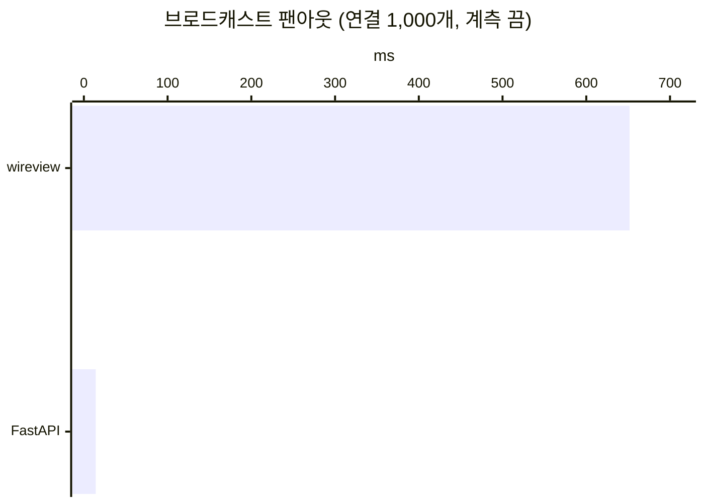
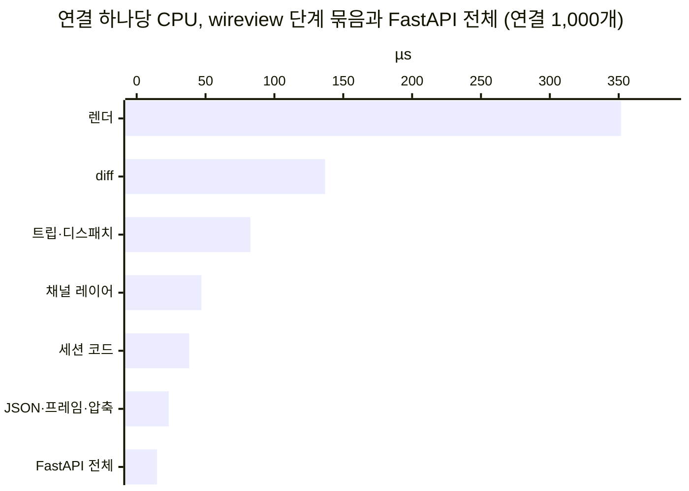

# 브로드캐스트 팬아웃: 연결 하나당 비용과 줄이는 길

> 2026-10-05. [#176](https://github.com/itda-work/django-wireview/issues/176) 1단계(측정과 설계) 산출물이다.
> **상태: 제안. 아무것도 구현하지 않았다.** 메인테이너가 §5의 권장안을 확인한 뒤 2단계(구현)를 연다.
> 측정 스크립트는 `bench/fanout_profile.py`이고, 재현 명령은 §1-4에 있다.

---

## 0. 요약

[#174](https://github.com/itda-work/django-wireview/issues/174)의 비교에서 브로드캐스트 하나가 연결 1,000개에 닿기까지
wireview는 632 ms, FastAPI는 19.3 ms(React)·21.5 ms(손 JS)였다. 같은 시나리오를 단계별로 쪼개 쟀다.

- **632 ms는 연결 하나당 약 650 µs의 CPU를 한 코어에서 1,000번 직렬로 쓴 것이다.** 이벤트 루프와
  `sync_to_async` 워커 스레드 하나가 GIL을 번갈아 잡는다. 계측을 켜고 쪼개면 연결당 680 µs(계측 비용 약 35 µs 포함)이고,
  두 스레드의 CPU 합(679.6 ms)이 서버 구간(686.2 ms)과 같다. 병렬로 도는 부분은 없다.
- **연결마다 같은 일을 다시 한다.** 템플릿 렌더(52%)와 diff를 위한 마커 파싱(18%)만으로 70%다. 1,000개 연결이 같은
  Board를 같은 상태로 보고 있으므로, 1,000번의 렌더 결과는 연결마다 발급 시각이 다른 data-state 토큰을 빼면 모두 같다.
- **템플릿 렌더 323 µs 중 Django 자체가 약 212 µs이고, 그 절반(약 100 µs)이 정수 52개의 `localize()`다.**
  Django의 `number_format`은 정수 지름길에 닿기 전에 `get_language()`와 `get_format()`을 세 번 부른다.
  나머지 약 100 µs는 wireview의 마커 처리다.
- **FastAPI 쪽 14.8 µs는 프레임 쓰기와 압축뿐이다.** JSON은 한 번 만들고(전체 0.01 ms 미만), 연결마다 starlette 1.6 µs,
  프레임 쓰기 9.8 µs, permessage-deflate 2.8 µs를 쓴다. wireview도 이 세 가지(JSON·프레임·압축)에는 연결당 23 µs만 쓴다.
- **스레드를 늘려도 빨라지지 않는다.** GIL이 있으면 Django 렌더 처리량은 스레드 1~8개에서 같다. GIL이 없는 3.14t에서도
  4스레드 1.0~1.8배로 흔들리고, 8스레드는 1스레드보다 느리다. 게다가 마커 상태가 프로세스 전역이라 지금 구조로는 렌더를
  두 스레드에서 동시에 돌릴 수 없다.

권장(§5)은 세 단계다. 먼저 모든 앱이 득을 보는 핫스팟을 줄인다(B). 목표는 연결당 680 → 470 µs 이하다. 다음으로,
사용자와 무관하다고 선언한 컴포넌트는 같은 입력의 렌더를 한 번만 하고 공유한다(A, opt-in). 목표는 1,000연결 180 ms
이하다. 렌더가 없는 브로드캐스트를 같은 프레임 그대로 보내는 길(D)은 2단계를 잰 뒤에 정한다.

## 1. 측정 조건과 방법

### 1-1. 환경

Apple M5 Pro(18코어), macOS 27.0, Python 3.14.7(GIL), Django 6.0, channels 4.3.2, asgiref 3.11.0, uvicorn 0.38.0,
websockets 15.0.1, FastAPI 0.142.2, starlette 1.7.0. 커밋은 `5a4f037`이고, 라이브러리 코드는 바꾸지 않았다. 본 측정의
시작·끝 load average는 4.8 → 3.9였다. 이 기계는 다른 작업(VM, node)과 함께 쓰여 load가 10까지 오르는 때가 있었다.
그때 잰 값은 본문 표에 쓰지 않았다.

### 1-2. 시나리오

`make bench-fastapi`의 팬아웃과 같다(`bench/compare_fastapi/`). uvicorn 1프로세스(`--ws websockets`, permessage-deflate
켜짐)에 WebSocket 클라이언트 1,000개를 붙이고, 모두 같은 `Board`(항목 50개 피드, 데이터는 property로 프로세스 메모리에서
읽는다)에 join한다. 그중 하나가 `announce`를 누르면 `abroadcast("board")`가 나가고, 모든 클라이언트가 갱신을 받을 때까지
잰다. 채널 레이어는 InMemory다. FastAPI 쪽은 같은 기계에서 공식 문서식 엔드포인트가 연결 목록을 돌며 `send_text`한다.

회차마다 서버를 새로 띄우고 두 스택의 순서를 번갈아 바꾼다. 5회차를 돌린다. 회차마다 워밍업 브로드캐스트 3번 뒤에
계측을 켠 브로드캐스트와 끈 브로드캐스트를 10번씩 번갈아 보낸다. 값은 회차 안의 중앙값을 내고, 다시 회차들의 중앙값을 쓴다.
tracemalloc은 켜지 않는다.

### 1-3. 계측

라이브러리 코드는 고치지 않았다. 서버 프로세스가 uvicorn을 띄우기 전에 함수를 바깥에서 감싼다(`install_probes`). 감싼
함수는 계측이 켜진 브로드캐스트에서만 기록한다.

- **구간.** `announce` 메시지가 ASGI `receive`에서 나온 때부터 마지막 WebSocket 프레임을 쓴 때까지를 서버 구간으로 잰다.
  클라이언트 쪽(드라이버 프로세스)의 송신·수신 시각도 같은 시계(macOS의 `perf_counter_ns`는 `mach_absolute_time`)로 남긴다.
- **루프와 워커.** 이벤트 루프가 `select()`에서 기다린 시간을 빼면 루프가 바빴던 시간이 남는다. 워커 스레드는
  `thread_handler`의 바깥 호출 구간을 기록한다.
- **단계.** 각 단계의 비용은 그것을 돌린 스레드의 CPU 시간(`time.thread_time_ns`)으로 잰다. 벽시계는 구간에만 쓴다.
  첫 시험(연결 50개)에서 단계도 벽시계로 쟀더니, 루프의 프레임 쓰기가 연결당 196 µs로 나왔다(FastAPI는 9 µs). 원인은
  GIL이었다. 프레임을 쓰는 동안 zlib 압축과 소켓 send가 GIL을 잠깐 놓으면, 워커가 그것을 잡는다. 그러면 루프는 다시 잡을
  때까지(최대 전환 간격 5 ms) 기다린다. 그 대기가 그 단계의 비용처럼 보였다. CPU 시간에는 그 대기가 들어가지 않는다.
- **계측 비용.** 계측을 끈 브로드캐스트는 651.7 ms(회차 649.2~673.5 ms), 켠 브로드캐스트는 686.4 ms였다. 계측이
  연결당 약 35 µs(5%)를 더한다. 끈 쪽 값은 #174의 632 ms(회차 620~706 ms)와 맞는다.

### 1-4. 재현

```bash
npm --prefix bench/compare_fastapi/client ci       # 한 번: FastAPI 쪽이 서빙할 클라이언트 빌드 (make bench-fastapi도 한다)
npm --prefix bench/compare_fastapi/client run build
uv run --with fastapi==0.142.2 python -m bench.fanout_profile                 # 두 스택, 5회차, 연결 1,000개 (약 2분)
uv run python -m bench.fanout_profile --only wireview --connections 250       # 연결 수를 바꿔 가며
uv run python -m bench.fanout_profile --only wireview --rounds 1 --cprofile   # 함수 단위 (시간은 부풀고, 비율은 남는다)
uv run python -m bench.fanout_profile inproc --cprofile                       # Board 렌더 하나의 분해, 워커 트립, 렌더 스레드
uv run --python 3.14t --no-project --with django==6.0 python -m bench.fanout_profile plain   # GIL 없는 렌더 스레드
uv run python -m bench.fanout_profile --report bench/.data/fanout-profile-<커밋>.json      # 저장한 결과의 표
```

결과 JSON은 `bench/.data/`(gitignore)에 남는다. 이 문서의 숫자는 그 JSON에서 옮겼다.

## 2. 결과

### 2-1. 구간



| | wireview | FastAPI |
|---|---:|---:|
| 클라이언트가 본 팬아웃 (계측 끔) | **651.7 ms** (회차 649.2~673.5) | **14.2 ms** (회차 14.0~15.0) |
| 서버 구간 (계측 켬) | 686.2 ms | 14.8 ms |
| 루프 CPU / 루프가 바빴던 시간 | 314.2 ms / 619.3 ms | 14.8 ms / 14.8 ms |
| 워커 CPU / 워커가 바빴던 시간 | 365.4 ms / 366.4 ms (스레드 1개) | — |
| 루프가 GIL을 기다린 시간 (바쁨 − CPU) | 305.1 ms | 0 |
| 루프가 `select()`에서 쉰 시간 | 73.0 ms | 0 |
| 첫 디스패치 / 마지막 디스패치 / 첫 프레임 | 9.1 ms / 39.3 ms / 39.2 ms | — / — / 0.06 ms |
| 마지막 프레임 뒤 마지막 클라이언트 수신 | 0.04 ms | 0.25 ms |

읽는 법:

- 클라이언트 쪽 꼬리는 없다. 마지막 프레임을 쓰고 0.04 ms 뒤에 마지막 클라이언트가 받는다. 시간은 모두 서버에서 쓴다.
- 1,000개 컨슈머의 디스패치는 39 ms 안에 모두 시작된다. 그 뒤 렌더가 워커 스레드 하나에 줄을 선다. 루프 CPU 314 ms와
  워커 CPU 365 ms를 더하면 680 ms이고, 이것이 서버 구간과 같다. 두 스레드가 겹쳐 일한 시간은 없다.

### 2-2. 단계별 (연결 1,000개, CPU)

| 단계 | 스레드 | CPU ms | 연결당 µs | 비율 |
|---|---|---:|---:|---:|
| 발행: `group_send`가 멤버마다 deepcopy + put | 루프 | 2.5 | 2.5 | 0.4% |
| 채널 레이어 수신: InMemory `_clean_expired` | 루프 | 44.5 | 44.5 | 6.5% |
| Channels 디스패치·asyncio·트립 예약 (측정되지 않은 루프 CPU) | 루프 | 68.9 | 68.9 | 10.1% |
| 트립의 스레드 쪽 나머지 (`thread_handler`, context 복사) | 워커 | 8.7 | 8.7 | 1.3% |
| `close_old_connections` (메시지마다 3번) | 워커 | 4.9 | 4.9 | 0.7% |
| 컨텍스트 읽기 (`_collect_context`, property 읽기 포함) | 워커 | 23.4 | 23.4 | 3.4% |
| **템플릿 렌더 (서명 제외)** | 워커 | **323.2** | **323.2** | **47.6%** |
| data-state 서명 (`sign_state`, 토큰 재사용) | 워커 | 5.1 | 5.1 | 0.7% |
| **diff 계산** (마커 파싱 124.4, 비교 8.8, settle 1.2, payload 0.3) | 루프 | **136.8** | **136.8** | **20.1%** |
| 세션 코드 (`send_render`·`_render_tree`의 나머지, 핸들러, 텔레메트리) | 루프 | 38.2 | 38.2 | 5.6% |
| JSON 직렬화 (`encode_json`) | 루프 | 2.0 | 2.0 | 0.3% |
| WebSocket 프레임 쓰기 (deflate 제외) | 루프 | 16.9 | 16.9 | 2.5% |
| permessage-deflate 압축 | 루프 | 4.5 | 4.5 | 0.7% |
| **합 (루프 CPU + 워커 CPU)** | | **679.6** | **679.6** | 100% |

호출 수로 확인한 사실도 있다. 메시지 하나가 워커 트립을 두 번 탄다(`thread_handler` 2,002회). 하나는 Channels의
`dispatch`가 핸들러 앞에서 부르는 `aclose_old_connections()`이고, 하나는 렌더다. `close_old_connections`는 메시지마다
세 번 돈다(3,003회). Channels 디스패치에서 한 번, 렌더 트립(`database_sync_to_async`)의 앞뒤에서 두 번이다.

묶어 보면 이렇다.

| 묶음 | 연결당 µs | 비율 | 연결마다 결과가 같은가 |
|---|---:|---:|---|
| 렌더 (컨텍스트 + 템플릿 + 서명) | 351.7 | 51.8% | 같다 |
| diff (거의 전부 마커 파싱) | 136.8 | 20.1% | 파싱은 같고, 비교만 연결마다 다르다 |
| 트립·디스패치 (Channels, asyncio, sync_to_async) | 82.6 | 12.2% | 구조 비용 |
| 채널 레이어 (발행 + InMemory 순회) | 47.0 | 6.9% | 구조 비용. InMemory만의 것은 연결 수에 비례한다 |
| 세션 코드 | 38.2 | 5.6% | 연결마다 |
| JSON + 프레임 + 압축 | 23.3 | 3.4% | 프레임은 연결마다 써야 한다 |



차트는 `python -m bench.fanout_profile --chart <결과>`가 결과 JSON에서 만든다. "FastAPI 전체"는 FastAPI 쪽의 연결당 CPU
전부(14.8 µs)다.

### 2-3. FastAPI 쪽 14.8 µs의 구성

| 단계 | 연결당 µs | 비율 |
|---|---:|---:|
| `json.dumps` (브로드캐스트당 한 번) | 0.0 | 0.0% |
| starlette `send_text` (uvicorn 제외) | 1.6 | 10.9% |
| WebSocket 프레임 쓰기 (deflate 제외) | 9.8 | 66.5% |
| permessage-deflate 압축 | 2.8 | 19.2% |
| 그 밖의 루프 | 0.5 | 3.3% |
| **합** | **14.8** | 100% |

FastAPI는 렌더도, 디스패치도, 스레드 이동도 없다. JSON을 한 번 만들고, 연결 목록을 돌며 같은 텍스트를 쓴다.
wireview가 같은 몫에 쓰는 시간은 연결당 23.3 µs다. 프레임이 69 B로 FastAPI(36 B)보다 크다. 나머지 656 µs는
FastAPI에 없는 일이다.

### 2-4. Board 렌더 하나를 쪼갠 것 (in-process)

`inproc` 모드는 Board 하나를 라이브 저장소로 마운트한다. 컨슈머가 부르는 함수들을 한 스레드에서 차례로 돌린다(400번 × 9회,
세 번 실행의 중앙값).

| 부분 | µs |
|---|---:|
| `render_diff` 전체 (트립 포함, 다른 일 없음) | 570.2 |
| 컨텍스트 읽기 (`_collect_context`) | 18.5 |
| 템플릿 렌더, wireview 마커 포함 | 311.2 |
| 같은 템플릿을 Django만으로 (마커·wireview 태그 없음) | 212.3 |
| 그 템플릿이 찍는 정수 52개의 `localize()` | 101.5 |
| `sign_state` (토큰 재사용) | 1.7 |
| diff: 마커 파싱만 | 113.7 |
| diff: 파싱 + settle + 비교 + payload | 116.7 |
| render 프레임의 `json.dumps` | 0.6 |

`render_diff` 하나(570 µs)가 팬아웃의 연결당 비용(680 µs)의 대부분이다. 나머지는 트립, 디스패치, 채널 레이어다.

cProfile(`inproc --cprofile`, 비율만 의미 있다)에서 템플릿 렌더 시간의 약 31%가 `localize()`였다. 그 안에서는
`number_format`이 `get_language()`(asgiref `Local`)와 `get_format()` 세 번을 지나서야 `numberformat.format`의
정수 지름길(`isinstance(number, int) and not use_grouping`)에 닿는다. 마커 쪽에서는 `MarkedVariableNode.render`와
`ComprehensionItemNode.render`의 래핑, `inject_marker`의 문자열 이어 붙이기가 크다. diff 쪽은 `_parse`(정규식 split 뒤 스택
접기)와 항목마다 부르는 `_finish`(렌더당 204번)가 거의 전부다.

워커 트립 하나의 비용은 다음과 같다(같은 실행들의 중앙값).

| 트립 | 하나씩 차례로 | 1,000개를 gather |
|---|---:|---:|
| `database_sync_to_async(noop)` | 46.9 µs | 18.9 µs |
| `aclose_old_connections()` | 48.4 µs | 17.6 µs |

하나씩 차례로 기다리면 깨어나는 지연이 그대로 보인다. 팬아웃처럼 여러 개가 겹치면 트립 하나에 루프와 워커를 합쳐 약 18 µs가
든다. 메시지 하나에 트립이 둘이므로, 연결당 약 36 µs다. 이것은 §2-2의 "Channels 디스패치·asyncio·트립 예약"과
"트립의 스레드 쪽 나머지"에 나뉘어 들어 있다.

### 2-5. 연결 수에 따라

wireview의 연결당 비용은 `_clean_expired`를 빼면 610~680 µs로 연결 수와 거의 무관하다. `_clean_expired`만 연결 수에 비례해
는다. 아래는 한 회차씩 잰 값이고, 이때 load average는 7~9였다.

| 연결 | wireview 팬아웃 | 연결당 | 그중 `_clean_expired` | FastAPI 팬아웃 | 연결당 |
|---:|---:|---:|---:|---:|---:|
| 250 | 155.5 ms | 622 µs | 11.7 µs | 3.8 ms | 15.4 µs |
| 500 | 324.0 ms | 648 µs | 22.9 µs | 5.8 ms | 11.6 µs |
| 1,000 | 724.9 ms | 725 µs | 49.3 µs | — | — |
| 2,000 | 1,548.6 ms | 774 µs | 93.0 µs | 24.7 ms | 12.3 µs |

Channels InMemory 레이어의 `receive()`와 `group_send()`는 들어올 때마다 `_clean_expired()`를 부른다. 이 함수는 큐에
메시지가 있는 모든 채널과 모든 그룹 멤버를 훑는다. 그래서 팬아웃 전체 비용이 연결 수의 제곱에 비례한다. 이것은 Channels의
것이고, 프로세스 하나 전용인 InMemory 레이어에만 해당한다. Redis와 NATS 레이어에는 이 순회가 없다. 대신 수신마다
네트워크 왕복이 든다.

### 2-6. 직렬인가 병렬인가

**직렬이다.** 이유는 세 겹이다.

1. **렌더 스레드가 하나다.** 컨슈머는 `ThreadSensitiveContext` 없이 돈다. 그래서 `database_sync_to_async`·`sync_to_async`가
   모두 asgiref의 `SyncToAsync.single_thread_executor`(`max_workers=1`)로 간다. 측정한 워커 스레드는 1개였다.
2. **GIL.** 루프와 워커가 동시에 바쁜 시간이 302.5 ms였지만, 그동안 둘 중 하나는 GIL을 기다렸다. 두 CPU 합이 구간과 같다.
3. **스레드를 늘려도 마찬가지다.** 같은 템플릿을 Django만으로 렌더하는 일을 스레드 1·2·4·8개에 나눠 렌더 하나당 벽시계
   µs를 쟀다.

| 인터프리터 | 1스레드 | 2스레드 | 4스레드 | 8스레드 |
|---|---:|---:|---:|---:|
| 3.14 (GIL), `inproc` 세 번 | 210.6~217.0 | 214.5~216.9 | 213.9~218.3 | 212.8~218.7 |
| 3.14 (GIL), `plain` 한 번 | 240.9 | 241.7 | 244.6 | 236.4 |
| 3.14t (GIL 없음), `plain` 세 번 | 255.8~321.9 | 197.3~250.6 | 145.0~280.2 | 299.9~342.1 |

GIL이 있으면 스레드 수와 상관없이 같다. GIL이 없으면 1스레드부터 6~34% 느리다(같은 `plain` 하네스의 GIL 빌드
240.9 µs 대비). 4스레드에서는 자기 1스레드 대비 1.0~1.8배로 흔들리고, 8스레드는 1스레드보다 느리다. 같은 템플릿 노드와
asgiref `Local`(번역 상태)을 여러 스레드가 함께 쓰기 때문으로 보이지만, 원인을 확정하지는 않았다.

**구조적으로도 지금은 병렬화할 수 없다.** 마커를 붙이는 `TemplateMarker`가 프로세스 전역 하나다(`get_template_marker()`).
`prepare_template`은 캐시된 템플릿의 노드를 제자리에서 감싸고, 그 노드가 그 전역의 `MarkerContext`를 붙든다. 두 스레드가
같은 템플릿을 동시에 렌더하면 마커 번호와 프레임 스택이 섞인다. 단일 스레드 executor가 지금까지 이것을 가려 왔다.

**프로세스는 병렬화된다.** 기존 벤치(`bench/results/a993181-uvicorn-*.json`, 항목 50개, 연결 2,000개)에서 1프로세스
InMemory 1,527.9 ms가 4프로세스 NATS 337.7 ms, Redis 416.1 ms가 됐다. 지금 쓸 수 있는 유일한 수평 확장이고,
`docs/DEPLOYMENT.md`가 이미 다중 프로세스 구성을 다룬다.

## 3. Phoenix LiveView는 같은 상황에서 무엇을 하나

아래는 Phoenix LiveView 1.x의 설계에서 알려진 사실이다. 이 저장소에서 따로 재지는 않았다.

- **렌더는 연결마다 한다.** LiveView 하나가 BEAM 프로세스 하나다. `Phoenix.PubSub.broadcast`가 구독한 모든 프로세스의
  메일박스에 메시지를 넣는다. 각 프로세스가 `handle_info/2`로 assigns를 바꾸고 다시 렌더한다. 렌더 결과를 연결 사이에
  공유하는 기능은 없다.
- **하지만 렌더가 싸다.** HEEx는 컴파일할 때 정적 부분과 동적 표현식을 나눈다. 렌더할 때는 assigns의 `__changed__`를 보고
  바뀐 assign에 기대는 표현식만 다시 계산한다. 결과는 처음부터 정적·동적 구조(`Phoenix.LiveView.Rendered`)이고,
  `Phoenix.LiveView.Diff`가 그 구조를 비교한다. HTML을 만든 뒤 다시 파싱하는 단계가 없다.
- **그리고 병렬이다.** BEAM 스케줄러가 코어마다 하나라서 1,000개 프로세스의 렌더가 모든 코어에 퍼진다.
- **같은 페이로드는 fastlane으로 간다.** LiveView가 아닌 Phoenix Channels 이야기다. 엔드포인트 브로드캐스트에서 가로채지
  않은 이벤트는 직렬화기마다 한 번만 인코딩하고, 채널 프로세스를 거치지 않고 소켓(transport) 프로세스로 바로 보낸다.

wireview와 비교하면 이렇다. wireview도 연결마다 렌더한다. 하지만 템플릿 전체를 다시 계산하고, 결과 HTML을 다시
파싱해 diff를 만들며, 그것을 코어 하나에서 차례로 한다. Phoenix의 세 가지(변경 추적, 구조 직접 생성, 병렬) 가운데
wireview에는 하나도 없다. Board처럼 데이터를 property로 읽는 컴포넌트는 Phoenix식 변경 추적으로도 줄일 수 없다는 점도
적어 둔다. 무엇이 바뀌었는지 프레임워크가 알 수 없다.

참고로 Rails의 Turbo Streams 브로드캐스트(`broadcast_append_to` 등)는 partial을 한 번 렌더하고, 같은 HTML을 ActionCable로
모든 구독자에게 보낸다. 그 대가로 partial은 현재 사용자에 기댈 수 없다. §4의 D가 이 모델이다.

## 4. 선택지

연결당 680 µs 가운데 같은 Board를 같은 상태로 그리는 한, 연결마다 결과가 같은 몫은 렌더 351.7 µs, 마커 파싱 124.4 µs,
렌더 트립 약 18 µs다. 약 495 µs(73%)다. 나머지 약 185 µs는 메시지를 연결마다 받고 보내는 구조 비용이다.

### A. 같은 입력이면 렌더를 공유한다

**원리.** 한 프로세스 안에서 같은 브로드캐스트 메시지를 처리하는 세션들이, "같은 입력"인 컴포넌트의 렌더 결과를 함께 쓴다.
첫 세션이 렌더하고 파싱한 `Rendered`(새 렌더)를 캐시에 넣는다. 나머지 세션은 그것을 가져와 자기 `_last_rendered`와
비교만 한다(연결당 비교 8.8 µs). 이전 렌더까지 공유하던 연결들은 diff와 JSON 텍스트까지 같으므로 그것도 공유한다.

**"같은 입력"을 안전하게 판정할 수 있나.** 자동으로는 안 된다. 렌더는 필드 말고도 다음을 읽는다.

- property. 아무 코드나 돌 수 있다. Board의 property는 전역 저장소를 읽는다.
- `self.user`, `self.session`, `self.wire`, 쿼리 파라미터(`repo.params`), 슬롯
- 템플릿 필터와 태그. ``, 번역, 사용자 정의 태그가 여기에 든다.

필드가 같아도 렌더가 같다는 보장이 없다. 그래서 **opt-in**으로 한다. 컴포넌트가 `class Meta`에서 "내 렌더는 필드와
요청 밖의 공유 데이터에만 기대고, 보는 사람에 기대지 않는다"고 선언한다. 이름은 2단계에서 정하고, 여기서는
`Meta.shared_render`라고 부른다. 선언한 클래스에만 다음 키로 공유한다.

- 클래스(FQN), 컴포넌트 id, 프로토콜 버전(`repo.vsn`)
- 서명 상태의 JSON. `exclude_fields`로 서명에서 빠진 필드도 렌더는 읽으므로, 키에는 `user`·`wire`·`session`을 뺀 모든 필드를 넣는다.
- 그 브로드캐스트 메시지의 식별자. 캐시는 그 메시지 하나를 처리하는 동안만 산다. 발행할 때 메시지에 id를 붙인다.
  이것은 채널 레이어 안의 메시지 모양이고, 브라우저 프로토콜은 바뀌지 않는다.

**판정 비용.** 서명 상태 JSON은 이미 렌더마다 만든다(`_state_json`, Board 2.9 µs). 키를 만드는 비용은 연결당 몇 µs다.

**선언을 검증하는 길.** `render_reads.py`(#111)가 이미 렌더 중에 컴포넌트의 어떤 이름을 읽는지 추적한다. DEBUG와 테스트에서
`shared_render` 컴포넌트가 `user`·`session`·`wire`를 읽으면 오류를 내게 할 수 있다. property 안의 `request`·`now()`·전역
상태는 잡지 못한다. 문서와 시스템 체크로 범위를 알린다.

**예상 효과.** 캐시가 맞으면 연결당 남는 것은 이렇다. 발행 2.5, InMemory 순회 44.5, Channels 디스패치와 `aclose` 트립 약 60
(지금의 "그 밖" 68.9에서 렌더 트립의 루프 몫 약 14를 빼고, `aclose` 트립의 스레드 몫과 `close_old_connections` 한 번을 더한
값), 세션 코드와 핸들러 약 30, 키 약 3, 비교 약 10, JSON 2, 프레임과 압축 21.4. 합하면 **약 175 µs**다. 1,000연결이면
**약 175 ms**(지금 650 ms)이고, InMemory 순회를 빼면 약 130 µs다. B를 먼저 하면 렌더 한 번의 비용도 준다. 하지만
연결이 1,000개면 한 번의 렌더(0.6 ms)는 이미 보이지 않는다.

**정확성 위험.**

| 대상 | 위험 | 첫 구현 범위에서의 처리 |
|---|---|---|
| 사용자별 렌더 (`self.user`) | 선언이 틀리면 다른 사람의 화면이 간다. 가장 큰 위험이다 | opt-in만. DEBUG·테스트에서 `user`·`session` 읽기를 오류로. 키에 사용자를 넣는 변형(같은 사용자의 여러 탭)은 다음으로 미룬다 |
| 세션 | 같다 | 같다 |
| live_session | 서명 봉투에 경계 이름과 인증 세대 지문이 들어간다. 사용자마다 토큰이 다르다 | 경계 안 컴포넌트는 공유하지 않는다. 또는 키에 (경계, 지문)을 넣는다 |
| 권한 | 핸들러는 지금처럼 세션마다 돈다. 공유하는 것은 핸들러가 끝난 뒤의 렌더뿐이다. 하지만 렌더가 권한을 읽으면 위와 같다 | 사용자 항목과 같다 |
| temporary_assigns | `settle`이 연결마다 이전 렌더에서 값을 가져와 새 `Rendered`를 바꾼다. 공유 객체를 바꾸면 안 된다 | temporary_assigns가 있는 클래스에서는 선언을 거절한다(시스템 체크) |
| 서명 상태 (id·user 결합) | data-state 토큰은 발급 시각이 달라 연결마다 다르다. 공유 렌더에는 처음 렌더한 연결의 토큰이 들어간다. 상태와 클래스가 같고 경계가 없으면 그 토큰은 모두에게 유효하다 | 첫 공유 렌더에서 data-state가 한 번 바뀌어 나간다(Board의 토큰은 150 B). 그 뒤로는 같다 |
| 컴포넌트 id | id는 정적 부분(`tag_header`)에 들어간다. id가 다르면 렌더가 다르다. id를 주지 않은 컴포넌트는 페이지마다 `rx-<uuid>`라 공유가 안 된다 | 첫 구현은 id가 같은 경우만. id를 동적 부분으로 옮기는 것은 다음 질문으로 남긴다 |
| LiveComponent | 부모 렌더가 자식의 수명주기(`take_lifecycle`)를 연결마다 돌린다. 자식 렌더는 그 연결의 저장소에 있다 | 템플릿이 LiveComponent·``·슬롯을 그리는 클래스에서는 선언을 거절한다 |
| refused 컴포넌트 | `repo.refused`면 렌더하지 않는다 | 지금처럼 캐시를 보기 전에 판정한다 |
| 브로드캐스트 사이의 다른 변경 | 공유 렌더는 첫 세션이 렌더한 시점의 전역 데이터를 보여 준다. 지금은 세션마다 렌더 시점이 조금씩 다르다 | 같은 메시지 안에서만 공유하므로, 차이는 그 메시지의 처리 시간(수백 ms) 안의 변경뿐이다. 그 변경이 브로드캐스트되면 다음 렌더가 고친다 |

**호환 영향.** 선언하지 않은 컴포넌트에는 아무것도 바뀌지 않는다. 공개 API에 Meta 키 하나가 는다(`docs/COMPATIBILITY.md`).
브라우저 프로토콜은 그대로다.

**구현 크기.** 중간이다. 세션의 `_dispatch_notifications`와 `send_render` 사이에 캐시를 넣는다. 발행 메시지에 id를 붙인다.
Meta 키와 시스템 체크, DEBUG 검증을 더하고, 문서를 쓴다.

**테스트 방법.**
- 공유 렌더와 연결마다 렌더한 결과가 바이트 단위로 같은지 본다(property, 슬롯 없음, 여러 상태).
- `user`를 읽는 property에 선언을 붙이면 DEBUG에서 실패하는지 본다.
- 선언한 클래스에 temporary_assigns·LiveComponent·live_session이 있으면 거절하는지 본다.
- 공유 뒤 이어지는 이벤트의 diff가 맞는지 본다(`tests/test_diff_roundtrip.py`의 드라이버로 브라우저 HTML과 대조).
- 팬아웃 E2E에서 연결 1,000개가 모두 같은 화면이 되는지 본다.
- `bench/fanout_profile.py`로 연결당 비용을 잰다.

### B. 연결 하나의 비용을 줄인다

**원리.** 결과를 바꾸지 않고 같은 일을 더 싸게 한다. 모든 앱의 모든 렌더가 득을 본다. 클릭 하나의 서버 처리(지금 1.5 ms)도
줄어든다.

| 항목 | 무엇을 | 근거 (지금) | 예상 |
|---|---|---|---|
| B1 정수 출력 | `MarkedVariableNode`가 값을 resolve한 뒤 `type(value) is int`이고 `USE_THOUSAND_SEPARATOR`가 꺼져 있으면 `str(value)`를 쓴다. Django의 `numberformat.format` 정수 지름길과 출력이 같다 | 정수 52개에 101.5 µs | −90 µs (Board). 정수가 없는 템플릿은 0 |
| B2 마커 경로 | `MarkedVariableNode`·`ComprehensionItemNode`·`_PartNode`의 렌더당 오버헤드를 줄인다. reads가 없을 때의 지름길, 속성 조회 줄이기, 문자열 이어 붙이기 줄이기 | 마커 포함 311.2 µs − Django만 212.3 µs = 약 99 µs | −50 µs |
| B3 diff 파서 | `_parse`·`_finish`의 할당을 줄인다. 항목 접기를 한 번에 한다 | 파싱 113.7~124.4 µs | −50~60 µs |
| B4 컨텍스트 이름 | `_collect_context`가 렌더마다 `dir(component)`를 돈다. 공개·비호출 이름 목록을 클래스마다 캐시한다 | 18.5~23.4 µs | −13 µs |
| B5 LiveComponent 장부 | 템플릿이 LiveComponent를 그리지 않으면 `component_refs(last)` 걷기, `take_lifecycle`, `_send_shown_again`을 건너뛴다 | 세션 코드 38.2 µs의 일부 | −10 µs |
| B6 중복 트립 | 채널 레이어 메시지에서 Channels `dispatch`의 `aclose_old_connections()` 트립을 생략한다. 렌더 트립이 앞뒤로 이미 닫는다 | 트립 하나 약 18 µs + 1.6 µs | −15~20 µs. 단 핸들러가 async ORM을 쓰면 오래된 연결을 볼 수 있다. 조사 뒤에 정한다 |

**예상 효과.** B1~B5를 합해 연결당 약 −210~225 µs다. 680 → **약 460 µs**, 1,000연결 팬아웃은 **약 460 ms**다. B6까지
하면 약 440 µs다. FastAPI와의 차이는 여전히 30배를 넘는다. B는 상수만 줄이고 구조는 그대로 둔다.

**정확성 위험.** 낮다. B1은 Django 동작을 복제하므로 조건을 정확히 맞춰야 한다. `bool` 제외(`type is int`),
`use_l10n`, `USE_THOUSAND_SEPARATOR`가 조건이다. 템플릿 엔진은 Django `VariableNode`의 출력과 대조하는 속성 테스트로
지킨다. B2·B3은 `tests/test_diff_roundtrip.py`와 기존 diff 테스트가 지킨다. B5는 "LiveComponent를 그리지 않는다"는 판정이
틀리면 자식 수명주기가 빠진다. 템플릿을 준비할 때 정적으로 정하고, 슬롯과 `` 안에서 그리는 LiveComponent까지
센다. 이 경로의 E2E(`nestprobe`·`slotprobe`)가 지킨다.

**호환 영향.** 없다(내부 최적화). B1은 정수 출력이 Django와 바이트 단위로 같아야 한다는 조건이 붙는다.

**구현 크기.** 항목마다 작다(B1·B4·B5). B2·B3은 중간이다.

**테스트 방법.** 기존 스위트 + 항목별 대조 테스트. 항목마다 `bench/fanout_profile.py inproc`와 `make bench`(`list.*`
페이로드와 ms)로 잰다.

더 큰 B가 하나 있다. **엔진이 렌더하면서 정적·동적 구조를 바로 만든다.** 마커 문자열을 만든 뒤 다시 파싱하지 않는 것이다.
Phoenix가 이렇게 한다. 그러면 파싱 114~124 µs가 통째로 사라지고 마커 오버헤드 일부도 함께 준다. 하지만 템플릿 엔진,
temporary_assigns의 keep 경로(#111), 슬롯, 중첩 컴포넌트를 모두 다시 써야 한다. 이번 이슈의 범위를 넘으므로 별도 이슈로
남긴다.

### C. 실행 구조를 바꾼다

| 항목 | 판정 | 근거 |
|---|---|---|
| C1 렌더를 워커 스레드 여러 개에서 | **기각** | GIL 아래에서는 1~8스레드 처리량이 같다(§2-6). GIL 없는 3.14t에서도 1.0~1.8배로 흔들리고 1스레드가 느려진다. 마커 상태가 프로세스 전역이라 지금은 정확성부터 깨진다. 스레드별 `MarkerContext`로 바꾸는 것은 3.14t가 기본이 될 때 다시 본다 |
| C2 프로세스를 늘린다 | **지금의 해법, 문서화** | 4프로세스에서 3.7~4.5배(§2-6). 이미 지원한다. 성능 가이드에 "팬아웃은 프로세스 수로 나뉜다"를 숫자와 함께 적는다 |
| C3 배치 | 일부만 | 렌더 여러 개를 트립 하나에 묶으면 트립 비용(연결당 약 18 µs)만 준다. 렌더 자체는 그대로다. 세션마다 따로 도는 컨슈머 태스크를 묶으려면 프로세스 단위 조정자가 필요한데, 그것은 A의 캐시가 하는 일과 같다 |
| C4 InMemory 레이어의 O(N²) | wireview 밖 | Channels의 `_clean_expired`다. InMemory는 단일 프로세스·개발용이다. 벤치 해석에 "InMemory는 연결 수에 비례하는 수신 비용이 있다"고 적고, upstream에 알린다 |

### D. 브로드캐스트의 의미를 바꾼다: 렌더 없이 같은 프레임을 보낸다

**원리.** 수신 세션이 다시 렌더하지 않는다. 서버가 프레임 하나를 만들어 구독 연결 모두에 같은 바이트를 쓴다. 대상은 서버가
`_last_rendered`로 추적하지 않는 DOM이어야 한다. 그래야 diff 기준이 어긋나지 않는다. 지금 그런 것은 셋이다. 스트림
(`stream_op`), `push_event`(훅), `exec_js`(JS 명령)다. 예를 들어 `await abroadcast_stream_insert("board", "items", item)`은
항목 템플릿을 한 번 렌더해 `stream_op` 하나를 모든 구독자에게 보낸다. 더 나아가 같은 프로세스의 구독자에게는 채널 레이어
디스패치도 거치지 않고, 프로세스 안의 구독 목록으로 프레임을 바로 쓴다(Phoenix Channels의 fastlane).

**예상 효과.** fastlane까지 하면 연결당 프레임 쓰기와 압축과 약간의 장부 정도다. 약 25~30 µs, 1,000연결 **약 30 ms**다.
FastAPI는 14.2 ms다. 채널 레이어 디스패치를 거치면 렌더와 비교가 빠질 뿐 나머지는 A와 같아, 연결당 약 150 µs다.

**정확성 위험.** 보는 사람마다 다른 내용을 보낼 수 없다. 이것이 정의다. 서버 컴포넌트의 상태는 바뀌지 않으므로, 페이지를
다시 열면(join) 서버가 다시 그린 것을 보게 된다. 스트림이 원래 그런 계약이라 새 위험은 아니다. live_session과 권한은
발행하는 쪽의 책임이 된다. 토픽을 구독한 연결이면 누구나 받는다. 지금 `notification`에서는 받는 쪽 컴포넌트가 걸러 낼 수
있었다. fastlane은 refused 컴포넌트와 페이지를 떠난 컴포넌트를 세션 장부 없이 다뤄야 하므로, 구독을 세션이 아니라
"토픽 → 소켓"으로 다시 짜야 한다.

**호환 영향.** 새 공개 API다. 기존 `abroadcast`의 의미는 바꾸지 않는다. 바꾸면 모든 `notification` 수신자가 깨진다.
fastlane은 `Broker`·`Outbound` 인터페이스(`core/transport.py`)에 "같은 프레임을 토픽에" 연산을 하나 더한다. 다른 연결
계층(Go, Elixir 프런트)도 그것을 구현해야 한다. `docs/design/transport-abstraction.md` §2가 "프런트가 맡을 수 있는 것"으로
꼽은 바로 그 몫이다.

**구현 크기.** 큼(fastlane 포함). 채널 레이어를 거치는 API만이면 중간이다.

**테스트 방법.** 스트림 E2E(`streamprobe`)에 브로드캐스트 경로를 더한다. 같은 프레임 바이트가 모든 연결에 가는지,
떠난 컴포넌트·refused 컴포넌트·재연결 뒤의 동작을 본다. `wire-protocol.md`의 표를 갱신하고 `test_wire_protocol_doc.py`로
맞춘다.

### E. (더한 선택지) 필드 변경 추적: Phoenix의 `__changed__`

**원리.** 지난 렌더 뒤로 바뀌지 않은 필드만 읽는 부분은 다시 렌더하지 않고 이전 값을 쓴다. `render_reads.py`가 부분마다
읽은 이름을 이미 추적하고, `Stale` → `settle`이 "이전 값을 그대로" 경로를 이미 갖고 있다(#111). 그 "stale"을 "변경 없음"으로
넓히는 것이다. 다만 지금의 keep 경로도 부분을 렌더한 뒤 값을 바꿔치기한다. CPU를 아끼려면 `_PartNode`가 렌더 자체를
건너뛰어야 한다.

**예상 효과.** 템플릿에 따라 다르다. Board는 0이다. 모든 데이터를 property로 읽으므로 무엇이 바뀌었는지 알 수 없다. 필드에
목록을 들고 브로드캐스트로 다른 필드 하나만 바꾸는 컴포넌트라면, 목록 루프(Board 렌더 비용의 대부분)를 건너뛴다.

**정확성 위험.** 크다. 필드가 같아도 필터·태그·property가 다른 것을 읽을 수 있다. 렌더가 필드의 순수 함수라는 가정이
필요하고, Phoenix는 언어 차원에서 그것을 강제한다. wireview에서는 opt-in이어야 한다.

**구현 크기.** 큼. **판정: 이번 이슈에서는 하지 않는다.** B의 "구조 직접 생성"과 함께 장기 과제로 남긴다.

### 선택지 요약

| | 원리 | 1,000연결 예상 | 정확성 위험 | 호환 영향 | 크기 |
|---|---|---:|---|---|---|
| 지금 | 연결마다 렌더·파싱, 한 코어 직렬 | 650 ms | — | — | — |
| B | 핫스팟 축소 (정수 출력, 마커, 파서, 컨텍스트, 장부) | 약 460 ms | 낮음 | 없음 | 작음~중간 |
| A (+B) | opt-in 클래스는 같은 입력의 렌더를 메시지당 한 번 | 약 175 ms (InMemory 순회 제외 약 130 ms) | 중간: 선언이 틀리면 남의 화면. opt-in·DEBUG 검증·범위 제한 | Meta 키 하나 | 중간 |
| C1 스레드 | 렌더 스레드 여러 개 | 이득 없음 (실측) | 지금은 깨짐 (전역 마커) | 없음 | — (기각) |
| C2 프로세스 | 프로세스 N개 + Redis/NATS | 약 1/N | 없음 | 없음 (이미 됨) | 문서만 |
| D | 렌더 없는 브로드캐스트(스트림·이벤트·JS)를 같은 프레임으로 | 약 30 ms (fastlane) / 약 150 ms (레이어 경유) | 사람마다 다른 내용 불가. 권한은 발행 쪽 책임 | 새 API, `Broker` 연산 하나 | 중간~큼 |
| E | 바뀌지 않은 필드만 읽는 부분은 렌더 건너뜀 | Board 0, 필드 기반 목록에 큼 | 큼 | opt-in | 큼 (장기) |

## 5. 권장안

**정공법은 연결 하나의 비용부터 줄이는 것이다.** 렌더를 공유하거나 브로드캐스트의 의미를 바꾸면 정확성의 짐을 앱 개발자에게
나눠 지운다. 그 전에 결과를 바꾸지 않는 비용부터 걷어 낸다. 그다음, 같은 화면을 많은 사람이 보는 경우(이 이슈의 시나리오)에
한해 개발자가 선언으로 공유를 고르게 한다. 연결별 렌더가 기본이라는 원칙은 Phoenix와 같고, 그대로 둔다.

| 단계 | 내용 | 목표 (Board, 연결 1,000개, `make bench-fastapi`의 팬아웃과 `bench/fanout_profile.py`) |
|---|---|---|
| 1 | **B1~B5** 각각 커밋하고, 커밋마다 `fanout_profile inproc`로 잰다. B6은 async ORM 핸들러에서 오래된 연결이 남는지 재현해 본 뒤에 정한다 | 연결당 CPU 680 → **≤ 470 µs**. 팬아웃 650 → **≤ 470 ms**. "값 하나 변경: 서버 처리" 1.5 ms → **≤ 1.3 ms**. 항목별: 정수 52개 102 → ≤ 10 µs, 마커 오버헤드 99 → ≤ 50 µs, 파싱 114 → ≤ 60 µs, 컨텍스트 18 → ≤ 6 µs |
| 2 | **A**를 opt-in으로. 범위는 temporary_assigns·LiveComponent·슬롯·live_session이 없고 id가 같은 컴포넌트다. DEBUG 읽기 검증과 시스템 체크를 붙인다. 벤치의 `Board`에 선언을 붙여 잰다(코드 줄 수 비교는 다시 센다) | 팬아웃 **≤ 180 ms**(InMemory). 연결당 **≤ 180 µs**, 그중 InMemory 순회가 약 45 µs. 선언하지 않은 컴포넌트는 1단계 수치 그대로 |
| 3 | 2단계의 수치를 보고 정한다. 남는 몫은 연결마다 메시지를 받고 보내는 구조 비용이다. 그것을 줄이는 길은 **D**(렌더 없는 브로드캐스트와 fastlane)뿐이다. D는 새 API라 별도 이슈로 설계를 다시 묻는다 | (하면) 같은 크기의 스트림 삽입 팬아웃 **≤ 40 ms** |
| 함께 | **C2**를 성능 가이드에 숫자로 적는다. InMemory의 O(N²)를 벤치 해석에 적고 Channels upstream에 알린다. B1의 근본 원인(정수 지름길 전에 `get_language`·`get_format`을 부르는 것)을 Django에 알린다 | — |

이 측정에서 FastAPI와의 차이는 46배다(651.7 ms 대 14.2 ms, #174에서는 632 ms 대 19.3 ms로 33배). 1단계를 마치면
약 33배, 2단계를 마치면 선언한 컴포넌트에서 약 12배가 된다. 남는 차이는 "세션마다 메시지를 받고 핸들러를 돌린다"는
wireview의 계약값이다. 그 계약을 지키는 한 FastAPI의 수치에는 닿지 않는다. 이 사실을 성능 가이드에 그대로 적는다.

1단계는 어떤 앱에도 해가 없으므로 확인 없이 착수해도 된다. 2단계(A)는 공개 API(Meta 키)와 "선언이 틀리면 남의 화면이
간다"는 위험을 들인다. 메인테이너의 확인을 받은 뒤 시작한다.
