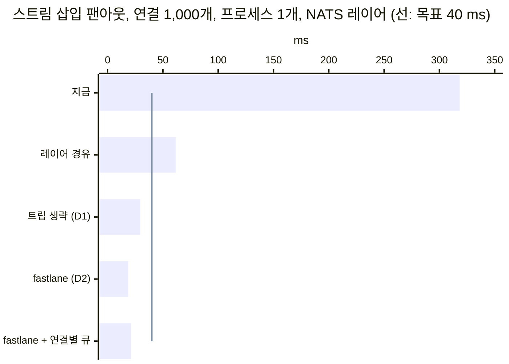
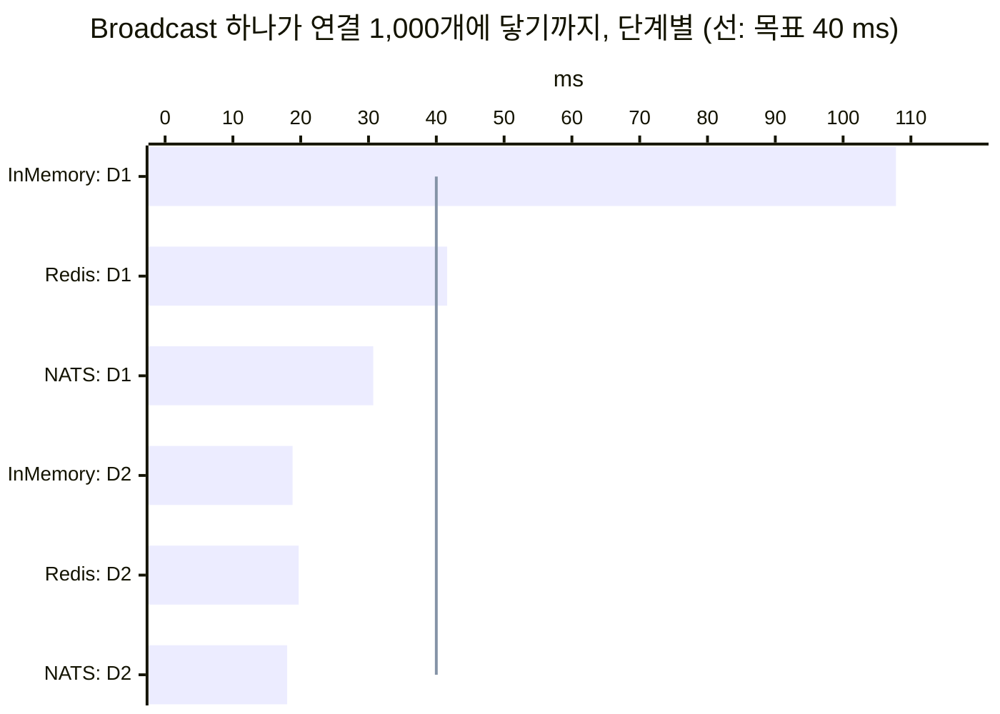
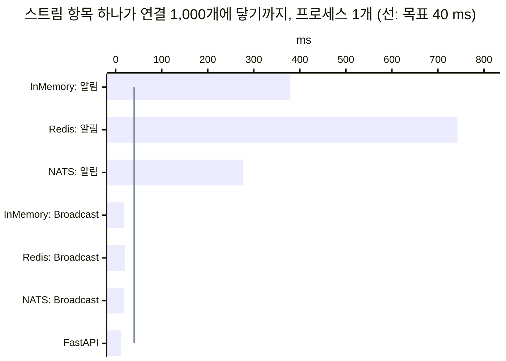

# 렌더 없는 브로드캐스트: 한 번 만든 패치를 구독한 연결 모두에

> 2026-10-06. [#178](https://github.com/itda-work/django-wireview/issues/178)의 설계다.
> [#176](https://github.com/itda-work/django-wireview/issues/176)의 3단계(D)에 해당한다.
> **상태: 구현됨(2026-10-06).** 메인테이너가 §10의 권장안을 그대로 택했고, 1단계(D1)를 잰 뒤 2단계(D2)까지 했다.
> 결과는 §11에 있다. §1~§10은 제안 당시의 글이고, §6-1의 수치는 저장소 밖의 시제품으로 잰 것이다.
> 사용법은 [Broadcast](../features/broadcast.md), #176의 측정과 선택지는 [broadcast-fanout](./broadcast-fanout.md)에 있다.

---

## 0. 요약

- **문제.** 지금 스트림 항목 하나를 모든 연결에 넣으려면 알림을 보낸다. 그러면 연결마다 `notification()`이 돌고,
  `stream_insert()`가 항목을 렌더하고, 그 `stream_op`를 채널 레이어로 자기 세션에 다시 보낸다. 연결 1,000개에서
  이 일은 318~843 ms 걸렸다(§6-1. 레이어에 따라 다르고, main의 코드다).
- **원리.** 발행하는 쪽이 항목을 한 번 렌더하고 프레임을 한 번 직렬화한다. 받는 연결에서는 다시 렌더하지도 다시
  직렬화하지도 않는다. 연결마다 다른 것은 컴포넌트 id 하나뿐이므로, 직렬화해 둔 앞뒤 문자열 사이에 그 id만 끼워
  쓴다. 그 결과는 지금 세션이 보내는 `stream_op`·`exec_js`·`push_event` 프레임과 바이트까지 같다. 그래서
  **브라우저 프로토콜은 바뀌지 않고 `PROTOCOL_VERSION`도 그대로다.**
- **측정(시제품).** 같은 항목을 연결 1,000개에 보낼 때, 프로세스 하나에서 걸린 시간이다.
  - 채널 레이어를 거쳐 세션마다 받되 렌더와 워커 트립을 빼면 29.6~33.9 ms였다.
  - 프로세스마다 한 번만 받아 그 프로세스의 소켓에 바로 쓰면(fastlane) 18.7~25.8 ms였다.
  - 목표는 40 ms 이하다.
- **권장 API.** 공개 이름 하나(`Broadcast`)를 더한다.
  `await Broadcast(Feed, "feed").stream_insert("items", post, at=0).asend()`처럼 쓴다. 대상은 컴포넌트 클래스와
  토픽이다. 받는 쪽은 그 클래스의 인스턴스 가운데 `get_subscriptions()`에 그 토픽이 있고 지금 닿을 수 있는
  (`repo.reachable`) 것뿐이다.
- **보낼 수 있는 것**은 스트림 삽입·삭제, `push_event`, `JS()` 명령이다. 일반 필드 변경은 보낼 수 없다.
  서버가 그 DOM을 diff 기준(`_last_rendered`)과 `data-state`로 추적하기 때문이다(§3-1).
  **사람마다 다른 내용도 보낼 수 없다.** 항목 템플릿이 `this`·`user`·`request`·`perms`·`csrf_token`을 읽으면
  발행이 실패한다(§3-3).
- **단계.** 1단계는 공개 API와 세션 경유 전달(D1)이다. 시제품에서 30~34 ms였다. 2단계는 같은 API 아래에서
  전달 경로만 프로세스 fastlane(D2)으로 바꾼다. 시제품에서 19~26 ms였다. 1단계의 실측이 목표를 넉넉히 넘으면
  2단계를 미룰지는 메인테이너가 정한다(§10).

## 1. 문제와 목표

### 1-1. #176이 잰 것

#176은 브로드캐스트 하나가 연결 1,000개에 닿는 시간을 단계별로 쪼갰다(Board, 항목 50개, uvicorn 1프로세스,
InMemory).

| 항목 | 값 |
|---|---:|
| 팬아웃 (계측 끔, `5a4f037`) | 651.7 ms. #174에서는 632 ms였다 |
| 연결당 CPU | 679.6 µs. 그중 렌더 351.7, diff 136.8, 트립·디스패치 82.6, 채널 레이어 47.0, 세션 코드 38.2, JSON·프레임·압축 23.3 |
| 1단계(B) 뒤 (`a6994e5`) | 팬아웃 445.2 ms, 연결당 459.5 µs. 그중 렌더와 diff가 약 275 µs, 트립·디스패치와 채널 레이어가 약 150 µs |
| 2단계(A) 켬 (`cef17df`, [broadcast-fanout](./broadcast-fanout.md) §7) | 팬아웃 89.6 ms, 연결당 109.0 µs. 같은 회차의 A 끔은 429.0 ms·436.8 µs |
| FastAPI (같은 기계, 같은 회차) | 14.2~16.4 ms. JSON을 한 번 만들고 연결 목록을 돌며 같은 텍스트를 쓴다 |

B는 연결 하나의 비용을 줄였을 뿐 구조는 그대로다. 2단계(A, opt-in 렌더 공유)는 렌더를 메시지당 한 번으로 줄여 연결당
109.0 µs가 됐다. 그래도 연결마다 메시지를 받고 수신자를 돌리고 diff를 만드는 일은 남는다. 그중 InMemory 레이어의 수신
순회 44.5 µs, 트립·디스패치 19.1 µs가 크다(broadcast-fanout §7-3). 그 비용을 없애는 길은 이 문서의 D뿐이다.

### 1-2. 이 문서가 다루는 경우

#176의 Board는 필드(property) 값이 바뀌는 브로드캐스트였다. 이 문서는 그와 다른 흔한 경우를 다룬다. 피드나
채팅이나 알림 목록에 **항목 하나가 들어오는** 경우다. 지금 wireview로는 이렇게 쓴다.

```python
class Feed(Component):
    class Meta:
        template_name = "feed/feed.html"
        subscriptions = {"feed"}

    async def publish(self, text: str):
        post = await Post.objects.acreate(text=text)
        await abroadcast("feed", pk=post.pk)

    async def notification(self, channel, pk):
        await self.stream_insert("items", await Post.objects.aget(pk=pk), at=0)
```

연결마다 다음 일이 일어난다.

1. 채널 레이어에서 메시지를 받는다. Channels가 워커 트립으로 `aclose_old_connections()`를 부른다.
2. `notification()`을 부른다. 위 예처럼 쿼리를 하면 그것도 연결마다 한다.
3. `stream_insert()`가 워커 스레드에서 항목 템플릿을 렌더한다.
4. `stream_op`을 `WireviewMeta.send` → `Broker.send_to_session`으로 **채널 레이어를 한 번 더 거쳐** 자기
   세션에 보낸다(`wireview/core/meta.py`의 `send_to`).
5. `send_render()`가 컴포넌트를 다시 렌더한다. 바뀐 것이 없으면 프레임은 나가지 않지만 렌더는 한다.
6. 4의 메일을 받아 다시 디스패치하고(트립 한 번 더), 그제야 프레임을 쓴다.

모든 연결이 같은 HTML을 받는데도, 연결마다 렌더 두 번, 레이어 왕복 두 번, 트립 두 번을 쓴다.

### 1-3. 목표

| 지표 | 목표 |
|---|---|
| 스트림 삽입 팬아웃 (연결 1,000개, 프로세스 1개, Redis·NATS 레이어) | **≤ 40 ms** |
| 받는 연결의 일 | 렌더 0번, JSON 직렬화 0번, 워커 트립 0번 |
| 브라우저 프로토콜 | 바꾸지 않는다. 옛 번들도 그대로 받는다 |
| 정확성 | refused·join_failed·떠난 컴포넌트에는 가지 않는다. live_session 경계를 넘지 않는다. 사람마다 다른 내용은 발행 시점에 거절한다 |

하지 않는 것도 있다. 일반 필드 변경의 팬아웃은 A(렌더 공유)의 몫이다(§8). 끊긴 동안 놓친 메시지를 다시 보내는
것도 하지 않는다(§4-4). 모델 저장을 자동으로 패치로 바꾸는 선언형 API도 이번 범위가 아니다(§3-4).

## 2. 다른 프레임워크는 같은 일을 어떻게 하나

2026-10-06에 각 저장소의 기본 브랜치를 읽었다. **확인**은 소스나 공식 문서를 직접 읽은 것이고, **추정**은 그것에서
끌어낸 추론이다. 커밋을 고정한 링크는 조사 원문에 있다. 여기에는 결론과 핵심 근거만 옮긴다.

### 2-1. Phoenix

**Channels fastlane (확인).** `Phoenix.Channel.Server.dispatch/3`는 구독자 목록을 돌면서 직렬화기를 키로 하는 맵을
누적한다. 그래서 직렬화기(V1·V2 JSON)마다 **딱 한 번** `fastlane!`로 인코딩한다. 그 바이트는 채널 프로세스를 거치지
않고 transport(소켓) 프로세스로 바로 간다
([`lib/phoenix/channel/server.ex`](https://github.com/phoenixframework/phoenix/blob/2ca60ffe811c0e585835cfc309b645c3a4190df1/lib/phoenix/channel/server.ex#L94-L122)).
프레임을 공유할 수 있는 이유는 V2 프레임 `[join_ref, ref, topic, event, payload]`에서 연결별 필드인 `join_ref`와
`ref`를 `nil`로 두기 때문이다. 연결마다 내용을 바꾸고 싶으면 `intercept`와 `handle_out`을 쓴다. 그러면 구독자마다
인코딩하게 되고, 문서가 그 비용을 직접 경고한다("encoded N times instead of a single shared encoding").

**PubSub (확인).** 분산 어댑터(PG2)는 다른 노드마다 메시지를 한 번 보내고, 받은 노드가 자기 구독자에게 다시
디스패치한다
([`pubsub/pg2.ex`](https://github.com/phoenixframework/phoenix_pubsub/blob/01cf8ed2d71f9f7798314fe79a766214131238ad/lib/phoenix/pubsub/pg2.ex#L16-L30)).
그래서 인코딩은 노드×직렬화기마다 한 번이다. 전달은 `send/2`일 뿐이라 ack도 재전송도 없다(at-most-once는 추정).

**LiveView (확인).** `handle_info`에서 `stream_insert`를 하면, 렌더·diff·인코딩을 모두 그 LiveView 프로세스 안에서
한다. LiveView에는 "한 번 렌더해서 여럿에게 보내는" 공개 기능이 없다. 이 사실은 `lib/`와 문서로 확인했다.
왜 없는지는 추정이다. `phx.gen.live` 생성기는 PubSub 메시지를 HTML이 아니라 데이터 신호로 쓰고, 받으면
`stream(..., reset: true)`로 목록을 DB에서 다시 읽는다. 스트림 항목은 렌더 직후 서버 상태에서 빠진다. 재연결하면
mount가 다시 돌고, 클라이언트는 이번 join이 다시 넣지 않은 스트림 항목을 지운다
([`dom_patch.ts`](https://github.com/phoenixframework/phoenix_live_view/blob/3509f9df969fb6b43a7b80f6ff091ea347d4f139/assets/js/phoenix_live_view/dom_patch.ts#L534-L549)).
`push_event`와 `JS`는 소켓 하나에만 간다.

### 2-2. Rails Turbo Streams

**렌더는 발행 때 한 번이다 (확인).** `broadcast_*_to`는 `ApplicationController.render`로 partial을 한 번 렌더해
`<turbo-stream>` 문자열을 만들고, 그것을 `ActionCable.server.broadcast`로 보낸다. 보통은 커밋 뒤의 `_later` 잡에서
렌더한다
([`broadcasts.rb`](https://github.com/hotwired/turbo-rails/blob/37530c08780fa6f6dbb56a633de4b81169bdd174/app/channels/turbo/streams/broadcasts.rb#L98-L126)).

**사람마다 다른 내용은 관례로만 막는다.** turbo-rails 소스와 handbook에는 이에 관한 문장이 없다. 지침은 DHH가 공식
포럼에서 한 말이다(2차 출처). "Partials used for turbo streaming have to be free of global references"
([discuss.hotwired.dev/t/1752](https://discuss.hotwired.dev/t/authentication-and-devise-with-broadcasts/1752)).
위반해도 오류가 나지 않는다. 값이 조용히 nil이 되거나 남의 정보가 나간다. 사람마다 내용이 달라야 하면 스트림을
쪼갠다(`turbo_stream_from Current.account, :entries`).

**인가는 서명된 스트림 이름이다 (확인).** 페이지를 렌더할 때 `signed-stream-name`을 발급한다. 구독할 때는 서명만
검증하고 사용자를 다시 인가하지 않는다. 서명에는 만료가 없다(영구적이라는 판단은 추정).

**ActionCable은 연결마다 다시 인코딩한다 (확인).** 발행할 때 JSON을 한 번 만든다. 그런데 구독마다 그것을 decode하고
`{identifier, message}` 봉투로 다시 encode한다. 소스의 TODO가 이 낭비를 인정한다
([`channel/streams.rb`](https://github.com/rails/rails/blob/f5aba78292f1c101d7e7d0cca52b55edf76856a5/actioncable/lib/action_cable/channel/streams.rb#L173-L233)).

**Turbo 8 refresh (확인).** `broadcasts_refreshes`는 HTML 없이 신호만 보낸다. 서버에서 0.5초, 브라우저에서 150 ms
디바운스한다. 그 뒤 클라이언트마다 페이지 전체를 HTTP로 다시 가져온다. 렌더는 각자의 요청 맥락에서 하므로 사람마다
다른 내용 문제가 없다. 대가로 구독자 N명이 GET을 N번 한다.

**재연결 (확인 + 추정).** 다시 구독할 뿐 놓친 것을 채우는 코드가 없다. Redis 어댑터는 PUBSUB이라 메시지를 저장하지
않는다.

### 2-3. Laravel Livewire와 Reverb

**Livewire는 브라우저마다 HTTP로 다시 렌더한다 (확인).** `#[On('echo:...')]` 리스너는 브라우저에서 이벤트를 받아
`$wire.call('__dispatch')`를 부른다. 그러면 브라우저마다 자기 컴포넌트 스냅샷을 실어 HTTP POST를 보내고, 서버가
사용자마다 다시 렌더한다
([`supportLaravelEcho.js`](https://github.com/livewire/livewire/blob/eee4431ba2d0327876ca9801c4ddbd15c268f3ee/js/features/supportLaravelEcho.js)).
이 왕복은 문서가 아니라 소스에서 확인했다. Turbo refresh와 같은 모델이고, 단위만 컴포넌트로 좁혀졌다.

**Reverb는 채널×서버마다 한 번 인코딩한다 (확인).** `Channel::broadcast`는 `json_encode`를 한 번 하고, 연결마다
같은 문자열을 `send`한다
([`Channel.php`](https://github.com/laravel/reverb/blob/74c8c4082c07f428d6399cc2f9bc5c6fd1cb1179/src/Protocols/Pusher/Channels/Channel.php#L95-L130)).
Pusher 프로토콜 프레임에는 구독별 식별자가 없다. private·presence 채널은 구독할 때마다 앱의 `/broadcasting/auth`가
socket_id와 채널 이름의 HMAC을 발급한다. 놓친 메시지는 다시 보내지 않는다. 예외는 `cache-` 채널로, 새 구독자에게
마지막 값 하나만 준다. `wire:stream`은 현재 HTTP 응답의 SSE라 브로드캐스트가 아니다.

### 2-4. 비교와 wireview가 가져올 것

| | Phoenix fastlane | LiveView + PubSub | Turbo Streams | Turbo refresh·Livewire | **wireview D (제안)** |
|---|---|---|---|---|---|
| 렌더 | 없음(앱의 payload) | 프로세스마다 | 발행 때 한 번 | 사용자마다 HTTP | 발행 때 한 번 |
| 직렬화 | 노드×직렬화기마다 한 번 | 연결마다 | 한 번 + 구독마다 decode·encode | — | 발행 때 한 번. 연결마다 id만 끼운다 |
| 사람마다 다른 내용 | `intercept`로 (N번 인코딩) | 자연스럽게 됨 | 관례로 금지(조용히 틀림) | 자연스럽게 됨 | **발행 때 오류** |
| 구독 인가 | `join/3` 통과 뒤 | mount 뒤 앱이 subscribe | 무기한 서명 이름 | 요청마다 | join(live_session·on_mount) 통과 뒤 서버가 구독 |
| 유실 | at-most-once | at-most-once, 재연결 때 mount가 다시 그림 | at-most-once | 다음 refresh까지 낡음(추정) | at-most-once, 다시 join하면 `joined()`가 다시 그림 |

wireview가 가져올 것은 넷이다. 첫째, Phoenix처럼 연결별 필드를 프레임에서 분리한다. 직렬화는 한 번 하고, id만
연결마다 끼운다. 둘째, Phoenix·Reverb처럼 프로세스마다 한 번만 받는다. 셋째, Turbo와 달리 사람마다 다른 내용을
관례가 아니라 오류로 막는다. 넷째, LiveView처럼 "놓치면 다음 join이 바로잡는다"를 계약으로 둔다.

## 3. API

### 3-1. 무엇을 보낼 수 있고 무엇은 안 되는가

조건은 하나다. **서버가 추적하지 않는 클라이언트 상태만 렌더 없이 바꿀 수 있다.** 서버는 컴포넌트마다 마지막 렌더
(`WireviewMeta._last_rendered`)를 diff 기준으로 들고 있고, 필드는 `data-state`로 서명해 둔다. 렌더 없이 그 DOM이나
필드를 바꾸면 기준이 어긋난다. 그러면 다음 diff가 틀린 자리에 들어가거나, 다음 morph가 바꾼 것을 되돌린다.
다시 join하면 서명된 옛 상태로 돌아간다.

| 연산 | 가능 | 근거 |
|---|---|---|
| 스트림 삽입 `stream_insert` | 예 | 스트림 컨테이너는 morph 대상에서 빠지고(`wire-stream`), 서버는 항목을 들고 있지 않다. 같은 dom id가 이미 있으면 제자리에서 교체하므로 두 번 와도 결과가 같다 |
| 스트림 삭제 `stream_delete` | 예 | 위와 같다. 없는 id를 지우면 아무 일도 없다 |
| 스트림 초기화 `stream` (reset) | **첫 범위에서 뺀다** | 형태로는 가능하다. 하지만 받는 모든 화면의 목록을 통째로 바꾼다. 연결마다 필터나 페이지가 다른 목록(검색 결과, 내 항목만)을 다른 목록으로 덮게 된다. 결정 항목 §10-6 |
| `push_event` (훅) | 예 | 서버가 추적하지 않는 일회성 신호다. 받는 훅이 없으면 버려진다 |
| `JS()` 명령 (`exec_js`) | 예 | 클라이언트만의 동작이다. 다만 서버가 그린 요소의 클래스·속성을 바꾸면, 그 요소의 다음 morph가 서버 HTML로 되돌린다. 세션마다 보내는 지금의 `push_js`와 같은 성질이다 |
| 필드 변경, 컴포넌트 렌더 | **아니오** | 위의 이유다. 같은 화면을 모두가 보는 필드 변경은 A(렌더 공유)가 줄인다(§8) |
| `flash`·`title`·`url_change` | 첫 범위 밖 | 페이지 단위 명령이라 형태로는 보낼 수 있다. 하지만 이동(`url_change`)을 모두에게 보내는 쓰임은 위험하다. flash는 이미 `toast()`가 있다. 필요가 확인되면 연산을 더한다 |

### 3-2. 후보와 권장

세 후보 모두 대상을 정하는 방법, 연산을 나열하는 방법, 동기 경로(신호 수신자, `on_commit`)를 갖춰야 한다.

**후보 1. 컴포넌트 클래스 메서드와 키워드.**

```python
await Feed.abroadcast_patch("feed", stream_insert=("items", post), push_event=("posted", {"pk": post.pk}))
```

- 장점: 클래스에서 기본 항목 템플릿(`{template_name}_item.html`)과 dom id 규칙을 얻는다. 찾기 쉽다.
- 단점: 연산 종류마다 키워드가 하나라서, 같은 연산을 두 번 하거나 순서를 정할 수 없다. 튜플 인자는 읽기 어렵다.
  `Component`에 멤버를 더하면 그 이름은 프레임워크의 것이 된다. 그래서 같은 이름의 사용자 메서드는 그날부터
  이벤트 핸들러가 아니다([호환성 정책](../COMPATIBILITY.md), W018). 한 기능에 이름이 둘(`abroadcast_patch`,
  `broadcast_patch`) 든다.

**후보 2. 스트림 전용 함수와, 받는 쪽의 Meta 선언.**

```python
class Feed(Component):
    class Meta:
        broadcast_streams = {"feed": "items"}     # 토픽 "feed"의 패치를 스트림 "items"로 받는다

await abroadcast_stream_insert("feed", "items", post, template="feed/feed_item.html")
```

- 장점: 받는 쪽이 선언하므로 시스템 체크가 받는 항목 템플릿을 미리 검사할 수 있다.
- 단점: 이름이 많다(함수 둘~셋, Meta 키 하나). `push_event`와 `JS`는 다루지 못한다. 발행하는 쪽이 템플릿을 매번
  적어야 한다. 받는 쪽 선언과 발행하는 쪽 이름이 어긋나도 조용히 아무 일도 없다.

**후보 3 (권장). `Broadcast` 빌더 하나.**

```python
from wireview import Broadcast

# 핸들러, async 뷰, 백그라운드 작업에서
await Broadcast(Feed, "feed").stream_insert("items", post, at=0, limit=50).push_event("posted", {"pk": post.pk}).asend()

# 신호 수신자처럼 동기인 곳에서 (지금의 broadcast()처럼 트랜잭션 커밋 뒤에 보낸다)
Broadcast(Feed, "feed").stream_delete("items", instance.pk).send()
```

- 생성자에는 대상인 컴포넌트 클래스와 토픽 하나를 넘긴다. 연산은 `JS()`처럼 체인으로 쌓고, 쌓은 순서대로 간다.
- 연산은 넷이다. `stream_insert(name, item, *, at=-1, limit=0, template=None, dom_id=None)`,
  `stream_delete(name, dom_id)`, `push_event(event, payload, *, hook_id=None)`, `js(JS)`. 인자의 뜻과 기본값은
  `Component`의 같은 이름 메서드와 같다. 기본 템플릿과 dom id(`{name}-{pk}`)는 대상 클래스에서 얻는다. 그래서
  `joined()`의 `stream()`과 브로드캐스트가 같은 id를 쓴다.
- 보내기는 둘이다. `await asend()`는 바로 보낸다. `send()`는 `broadcast()`처럼 `on_commit`으로 미룬다. 미룬 경우
  항목도 커밋 뒤에 렌더한다. 롤백된 트랜잭션의 항목은 렌더하지 않고, 렌더 시점의 DB는 커밋된 상태다. Turbo의
  `_later`와 같은 순서다.
- 받는 것은 **대상 클래스의 인스턴스**(정확히 그 클래스, §10-2) 가운데 `get_subscriptions()`에 그 토픽이 있고,
  그 연결에서 지금 닿을 수 있는(`repo.reachable`) 것이다. 연결 하나에 둘 있으면 둘 다 받는다.

권장 이유는 다음과 같다.

1. 공개 이름이 하나다. `Component`에 멤버도, `Meta`에 키도 더하지 않는다. 그래서 사용자 메서드와 이름이 부딪칠
   일이 없다(W018).
2. 대상을 클래스로 정하면, 그 클래스를 고른 사람이 그 클래스의 받는 방식을 책임진다. 토픽만으로 정하면 위험하다.
   어떤 컴포넌트가 같은 토픽을 구독하면서 `notification()` 안에서 사람마다 걸러 내고 있을 수 있다. 그 토픽에
   누군가 패치를 보내면, 그 컴포넌트는 거르지 못한 HTML을 그대로 받는다. 후보 2는 이 문제를 받는 쪽 선언으로
   막고, 후보 3은 대상 이름으로 막는다. 후보 3이 이름을 덜 쓴다.
3. 기본 템플릿과 dom id를 클래스에서 얻으므로, 같은 목록을 그리는 세 경로(`stream()`, `stream_insert()`,
   브로드캐스트)가 같은 규칙을 쓴다.
4. `JS()`라는 체인 빌더가 이미 있다. 같은 모양이라 새로 배울 것이 적다.

이름 `Patch`는 버렸다. 이 저장소에서 "patch"는 이미 두 뜻으로 쓰인다. 하나는 같은 경로로의 `push_to`가 페이지를
가져오지 않는 이동이고(#169), 다른 하나는 DOM 패치다. `Broadcast`도 모듈 함수 `broadcast()`와 이름이 겹친다.
그래도 그 함수와 같은 일(발행)의 다른 형태라서 덜 헷갈린다고 판단했다. 이름은 결정 항목 §10-1에 남긴다.

### 3-3. 사람마다 다른 내용을 막는 법

받는 사람이 없는 렌더이므로, 항목 HTML은 보는 사람과 무관해야 한다. 지금의 `_render_stream_item`은
`{"item": item, "this": self}`로 렌더하고 request를 넘기지 않는다. 그래서 컨텍스트 프로세서가 돌지 않고, `user`는
지금도 빈 값이다. 보는 사람에 기대는 길은 사실상 `this`(그 연결의 컴포넌트)와, 렌더 중에 읽히는 전역 상태 둘뿐이다.

| 지점 | 막는 법 | 잡는 것 | 잡지 못하는 것 |
|---|---|---|---|
| 렌더 컨텍스트 | 컨텍스트는 `{"item": item}`이다. `this`·`user`·`request`·`perms`·`csrf_token` 자리에는 감시 객체를 둔다. 감시 객체는 속성 접근, `str()`, 진릿값 평가에서 오류를 낸다. 그 오류에는 `silent_variable_failure`가 없으므로 Django가 삼키지 않는다. 오류는 발행한 코드(핸들러)에서 나고 변수 이름을 말한다 | `{{ this.x }}`, ``, ``, `{{ request.path }}` | 항목 객체의 property가 전역에서 현재 사용자를 읽는 경우(아래) |
| 언어·시간대 | 항목을 `translation.override(settings.LANGUAGE_CODE)`와 기본 시간대 아래에서 렌더한다. 발행한 요청이 켜 둔 언어나 시간대가 모두에게 새지 않게 한다 | 발행자의 언어로 번역된 항목이 다른 사용자에게 가는 것 | 사용자마다 시간대를 달리 보여 주고 싶은 앱. 시각은 `<time datetime="...">`로 보내고 훅에서 지역 시각으로 바꾸거나, 언어별 토픽(`feed.ko`, `feed.en`)으로 나눈다. Rails도 같은 조언을 한다 |
| 항목 객체 | 문서로 알린다 | — | thread-local이나 contextvar로 "현재 사용자"를 읽는 property(django-crum류). `sync_to_async`가 contextvar를 워커 스레드로 옮기므로, 발행한 사람의 권한으로 계산된 값이 모두에게 갈 수 있다. Turbo의 Current attributes 경고와 같은 함정이다 |
| 대상 | 클래스로 정한다(§3-2) | 다른 클래스가 같은 토픽에서 하던 사람별 거르기를 건너뛰는 것 | — |
| 테스트 | `wireview.testing`의 `mount()`가 받은 브로드캐스트를 `stream_ops`에 남긴다(§9-2) | 앱이 자기 템플릿을 브로드캐스트 경로로 렌더해 보는 것 | — |

감시 객체를 DEBUG에서만 둘지, 언제나 둘지는 결정 항목이다(§10-3). 권장은 **언제나**다. 비용은 렌더당 객체 몇 개
뿐이다. 그리고 운영에서만 조용히 빈 값이 되면, 위반이 Turbo처럼 숨는다.

시스템 체크는 첫 범위에 넣지 않는다. 후보 3에서는 어떤 템플릿이 브로드캐스트로 렌더될지 정적으로 알 수 없다.
런타임 감시가 실제로 실행한 경로를 정확히 잡는다. 체크로 미리 잡으려면 받는 쪽 선언(후보 2)이 필요하다.

### 3-4. 모델 알림(AUTO_BROADCAST)과의 결합

`AUTO_BROADCAST`는 모델 신호를 `model_mutation`으로 보내고, 받는 컴포넌트마다 `mutation()`을 부른다. 그 안에서
`stream_insert`를 하면 §1-2의 경로가 된다. 렌더 없는 브로드캐스트와 묶는 길은 둘이다.

- **(권장, 첫 범위) 앱이 신호 수신자에서 직접 보낸다.**

  ```python
  @receiver(post_save, sender=Post)
  def _post_saved(sender, instance, created, **kwargs):
      if created:
          Broadcast(Feed, "feed").stream_insert("items", instance, at=0, limit=50).send()
  ```

  `send()`는 커밋 뒤에 렌더하고 보낸다. 어느 목록에 넣을지(토픽), 어디에 넣을지(`at`), 무엇으로 그릴지(템플릿)를
  앱이 정한다.
- **(나중) 선언형.** Rails의 `broadcasts_to`처럼 컴포넌트나 모델에 "이 모델이 저장되면 이 스트림에 넣는다"를
  선언하는 것이다. 어느 행이 어느 토픽에 속하는지, 삭제·수정을 어떻게 다룰지, `senders` 매핑([auto-broadcast-fields](./auto-broadcast-fields.md))과
  어떻게 맞출지까지 정해야 한다. 첫 범위의 쓰임을 보고 별도 이슈로 연다.

같은 항목을 `mutation()`의 `stream_insert`와 브로드캐스트가 둘 다 넣으면 안 된다. dom id가 같아 결과는 같지만
일을 두 번 한다. 튜토리얼의 "핸들러와 `mutation()` 양쪽에서 넣지 마세요"
([Streams API](../tutorials/06-streams-api.md))와 같은 규칙이다.

## 4. 일관성

### 4-1. 렌더 없이 DOM이 바뀌면 서버는 무엇을 아는가

아무것도 모른다. 그리고 몰라도 맞아야 한다.

- **스트림.** 서버는 원래 스트림 항목을 들고 있지 않다. `data-state`에도 항목이 없다. 컴포넌트가 다시 렌더해도
  `wire-stream` 컨테이너는 morph에서 빠지므로, 브로드캐스트가 넣은 항목이 남는다. 세션이 보낸 `stream_insert`와
  같은 계약이다.
- **`push_event`.** 훅에 가는 일회성 신호다. 서버 상태와 관계가 없다.
- **`JS()`.** 클라이언트만의 변경이다. 서버가 그린 요소의 속성을 바꾸면 그 요소의 다음 morph가 되돌린다. 세션마다
  보내는 지금의 `push_js`도 같다. 오래 남아야 하는 상태라면 브로드캐스트로 보낼 것이 아니라 필드여야 한다.
- **필드.** 바뀌지 않는다. 그래서 필드에 기대는 화면(개수 표시 같은 것)은 브로드캐스트로 바꿀 수 없다. 개수와
  목록을 함께 바꿔야 하면, 목록은 브로드캐스트로 보내고 개수는 알림(필요하면 A)으로 보낸다.

### 4-2. 재연결과 다시 join

다시 join하면 `joined()`가 다시 돈다. 스트림을 쓰는 컴포넌트는 거기서 `stream()`으로 DB의 지금 목록을 다시
보낸다(reset). 그 reset이 끊기기 전에 받은 브로드캐스트 항목을 모두 갈아 치운다. 끊긴 동안 놓친 항목도 DB에
있으면 다시 보인다. LiveView와 같은 성질이다(§2-1).

그 결과 두 가지가 앱의 책임이 된다.

- **DB에 없는 항목은 재연결하면 사라진다.** 저장하지 않는 채팅처럼 브로드캐스트로만 존재하는 항목은 재연결 뒤
  목록에서 빠진다. 지금의 `stream_insert`도 같다.
- **`push_event`와 `JS()`는 다시 보내지 않는다.** 훅은 `reconnected()`에서 필요한 것을 다시 읽는다([훅](../features/hooks.md)).

### 4-3. 구독이 시작되는 순서

이 절이 이 설계에서 가장 미묘하다. 지금의 join은 다음 순서로 돈다(`WireviewSession.command_join`).

1. `joined()`가 pending 모드에서 돈다. 그 안의 `stream()` reset은 큐에 쌓인다.
2. 첫 render를 쓴다.
3. 구독을 맞춘다(`after_mutation_chores` → `group_add`).
4. 큐를 비운다(`flush_pending`). 스트림 연산은 **세션 메일**이다. 채널 레이어를 거쳐 자기 채널로 가고, 지금 핸들러가
   끝난 **뒤에** 처리되어 프레임이 된다.
5. `joined`를 같은 메일 경로로 보낸다. 그래서 4 다음에 도착한다.

알림이라면 이 순서로 맞다. 3 뒤에 온 알림은 같은 컨슈머가 차례로 처리한다. 그 `notification()`의 `stream_insert`가
낸 메일은 4의 reset 메일 **뒤에** 줄을 서므로, 삽입이 reset에 지워지지 않는다.

렌더 없는 브로드캐스트는 이 줄을 건너뛴다. 3과 4의 메일 처리 사이에 패치가 도착하면, 그 프레임이 reset 프레임보다
먼저 써지고, 곧이어 온 reset이 그것을 지운다. 그 항목이 `joined()`의 쿼리보다 늦게 커밋됐다면 화면에 끝내 나오지
않는다. 이것은 D1(세션 경유)과 D2(fastlane) 모두에 해당한다. D1도 패치 메시지가 reset 메일보다 먼저 채널에 들어올
수 있기 때문이다.

**권장은 "잡아 두었다가 놓아준다"이다.**

- 컴포넌트를 받는 쪽 장부에 **잡힌 상태로** 올린다. 그 사이에 온 패치는 그 컴포넌트 앞으로 쌓아 둔다.
- 세션이 자기 메일로 보낸 `joined`(옛 클라이언트에는 내부 표식 메일)를 처리할 때 놓아준다. 그 메일은 `joined()`가
  쌓은 연산들 뒤에 도착하므로, 쌓아 둔 패치가 reset 뒤에 써진다.
- 쌓아 둔 것이 상한을 넘으면 §6-4의 넘침 규칙을 따른다.

**한 걸음 더(권장, 결정 항목 §10-5).** 잡힌 등록을 3이 아니라 1 **앞**, 곧 `joined()`가 DB를 읽기 전으로 당긴다.
그러면 `joined()`의 쿼리와 구독 사이의 틈이 닫힌다. 쿼리 전에 커밋된 항목은 reset에 들어 있다. 쿼리 뒤에 커밋된
항목은 쌓아 둔 패치로 온다. 둘 다에 들어간 항목은 dom id가 같아 제자리에서 교체되므로 결과가 같다. 이것이
Phoenix의 "mount에서 먼저 subscribe하고 읽는다"와 같은 순서다. 다만 `get_subscriptions()`가 `joined()`에서 정하는
값에 기대면 그 토픽은 `joined()` 뒤에야 알 수 있다. 그 경우의 틈은 지금 알림이 가진 틈과 같다. 문서에 적는다.

이 틈은 지금 알림에도 있다. 쿼리 뒤, `group_add` 전에 발행된 알림은 그 연결에 닿지 않는다. 같은 당김을 알림
구독에도 할지는 이 이슈 밖이다. 다만 같은 장치로 할 수 있다.

LiveComponent도 같다. 부모의 render(`_render_tree`)가 자식을 만들고 `joined()`를 돌린 뒤 자식의 큐를 비운다. 그
자식의 `joined` 메일에서 놓아준다. 부모가 자식을 그리지 않게 되면(`leaving()`) 바로 장부에서 내린다.

**join 밖의 reset(구현 검수에서 추가).** 같은 경합은 `joined()` 밖에도 있다. 이벤트 핸들러·`params_changed`·
`notification()`·LiveComponent `update()`가 부른 `stream()` reset도 세션 메일이라, 그 사이에 온 패치를 지운다. 처음
구현은 join만 잡았고 검수(D1)가 핸들러에서 재현했다. 그래서 잡기·놓기를 `stream()` 자신에게 옮겼다. 세션이 토픽을 듣는
컴포넌트의 `wire.patch_gate`에 자기 잡기·놓기를 두고, `stream()`은 목록을 읽기 **전에** 잡고 reset을 보낸 뒤
`release_patches` 메일을 그 뒤에 보낸다. 핸들러마다 잡는 길(모든 디스패치 경로를 감싼다)도 있었지만, `start_async`의
콜백처럼 세션 밖 태스크에서 부르는 `stream()`까지 한 곳에서 덮는 쪽을 골랐다. 대가는 목록을 미리 읽어 리스트로 넘기는
경우다 — 읽기와 `stream()` 사이의 틈은 남고, 기능 문서가 QuerySet을 넘기라고 적는다.

재검수(R1·R3)가 잡기를 컴포넌트당 참·거짓 하나로 둔 것을 깼다. 한 핸들러의 두 reset은 첫 reset의 놓기 메일로 둘째
reset 동안 온 패치까지 내보냈고(`reset → insert → reset`), 만료된 홀드의 늦은 메일이나 `send_render`가 한 번 더 보낸
놓기가 같은 인스턴스의 다음 홀드를 풀었다. 그래서 잡기를 **토큰**으로 센다. join의 잡기와 reset마다의 잡기가 각자
토큰을 받고, `release_patches` 메일이 자기 토큰을 싣는다. 남은 토큰이 없을 때에만 잡아 둔 패치가 나간다. 토큰은 연결에서
고유하므로 낡은 메일은 지금의 홀드를 건드리지 못한다. 잡다가 구독(`group_add`)이 실패하면 그 토큰을 돌려준다(R4).
연결이 닿지 않는 인스턴스와 닫힌 연결은 잡지 않는다(R6). `wireview.testing`의 `mount()`도 같은 순서를 지킨다(R5).

**놓기 메일이 버려지면.** 놓기는 세션 메일이므로 꽉 찬 채널이 버릴 수 있다. 그러면 잡힌 패치가 영영 풀리지 않는다.
놓기 메일이 채널로 나갈 때 그 토큰에 기한(`patches.HOLD_SECONDS`, 10초)을 걸고, 넘으면 경고와 함께 그 토큰을 놓는다.
닫지 않는 이유는 reset 메일이 함께 버려졌다면 닫아도 다시 join하는 것 말고 얻는 것이 없고, 버려지지 않았다면 쓰는 것이
맞기 때문이다. 기한은 메일이 **채널로 나갈 때**부터 잰다. 잡을 때부터 재면 오래 걸리는 `joined()`가 기한을 넘겨 reset
전에 풀린다. pending 모드(`joined()`, LiveComponent `update()`)의 메일은 렌더 뒤 `flush_pending`까지 큐에 있으므로
`WireviewMeta.after_flush`로 그때 건다 — 큐에 넣을 때 건 첫 수정은 렌더가 길면 reset보다 먼저 풀렸다(재검수 R2).

### 4-4. 유실과 순서

**at-most-once다.** 다음 경우에 패치가 그 연결에 닿지 않는다.

- 채널 레이어가 버린다. 꽉 찬 멤버에게 `group_send`는 조용히 버린다. channels_redis는 INFO 로그를 남기고, InMemory는
  아무 말도 없고, channels-nats는 받는 쪽에서 WARNING을 남긴다(`ChannelsBroker` docstring).
- 연결의 보낼 큐가 넘친다(§6-4). 그때는 버리지 않고 소켓을 닫는다. 페이지는 다시 연결해 join하고, 그 join이
  화면을 바로잡는다.
- 연결이 끊겨 있다. 다시 join하면 §4-2대로 바로잡힌다.
- 롤링 배포 중이다. 옛 프로세스의 연결은 새 그룹(§7-2)에 들어 있지 않아 받지 못한다. 그 프로세스가 내려가면
  다시 연결해 바로잡힌다.

연결이 살아 있는 동안 버려진 패치는 다음 join(재연결·새로고침·이동)까지 화면에 빠진 채 남는다. 지금의 알림도 같다.
놓친 것을 알아채는 번호(시퀀스)를 붙여 클라이언트가 다시 join을 청하게 하는 길이 있다. 하지만 이것은 새 프로토콜
형태가 되므로 첫 범위에 넣지 않는다(§10-9).

**순서.** 한 발행 프로세스가 한 토픽에 보낸 패치들은, 채널 레이어가 그 순서를 지키는 한 각 연결에 같은 순서로
간다. InMemory와 NATS는 그렇다. Redis는 채널마다 정렬 집합에 시각을 점수로 쌓는다. 서로 다른 발행 프로세스
사이에는 순서가 없다. 지금의 알림과 같다. 한 브로드캐스트 안의 연산들(삽입 다음 `push_event`)은 한 메시지로
가므로 언제나 쌓은 순서대로 적용된다. 같은 컴포넌트를 향한 패치와 세션 출력 사이의 순서는 §4-3의 join 때만
정한다. 그 밖에는 서로 다른 DOM(스트림 컨테이너, 훅)을 바꾸므로 순서에 기대지 않는다.

**발행한 연결도 받는다.** 발행한 컴포넌트가 그 토픽을 구독하고 있으면 자기 패치도 받는다. 핸들러에서 직접 넣고
브로드캐스트도 보내면 같은 항목이 두 번 온다(결과는 같다). "발행자 빼고"(Laravel의 `toOthers`)는 첫 범위에 넣지
않는다(§10-8).

## 5. 권한과 경계

**구독이 곧 권한이다.** 렌더 없는 브로드캐스트에는 받는 쪽 코드가 없다. 그래서 받는 쪽에서 사람마다 걸러 낼 수도
없다. 누가 받을지는 오직 구독으로 정해지고, 구독은 서버의 컴포넌트 코드(`get_subscriptions()`)가 정한다. 그
코드는 join이 통과한 뒤의 인스턴스에서 돈다.

- 인스턴스의 필드는 서명된 `data-state`에서 온다. 클라이언트가 토픽을 고를 수 없다.
- 그 인스턴스는 live_session의 `authorize`와 `on_mount`를 통과했다([live_session](../features/live-session.md)).
  `Meta.live_sessions`를 선언한 클래스는 그 경계의 페이지에만 존재한다. 그래서 대상을 클래스로 정하면 경계도 그
  클래스의 것을 따른다.
- 토픽 이름에 받을 사람을 담는다. 방이면 `room.{id}`으로 하고, 그 방의 멤버인지는 `on_mount`나 `joined()`에서
  확인해 아니면 halt한다. Turbo의 "서명된 이름, 만료 없음"과 달리, wireview는 join할 때마다 서버가 다시 판단한다.

**refused·join_failed·떠난 컴포넌트.** 받는 쪽 장부는 구독 집합과 같은 자리에서 다시 계산한다. 그 계산은
`repo.reachable_components()`를 돌기 때문에 refused(`repo.refused`)는 처음부터 빠진다. 장부만 믿지 않고, 프레임을
쓰기 직전에도 `repo.reachable(id)`를 다시 묻는다(사전 조회 하나, 1 µs 안쪽). 다음 경로에서는 장부를 바로 고친다.
`_join_failed`, `_crashed`, `command_leave`, LiveComponent의 `leaving()`, 연결의 `stop()`이다. `_join_failed`는
지금 구독을 다시 계산하지 않는다. 알림은 받을 때 `reachable`을 다시 보기 때문에 문제가 없었다. 브로드캐스트에서는
쓰기 직전의 확인이 그 몫을 한다.

**인증 세대.** 로그아웃이나 다시 로그인하면 인증 토픽(`wireview.auth.<지문>`)이 그 세대의 소켓을 닫는다.
`stop()`이 장부를 비운다. 발행과 소켓 닫힘 사이의 몇 ms 동안 패치가 갈 수 있다. 지금의 알림도 같다.

**발행할 권한.** `Broadcast`는 서버 코드에서만 부를 수 있다. 클라이언트가 부를 수 있는 핸들러 안에서 부르면, 그
핸들러가 이미 지나야 하는 인가를 따른다. 따로 더할 것은 없다.

## 6. 전송

### 6-1. 측정

같은 스트림 삽입을 연결 1,000개에 보내는 경로 다섯을 쟀다. 라이브러리 코드는 main(`19959c9`) 그대로 썼다. 그래서
#176의 1단계(B)는 들어 있지 않다.

**환경.** Apple M5 Pro(18코어), macOS 27.0, Python 3.14.7, Django 6.0, channels 4.3.2, channels_redis 4.3.0,
channels-nats 0.6.1, redis-server 8.10.1, nats-server 2.14.6, uvicorn 0.38.0(`--ws websockets`, permessage-deflate
켜짐), websockets 15.0.1. 이 기계는 Parallels VM(CPU 약 230%)과 다른 작업을 함께 돌리고 있었다. load average는
회차마다 5.4~15.8이었다. 회차별 값과 load를 함께 적는다.

**방법.** 스크래치 스크립트로 쟀다. 회차마다 uvicorn 1프로세스를 새로 띄우고 클라이언트 1,000개를 붙인다. 그중 하나가
발행을 일으키고, 모든 클라이언트가 `stream_op` 프레임을 받기까지의 시간을 잰다. 워밍업 3번 뒤 10번을 재고, 회차
안의 중앙값을 낸다. 회차는 3번이고 경로의 순서는 회차마다 섞는다. 서버 프로세스의 CPU(user + system)는 잰
발행 동안의 값을 연결 수로 나눴다. 이 CPU에는 마지막 프레임 뒤의 일도 들어간다. 예를 들어 InMemory 레이어의 다음
`receive()`가 부르는 `_clean_expired`다. 그래서 CPU를 연결 수로 나눈 값이 시간을 연결 수로 나눈 값보다 클 수 있다.
항목은 `<li>` 하나(작성자, 본문, 시각, 번호)다. 프레임은 지금 경로 325 B, 시제품 338 B다. 시제품의 컴포넌트 id가
13자 길어서 생긴 차이다.

| 경로 | 무엇을 하나 |
|---|---|
| **지금** | 실제 wireview다. `abroadcast` 알림을 받으면 연결마다 `stream_insert`를 한다(§1-2의 1~6) |
| **레이어 경유** | wireview가 아닌 Channels 컨슈머로 만든 시제품이다. 발행하는 쪽이 항목을 한 번 렌더하고 프레임의 앞뒤 문자열을 만든다. `group_send` 뒤 연결마다 핸들러가 id를 끼워 쓴다. Channels의 `dispatch`가 핸들러 앞에서 `aclose_old_connections()` 트립을 탄다 |
| **레이어 경유, 트립 생략 (D1)** | 위와 같되, 이 메시지 종류에만 그 트립을 건너뛴다 |
| **fastlane (D2)** | 프로세스의 채널 하나를 그룹에 넣는다. 프로세스는 메시지를 한 번 받아 자기 소켓 장부를 돌며 바로 쓴다 |
| **fastlane + 연결별 큐 (D2 권장형)** | 위와 같되, 프레임을 연결마다의 큐에 넣고 그 연결의 태스크가 쓴다 |

**연결 1,000개, 프로세스 1개** (회차 중앙값의 중앙값, 괄호는 회차 셋):

| 경로 | InMemory | Redis | NATS | 연결당 CPU µs (InMemory / Redis / NATS) |
|---|---:|---:|---:|---:|
| 지금 | 406.9 ms (355.4, 463.3, 406.9) | 842.7 ms (1,051.3, 824.3, 842.7) | 318.3 ms (292.3, 318.3, 321.4) | 447.6 / 822.3 / 325.5 |
| 레이어 경유 | 68.4 ms (61.7, 77.3, 68.4) | 60.7 ms (58.8, 60.7, 67.6) | 61.6 ms (55.4, 61.6, 61.6) | 110.3 / 78.9 / 68.1 |
| 레이어 경유, 트립 생략 (D1) | 31.6 ms (28.8, 31.6, 35.4) | 33.9 ms (34.4, 29.3, 33.9) | 29.6 ms (26.9, 29.6, 35.3) | 86.6 / 48.0 / 32.4 |
| fastlane (D2) | 25.8 ms (20.5, 28.4, 25.8) | 22.4 ms (19.5, 22.4, 22.5) | 18.7 ms (18.7, 18.7, 29.7) | 24.4 / 21.5 / 18.3 |
| fastlane + 연결별 큐 | 20.8 ms (19.8, 23.6, 20.8) | 23.7 ms (25.3, 21.6, 23.7) | 21.1 ms (20.7, 29.8, 21.1) | 21.2 / 23.3 / 22.1 |



**연결 1,000개, 프로세스 4개** (`uvicorn --workers 4`, 회차 둘). 이 구성은 연결이 워커에 고르게 나뉘는지 따로 보지 않았다.

| 경로 | Redis | NATS |
|---|---:|---:|
| 지금 | 694.2 ms (826.4, 562.1) | 243.6 ms (340.5, 146.7) |
| 레이어 경유, 트립 생략 (D1) | 23.6 ms (23.3, 23.9) | 21.6 ms (22.5, 20.7) |
| fastlane + 연결별 큐 (D2) | 16.8 ms (19.4, 14.2) | 13.9 ms (14.8, 13.0) |

읽는 법은 다음과 같다.

- **지금의 경로가 느린 이유는 렌더와 왕복이다.** 연결당 CPU가 325~822 µs다. Redis가 가장 느린 이유는 §1-2의
  4번 단계 때문이다. 연결마다 하는 세션 메일이 Redis 왕복이다. 프로세스를 넷으로 늘려도 Redis에서는 694 ms에
  머문다.
- **렌더를 빼도, Channels가 메시지마다 타는 트립이 남으면 60 ms대다.** 그 트립 하나를 빼자 시간이 절반이 됐다
  (61~68 → 30~34 ms). 트립 하나가 연결당 약 30 µs다. #176의 트립 비용(겹칠 때 약 18 µs)에, 스레드를 깨우는 지연이
  더해진 값이다.
- **D1은 프로세스 하나에서 목표 근처다.** 29.6~33.9 ms다. 다만 시제품의 핸들러는 id를 끼우기만 한다. 실제 세션
  코드는 받는 컴포넌트를 찾고, `reachable`을 확인하고, 잡힌 상태를 본다. 그 몫을 연결당 3~6 µs로 추정하면
  **약 33~40 ms**다. 목표를 아슬아슬하게 맞춘다.
- **D2는 목표 안쪽이다.** 18.7~25.8 ms다. 연결당 CPU 18~24 µs는 #176의 "JSON·프레임·압축" 몫(연결당 23.3 µs)과
  같은 크기다. 남은 일이 사실상 프레임 쓰기와 압축뿐이다. FastAPI(#176, 36 B 프레임)의 14.2~16.4 ms와는 몇 ms
  차이다.
- **연결별 큐의 비용은 측정 오차 안이다.** 큐는 느린 연결 하나가 나머지를 막지 않게 한다(§6-4). 이 이점을 거의
  공짜로 얻는다.
- **프로세스 4개에서는 13.9~23.6 ms다.** 프로세스 하나보다 덜 줄었다. 클라이언트 1,000개를 한 드라이버 프로세스가
  받으므로, 이 값에는 측정 쪽의 바닥이 섞여 있다고 본다(추정).

### 6-2. 채널 레이어가 그룹 메시지 하나를 연결마다 어떻게 나르나

| 레이어 | `group_send` 하나가 같은 프로세스의 멤버 N개에 닿는 방식 | 연결당 레이어 비용 |
|---|---|---|
| InMemory | 멤버마다 `deepcopy`해 큐에 넣는다(#176: 연결당 2.5 µs). 멤버의 `receive()`는 들어올 때마다 `_clean_expired()`로 모든 채널과 그룹을 훑는다(#176: 1,000개에서 44.5 µs, 2,000개에서 93.0 µs). 그래서 팬아웃 전체가 N²에 비례한다 | 크다. 연결 수에 비례해 는다 |
| channels_redis 4.3 | 프로세스 로컬 채널(`specific.<접두사>!<id>`)은 프로세스마다 Redis 키 하나를 함께 쓴다. `_map_channel_keys_to_connection`이 키마다 메시지를 **한 번** 직렬화하고, `__asgi_channel__`에 그 프로세스의 멤버 목록을 담는다. 받는 쪽은 한 번 역직렬화해 **같은 dict**를 각 멤버의 버퍼에 넣는다(`core.py` 586~631행, 340~347행) | 작다. 버퍼 넣기와 Channels 디스패치 정도다 |
| channels-nats 0.6 | 그룹 subject로 한 번 publish한다. 각 프로세스의 그룹 구독이 받은 bytes를 멤버마다 메일박스에 넣고(`_group_deliver`), 각 멤버의 `receive()`가 **멤버마다 msgpack을 디코드**한다(`_decode`) | 중간이다. 프레임 크기에 비례하는 디코드가 멤버마다 있다 |

어느 레이어든 그 뒤에는 Channels가 멤버마다 `dispatch`를 한다. 그 안에서 asyncio가 깨어나고, 기본 디스패치는
워커 트립을 탄다. D1은 이 멤버별 비용을 그대로 진다. D2는 프로세스마다 한 번만 받으므로 레이어 비용이 프로세스
수에 비례하고, 연결 수와는 무관하다.

### 6-3. D1: 세션 경유

- 발행하는 쪽은 별도 그룹 `wireview.patch.<토픽>`으로 보낸다. 알림 그룹(`<토픽>`)과 나누는 이유는 §7-2다.
- 세션은 그 토픽의 대상 컴포넌트가 있을 때 그 그룹에 들어간다. 장부는 구독 집합과 같은 자리에서 계산한다.
- 컨슈머는 이 메시지 종류에만 `dispatch`의 `aclose_old_connections()` 트립을 건너뛴다. #176의 B6을 기각한 이유는,
  다음 메시지의 핸들러(사용자 코드)가 이전 메시지 뒤에 열린 오래된 연결을 쓸 수 있다는 것이었다. 이 메시지의
  처리기는 세션 내부 코드만 돌고 DB를 쓰지 않는다. 그리고 다음 메시지는 자기 디스패치에서 여전히 트립을 탄다.
  그래서 그 이유가 여기에는 해당하지 않는다. `tests/test_dispatch_connections.py`(`perf/fanout`)와 같은 모양의
  테스트로 지킨다.
- 처리기는 대상 클래스·토픽의 컴포넌트를 찾는다. `reachable`을 확인하고, 잡힌 상태면 쌓아 두고, 아니면 프레임마다
  `앞 + json.dumps(id) + 뒤`를 `Outbound.send_text()`로 쓴다. `send_json`(다시 직렬화)을 쓰지 않는다.
- 장점은 변경이 작다는 것이다. 세션의 차례 처리를 그대로 쓰므로 연결 안의 순서가 자연스럽다. 프로세스 단위의
  새 구조물도 없다.
- 단점은 연결마다 레이어 수신과 Channels 디스패치가 남는다는 것이다. 그래서 목표를 아슬아슬하게 맞추고(§6-1),
  InMemory에서는 연결 수의 제곱으로 는다.

### 6-4. D2: 프로세스 fastlane

- **프로세스마다 한 번 받는다.** 프로세스(이벤트 루프)마다 `new_channel()`로 채널 하나를 만든다. 그 프로세스에
  토픽의 대상이 처음 생기면 그 채널을 `wireview.patch.<토픽>`에 넣고(`group_add`), 마지막이 사라지면 뺀다. 발행은
  그 그룹으로 한 번이다. 프로세스 수만큼 메시지가 가고, 연결 수와는 무관하다. Phoenix PG2의 "노드마다 한 번"과
  같다.
- **받는 루프는 옮기기만 한다.** 레이어 채널에서 받은 메시지를 프로세스 안의 큐로 옮기는 일만 한다. 그래야 레이어의
  채널 용량(channels_redis·InMemory 기본 100)에 걸리지 않는다. 디스패처가 그 큐를 비우며 장부를 돈다.
- **장부.** `(대상 클래스, 토픽) → {연결: {컴포넌트 id}}`이다. 세션이 구독 집합을 맞출 때 함께 고치고, §5의 경로에서
  바로 고친다. 쓰기 직전에 `session.repo.reachable(id)`를 다시 확인한다.
- **연결별 큐와 쓰는 태스크.** 디스패처는 프레임을 연결의 큐에 `put_nowait`만 한다. 연결의 태스크가 `send`를
  기다린다. 큐 없이 디스패처가 소켓마다 `await send`를 하면, TCP 버퍼가 찬 느린 클라이언트 하나에서 `drain()`이
  막힌다. 그러면 그 뒤의 모든 연결이 기다린다. Phoenix가 transport 프로세스의 메일박스에 넣기만 하는 것과 같은
  이유다. 태스크는 처음 등록될 때 만든다. 브로드캐스트를 받지 않는 연결은 그 비용을 내지 않는다.
- **넘침.** 큐에 상한을 둔다(예: 1,000프레임, §10-4). 넘으면 그 소켓을 닫는다. 클라이언트는 다시 연결해 join하고
  화면을 바로잡는다. 버리고 계속 가면 화면이 조용히 틀린 채 남는다. 닫는 쪽이 at-most-once 계약 안에서 정직하다.
  텔레메트리 이벤트로 알린다.
- **그룹 만료.** channels_redis와 InMemory는 그룹 멤버십을 `group_expiry`(기본 86,400초) 뒤에 버린다. 연결의
  채널은 그보다 짧게 살지만, 프로세스 채널은 프로세스만큼 산다. 그래서 프로세스 채널의 멤버십은 주기적으로(예:
  한 시간마다) 다시 `group_add`한다. channels-nats는 이 값을 저장만 하고 적용하지 않는다.
- **소켓에 쓰기.** `Outbound`에 미리 직렬화한 텍스트를 그대로 쓰는 연산(`send_text`)을 더한다.
  `ChannelsOutbound`는 `consumer.send(text_data=...)`로 쓴다. 컨슈머 자신의 태스크가 아닌 태스크에서 ASGI `send`를
  부르는 셈이다. 시제품은 uvicorn(websockets 구현)에서 프레임 하나가 한 번에 써져 섞이지 않았다. daphne와 uvicorn의
  wsproto 구현에서는 구현 때 확인한다(추정, §10-11).

### 6-5. 인터페이스(`core/transport.py`)

채널 레이어는 여전히 `core/transport.py`에서만 다룬다. 다음 연산을 더한다. 이름과 시그니처는 구현 때 정한다.
`Broker`·`Outbound`는 공개 API가 아니다.

| 어디에 | 연산 | D1 | D2 |
|---|---|---|---|
| `Broker` | `publish_patch(topic, message)`: 패치 그룹으로 한 번 발행한다 | `group_send("wireview.patch.<topic>")` | 같다 |
| `Outbound` | `send_text(text)`: 직렬화한 프레임을 그대로 쓴다 | 세션이 부른다 | 연결의 태스크가 부른다 |
| `Outbound` | `subscribe_patches(topic)`/`unsubscribe_patches(topic)` | 연결 채널의 `group_add` | 프로세스 허브에 등록한다. 0→1과 1→0일 때만 프로세스 채널의 `group_add`/`group_discard`를 한다 |
| 프로세스 허브(새 내부 모듈) | 받는 루프, 디스패처, 장부, 그룹 갱신 | 없음 | 있음 |

`transport-abstraction.md` §2는 동일 페이로드의 팬아웃(`stream_op`·`exec_js`·presence)을 "프런트가 맡을 수 있는
것"으로 꼽았다([전송 추상화](./transport-abstraction.md)). D2의 허브가 바로 그 경계다. 나중에 Go나 Elixir 프런트를
붙이면, 이 허브의 일을 프런트가 맡는다.

### 6-6. 예상 수치

| 구성 | 1,000연결 예상 | 근거 |
|---|---:|---|
| 지금 | 318~843 ms | §6-1 실측(main, B 없음). B가 들어오면 항목 렌더가 줄지만, 트립 둘과 메일 왕복은 그대로다 |
| D1 (프로세스 1개, Redis·NATS) | 약 33~40 ms | 시제품 29.6~33.9 ms에 세션 코드 연결당 3~6 µs를 더했다(추정) |
| D1 (InMemory) | 약 35~40 ms. 2,000연결에서 약 2.5~3배 | `_clean_expired`가 연결 수에 비례한다(#176 §2-5) |
| D2 (프로세스 1개) | 약 20~28 ms | 시제품 18.7~25.8 ms에 장부·`reachable` 확인 연결당 1~2 µs를 더했다 |
| D2 (프로세스 P개) | 레이어 한 번(1 ms 안쪽) + (1,000/P) × 약 21 µs | 프로세스마다 메시지 하나다. 4개에서 잰 값 13.9~16.8 ms에는 드라이버의 바닥이 섞여 있다 |
| 참고: FastAPI (#176) | 14.2~16.4 ms | 36 B 프레임 |

## 7. 프로토콜

### 7-1. 브라우저 쪽: 바뀌지 않는다

연결마다 보내는 프레임은 다음 셋이고, 모두 이미 있는 형태다.

- `{"command": "stream_op", "payload": {"op", "stream", "items", "at", "limit"?, "id"}}`
- `{"command": "exec_js", "payload": {"id", "commands"}}`
- `{"command": "push_event", "payload": {"component_id", "hook_id", "event", "payload"}}`

발행하는 쪽은 이것을 지금 세션과 같은 `json.dumps` 설정과 키 순서로 직렬화한다. 그러고 id 자리에서 둘로 자른다.
그래서 연결마다 끼워 만든 프레임은, 그 연결의 세션이 같은 연산을 보냈을 때의 프레임과 **바이트까지 같다.** 이것을
테스트로 지킨다(§9-2).

[wire-protocol](../implementation/wire-protocol.md) §7의 규칙에 따라 새 diff 형태도, 새 명령도 없다. 그래서
`PROTOCOL_VERSION`은 올리지 않는다. 혼합 버전은 이렇다.

- **옛 번들과 새 서버.** 받는 프레임이 지금과 같다. `stream_op`의 `id`를 읽지 않는 아주 옛 번들은, 지금처럼
  페이지에서 처음 나오는 같은 이름의 컨테이너에 넣는다.
- **새 번들과 옛 서버.** 옛 서버는 이 기능이 없을 뿐이다.

Phoenix처럼 id를 프레임에서 빼고 "토픽에 걸린 컨테이너"를 찾게 하면 바이트를 완전히 공유할 수 있다. 그 대신
클라이언트가 컴포넌트와 토픽의 관계를 알아야 한다. 그러려면 새 명령, `vsn` 올림, 클라이언트 변경이 필요하다. id를
끼우는 비용은 연결당 1 µs 안쪽이고, permessage-deflate는 어차피 연결마다 압축한다. 그래서 바이트 공유로 얻는 것이
거의 없다. 이 길은 버렸다.

### 7-2. 서버 사이: 새 fan-out 메시지 종류 하나

[wire-protocol](../implementation/wire-protocol.md) §5의 표에 행 하나를 더한다.

| type | 필드 | 발행 지점 | 수신 처리 |
|---|---|---|---|
| `wireview.patch` | `target`(클래스 FQN), `topic`, `frames: [[앞, 뒤], ...]` | `Broadcast.asend()`·`send()` | D1: 세션이 대상 컴포넌트마다 id를 끼워 쓴다. D2: 프로세스 허브가 같은 일을 한다 |

그룹은 `wireview.patch.<토픽>`이다. 알림 그룹(`<토픽>`)과 나눈다. 같은 그룹에 보내면, 롤링 배포 중 그 토픽을 구독한
옛 프로세스의 컨슈머가 모르는 `type`을 받는다. Channels의 `dispatch`는 처리기가 없는 메시지에 `ValueError`를 던지고,
그러면 컨슈머가 죽고 페이지가 다시 연결한다. 나누면 옛 프로세스는 이 그룹에 들어 있지 않으므로 아무것도 받지 않는다.
그 대가로 옛 프로세스의 연결은 배포가 끝날 때까지 패치를 받지 못한다(§4-4). 그룹 이름은 100자 미만이어야 하므로
토픽은 84자까지다. 넘으면 발행 때 오류를 낸다.

이 메시지는 서버 프로세스 사이의 것이라 `PROTOCOL_VERSION`과 무관하다. `model_mutation`의 부분 필드와 같은
취급이다.

## 8. A(opt-in 렌더 공유)와의 관계

| | A: 렌더 공유 (#176 2단계) | D: 렌더 없는 브로드캐스트 (이 문서) |
|---|---|---|
| 대상 | 필드·property가 바뀌어 **컴포넌트를 다시 그려야** 하는 브로드캐스트 | 스트림 항목, 훅 이벤트, JS 명령. 서버가 추적하지 않는 DOM |
| 받는 쪽 | 연결마다 `notification()`이 돌고 diff를 만든다. 렌더만 메시지당 한 번이다 | 받는 쪽 코드가 없다 |
| 선언 | 컴포넌트가 "내 렌더는 보는 사람과 무관하다"고 선언(Meta 키) | 발행하는 쪽이 `Broadcast(클래스, 토픽)`으로 보낸다 |
| 틀렸을 때 | 선언이 틀리면 남의 화면이 간다. DEBUG의 읽기 검증으로 막는다 | 항목 템플릿이 보는 사람을 읽으면 발행이 실패한다 |
| 1,000연결 | 89.6 ms, 연결당 109.0 µs (실측, broadcast-fanout §7) | 18.0~19.7 ms, 연결당 17.4~19.0 µs (실측, §11) |
| API | Meta 키 하나 | 이름 하나(`Broadcast`) |

**서로 대체하지 않는다.** Board의 공지처럼 필드에 기대는 화면은 D로 바꿀 수 없다. `JS()`에는 텍스트를 바꾸는
명령이 없고, 있더라도 다음 렌더가 되돌린다. 피드처럼 항목이 쌓이는 화면은 A로도 되지만, A는 여전히 연결마다 받고
diff를 만든다. 둘을 함께 쓰는 것이 자연스럽다. 새 글이 오면 목록에는 D로 항목을 넣는다. 머리의 "새 글 N개"는 알림으로
보내고, 그 컴포넌트가 A를 선언했으면 렌더를 공유한다.

**겹치는 부분.** 둘 다 "같은 메시지를 프로세스 안의 여러 연결이 처리한다"는 사실을 이용한다. A의 캐시는 메시지
id마다 프로세스 안에서 산다. D2의 허브는 프로세스마다 메시지를 한 번 받는다. 구현 순서는 서로 독립이다. D2의 허브는
나중에 A의 "메시지마다 한 번 렌더"를 위한 조정자로도 쓸 수 있다(#176 §4-C3이 말한 "프로세스 단위 조정자"). 다만
그것은 A의 구현 때 정한다.

**#176의 계획과 맞추기.** #176은 "2단계(A)의 수치를 보고 D를 정한다"고 했다. 메인테이너는 1·2·3단계를 모두
진행하기로 정했다(2026-10-05). D의 1단계(API와 D1)는 A와 다른 경로(새 메시지 종류)를 건드리므로 A와 함께
진행해도 충돌하지 않는다. 겹치는 파일은 `session.py`의 수신 처리기 근처뿐이다.

## 9. 단계별 구현 계획과 테스트 계획

### 9-1. 단계

| 단계 | 내용 | 완료 조건 |
|---|---|---|
| 0 | 이 문서. 메인테이너가 §10을 정한다 | — |
| 1 | **공개 API와 D1.** `Broadcast` 빌더(연산 넷, `asend`/`send`). 렌더 감시 객체와 언어·시간대 고정. `wireview.patch` 메시지와 그룹. 세션 처리기(트립 생략, id 끼우기, `send_text`). 잡기·놓기(§4-3, `joined()` 전 등록 포함). §5 경로의 장부 정리. `mount()`의 브로드캐스트 수신. 텔레메트리 | §9-2의 단위·통합·E2E 통과. 벤치 시나리오(아래)에서 1,000연결 Redis·NATS 프로세스 1개 **≤ 40 ms** |
| 2 | **D2 fastlane.** 프로세스 허브, 프로세스 채널과 그룹 갱신, 연결별 큐와 쓰는 태스크, 넘침 규칙. 공개 API는 그대로다 | 같은 벤치에서 **≤ 30 ms**. 넘침·그룹 갱신·롤링 배포 테스트 |
| 3 | **다시 재기와 문서.** `make bench-fastapi`에 스트림 삽입 팬아웃을 더하고 README·PERFORMANCE의 차트를 갱신한다. 기능 문서를 쓴다. `docs/site.toml`, COMPATIBILITY(공개 이름 `Broadcast`, 텔레메트리 이름), CHANGELOG, wire-protocol §5, 앱 개발자용 스킬, Streams 튜토리얼을 고친다 | 문서 가드 테스트 통과(`test_doc_links`·`test_doc_site`·`test_public_api`·`test_doc_examples`·`test_wire_protocol_doc`) |

1단계만으로 목표를 넉넉히 넘으면 2단계를 미룰 수 있다(§10-10). 그 판단은 1단계의 실측으로 한다.

### 9-2. 테스트

**단위·통합** (WebSocket 없이, `RecordingOutbound`·`mount()`):

- 빌더. 연산이 쌓인 순서로 간다. 기본 템플릿과 dom id가 대상 클래스의 `stream_insert`와 같다.
  `push_event` payload가 JSON이 아니면 발행 때 실패한다. 토픽이 84자를 넘으면 실패한다.
- **바이트 동일성.** 같은 연산을 세션이 보낼 때(`component_stream_op`, `component_exec_js`, `component_push_event`)와
  브로드캐스트로 끼워 만들 때의 프레임이 같다. 대상은 `limit` 있음·없음, 따옴표·비ASCII가 든 id와 HTML이다.
- 렌더 감시. 항목 템플릿이 `this.x`, `user.is_staff`, `request.path`, ``, `perms`를 읽으면 변수
  이름을 담은 오류가 난다. `item`만 읽으면 통과한다. 발행 쪽에서 `activate("ko")`를 해도 `LANGUAGE_CODE`로
  렌더된다.
- 대상 고르기. 정확한 클래스만 받는다(하위 클래스, 다른 클래스는 받지 않는다). 그 토픽을 구독한 것만 받는다.
  한 페이지의 같은 클래스 둘은 프레임 둘을 받는다. LiveComponent도 대상이 될 수 있다.
- 닿지 않는 것. join이 실패한 id, 그 id 아래 부모 패스가 다시 만든 인스턴스와 그것이 소유한 LiveComponent,
  떠난 것, 예외로 버려진 것은 받지 않는다. 장부를 일부러 낡게 둬도 쓰기 직전의 `reachable` 확인이 막는다.
  `tests/test_live_session_contract.py`의 경로 표에 "렌더 없는 브로드캐스트" 행을 더한다.
- **순서.** join의 `joined()` 큐와 `joined` 메일 사이에 도착한 패치는 reset 뒤에 써진다. `joined()`의 쿼리와 커밋
  사이에 발행된 항목이 사라지지 않는다(등록을 `joined()` 전으로 당긴 경우). LiveComponent의 첫 렌더에서도 같다.
- live_session. 경계 안의 대상은 받는다. 로그아웃 발행 뒤 소켓이 닫히고 장부가 빈다.
- 디스패치 트립 생략이 이 메시지 종류에만 적용된다. 다른 메시지는 여전히 트립을 탄다.
  `test_dispatch_connections.py`와 같은 방식(asgiref communicator)으로 본다.
- 섞인 버전. `<토픽>` 그룹(알림)에 든 컨슈머는 `wireview.patch`를 받지 않는다.
- D2. 프로세스마다 한 번 받는다(가짜 레이어로 group_send 횟수를 센다). 0→1·1→0에서만 group_add·discard한다. 그룹
  갱신 타이머가 돈다. 연결별 큐가 넘치면 그 소켓을 닫고 텔레메트리를 낸다. 느린 연결 하나가 다른 연결의 프레임을
  막지 않는다.

**레이어** (`WIREVIEW_TEST_LAYER` memory·redis·nats): 발행부터 소켓 쓰기까지 실제 레이어로 돈다. channels_redis의 같은
dict 공유, channels-nats의 멤버별 디코드가 D1의 결과를 바꾸지 않는지 본다. D2의 프로세스 채널이 재연결(NATS)과 만료
(Redis) 뒤에도 받는지 본다.

**E2E** (브라우저, `tests/testproj`): 새 픽스처 `broadcastprobe/`를 둔다. `testproj/e2e_server.py`와
`e2e_browser.py`의 정본 대기를 쓴다.

- 브라우저 컨텍스트 둘이 같은 피드를 연다. 한쪽에서 발행하면 둘 다 항목을 본다. 삭제, `push_event`(훅이 받은 것을
  화면에 남긴다), `JS()`도 같다.
- join이 실패한 컴포넌트(errorprobe식)가 있는 페이지는 받지 않는다.
- 연결을 끊었다 붙이면(offlineprobe식), 끊긴 동안 DB에 들어간 항목이 reset으로 보이고, 그 뒤의 발행도 보인다.
- 같은 이름 스트림을 가진 다른 클래스의 컴포넌트는 받지 않는다.
- CSP E2E(`test_csp_e2e.py`)의 바인딩 표에 브로드캐스트로 들어온 항목 안의 `wire-on-*`를 더한다. 항목 HTML이
  위임 리스너로 동작하는지 본다.
- CI는 지금처럼 E2E를 NATS·Redis로 한 번씩 돈다.

**벤치.** `bench/compare_fastapi`에 스트림 삽입 팬아웃 시나리오를 더한다. FastAPI 쪽은 같은 항목 HTML을 JSON으로
보낸다. `bench/fanout_profile.py`에도 같은 모드를 넣는다. 1단계와 2단계마다 잰다. 숫자는 비교 차트와 함께 둔다.

## 10. 결정이 필요한 것 (메인테이너용)

| # | 질문 | 권장 | 다른 선택지 |
|---|---|---|---|
| 1 | API 모양과 이름 | `Broadcast(클래스, 토픽)` 빌더, `asend()`/`send()`(§3-2 후보 3). 공개 이름 하나 | 후보 1(클래스 메서드 + 키워드), 후보 2(스트림 함수 + Meta 선언). 이름 `Patch`, `Fanout` |
| 2 | 대상 클래스를 어떻게 맞추나 | 정확히 그 클래스. 하위 클래스는 템플릿과 dom id 규칙을 바꿀 수 있다 | `isinstance`. 클래스 여럿을 받기 |
| 3 | 렌더 감시 객체(`this`·`user`·`request`·`perms`·`csrf_token`) | 언제나 오류 | DEBUG에서만 오류, 운영에서는 빈 값 |
| 4 | 연결별 큐 상한과 넘칠 때(D2) | 1,000프레임. 넘치면 소켓을 닫는다(닫는 코드는 구현 때 정한다). 텔레메트리 이벤트 하나 | 버리고 경고. 상한 설정 키 |
| 5 | 등록 시점 | `joined()` **전**에 잡힌 상태로 등록하고 `joined` 메일에서 놓는다. 쿼리와 구독 사이의 틈을 닫는다 | 지금 알림처럼 첫 렌더 뒤에 등록(틈이 남는다). 같은 당김을 알림 구독에도 할지는 별도 이슈 |
| 6 | 첫 범위의 연산 | `stream_insert`, `stream_delete`, `push_event`, `js` | `stream`(reset) 포함. `flash` 포함 |
| 7 | 항목 렌더의 언어·시간대 | `LANGUAGE_CODE`와 기본 시간대로 고정 | 발행한 쪽의 것. `Broadcast(..., language=)` 인자 |
| 8 | 발행한 연결 빼기 (`toOthers`) | 첫 범위에 넣지 않는다. 스트림은 dom id로 같은 결과가 된다 | `asend(exclude=self)` |
| 9 | 놓친 것을 알아채기 | 넣지 않는다. at-most-once이고, 다음 join이 바로잡는다 | 토픽별 시퀀스 번호와 클라이언트의 다시 join 요청(새 형태, `vsn` 올림) |
| 10 | 2단계(D2)를 언제 하나 | 1단계 실측 뒤에 정한다. 1단계가 Redis·NATS에서 35 ms를 넘으면 바로 한다 | 처음부터 D2만 한다(D1 생략) |
| 11 | 다른 태스크에서 ASGI `send` 부르기(D2) | uvicorn(websockets·wsproto)과 daphne에서 확인한 뒤에 쓴다. 안 되면 연결별 큐를 컨슈머 자신의 디스패치 루프로 옮긴다 | — |
| 12 | 텔레메트리 | `broadcast_published` 구간을 재사용한다(`kind` 필드). 넘침 이벤트 하나를 새로 둔다 | 새 구간 시그널 |
| 13 | 선언형 모델 결합(`broadcasts_to`류) | 별도 이슈로 미룬다 | 이번에 함께 |

## 11. 구현 결과

### 11-1. 무엇을 만들었나

§10의 권장안 그대로다. 공개 이름은 `Broadcast` 하나이고 연산은 넷, 대상은 정확히 그 클래스, 감시 객체는 언제나,
언어·시간대는 기본값, 등록은 `joined()` 전, `toOthers`와 시퀀스 번호는 없다. 텔레메트리는 `broadcast_published`에
`kind`를 더하고 이벤트 `broadcast_overflowed`를 새로 뒀다. 선언형 모델 결합은 만들지 않았다(별도 이슈 거리).

| 설계와 다른 점 | 왜 |
|---|---|
| 감시 객체를 `core/watched.py`로 모았다 | A의 `shared_render`와 같은 일이다. 켜는 조건만 다르다(A는 `VERIFY_SHARED_RENDER`, D는 언제나) |
| 항목 템플릿의 `this`는 대상 클래스를 품는다 | ``는 `this`로 핸들러가 있는지 확인하므로, 그대로 두면 항목 안의 바인딩이 모두 오류였다. 이제 클래스에서 확인한다. `myself=True`는 인스턴스 id를 읽으므로 여전히 오류다 |
| 대상 클래스가 정적으로 구독하지 않는 토픽은 만들 때 `ValueError` | 오타 하나로 모든 패치가 조용히 사라진다. `get_subscriptions()`를 오버라이드한 클래스는 검사하지 않는다 |
| 시스템 체크는 더하지 않았다 | §3-3대로 런타임이 정확히 잡는다. 조용한 실패는 위의 생성자 검사와 감시 객체가 막는다. 다음 번호는 W020이다 |
| 토픽이 정해지기 전에는 잡지 않는다 | `get_subscriptions()`가 비었으면 `joined()` 전에 잡을 것이 없다. 그런 컴포넌트는 첫 렌더 뒤에 잡는다(§4-3이 말한 틈과 같다) |
| 잡아 둔 프레임과 큐를 한 상한(`QUEUE_LIMIT`, 1,000)으로 | 둘 다 "이 연결에 쓰지 못한 프레임"이다. 넘으면 소켓을 1013으로 닫는다 |

### 11-2. D1을 재고 D2로 갔다

`bench.compare_fastapi.stream_fanout`이 잰다. README 비교 벤치의 스토어 위에 피드 하나를 두고, 연결 1,000개, uvicorn
1프로세스, 항목 `<li>` 하나를 삽입한다. 워밍업 3번 뒤 10번의 중앙값이 회차의 값이고, 3회차의 중앙값과 범위를 적는다.
Redis·NATS 레이어는 [배포 가이드](../DEPLOYMENT.md)의 `capacity` 1,500을 쓴다 — channels_redis는 한 프로세스의 프로세스
로컬 채널을 Redis 키 하나에 담아, 기본값 100에서는 join 1,000개가 몰리면 자기 세션 메일(`joined`)을 버렸다. 원본은
`bench/results/cd6a6ae-stream-fanout-d1.json`(D1, 그 커밋의 worktree에서 같은 벤치로)과 `bench/results/3ab5818-stream-fanout.json`(D2)이다.
두 해시는 A(#176 2단계)의 검수 수정이 main에 들어가기 전, 그 위로 rebase하기 전의 커밋이다. rebase마다 해시가 바뀌므로
같은 변경은 커밋 제목으로 찾는다 — D1은 `feat: Send one rendered patch to every subscriber of a topic`, D2는
`bench: Measure one stream item reaching every page, three ways`다. Broadcast 경로는 A의 렌더 공유를 지나지 않는다.

| | InMemory | Redis | NATS | 연결당 CPU (InMemory, Redis, NATS) | FastAPI (같은 회차) |
|---|---:|---:|---:|---:|---:|
| D1: 연결마다 레이어에서 받는다 | 107.8 ms (106.3~108.3) | 41.6 ms (40.3~41.9) | 30.7 ms (30.6~31.2) | 111.0 µs / 44.9 µs / 31.7 µs | 12.1 ms |
| D2: 프로세스가 한 번 받는다 | 18.8 ms (18.0~19.7) | 19.7 ms (18.4~20.5) | 18.0 ms (17.9~18.8) | 18.5 µs / 19.0 µs / 17.4 µs | 12.0 ms |



D1은 Redis에서 목표 35 ms(§10-10)를 넘었다. 그래서 결정 8대로 D2까지 했다. D1에서 InMemory가 유독 느린 것은
§6-2의 `_clean_expired` 때문이다 — 연결마다 메시지를 받을 때 모든 채널을 훑으므로 연결 수의 제곱으로 는다. D2는
프로세스가 메시지를 한 번 받으므로 레이어 사이의 차이가 사라졌다. 연결당 CPU 17.4~19.0 µs는 #176이 잰 "JSON·프레임·압축"
몫과 같은 크기로, 남은 일이 사실상 프레임 쓰기와 압축이다.

**다른 태스크에서 ASGI `send`(§10-11).** D2는 연결별 큐를 그 연결의 태스크가 쓰므로, 컨슈머 자신의 태스크가 아닌 곳에서
`send`를 부른다. uvicorn의 websockets 구현(legacy 프로토콜의 `write_frame`이 프레임을 `transport.write` 한 번으로 쓰고
`drain`은 락을 잡는다), websockets-sansio와 wsproto 구현(`conn.send` 뒤 `transport.write` 한 번), daphne(`handle_reply`가
`sendMessage`로 한 번에 쓴다)를 소스로 확인했다. 모두 `websocket.send` 하나를 프레임 하나로 동기적으로 쓰므로 섞이지 않는다.

### 11-3. 알림 경로, FastAPI와 함께

같은 회차에 알림을 받아 연결마다 `stream_insert()`하는 지금까지의 쓰임과 FastAPI(항목 HTML을 JSON 한 번에 담아 연결마다
같은 텍스트를 쓴다)를 함께 쟀다. 프레임은 wireview 205 B, FastAPI 80 B다 — `stream_op`의 봉투와 컴포넌트 id 때문이다.

| | InMemory | Redis | NATS | 연결당 CPU (InMemory, Redis, NATS) |
|---|---:|---:|---:|---:|
| wireview, 알림 | 379.4 ms (368.4~384.9) | 742.6 ms (710.9~763.6) | 276.3 ms (273.8~278.4) | 373.7 µs / 644.0 µs / 269.0 µs |
| wireview, Broadcast | 18.8 ms (18.0~19.7) | 19.7 ms (18.4~20.5) | 18.0 ms (17.9~18.8) | 18.5 µs / 19.0 µs / 17.4 µs |
| FastAPI (레이어 없음) | 12.0 ms (11.4~12.2) | 12.0 ms (11.4~12.2) | 12.0 ms (11.4~12.2) | 11.5 µs |



### 11-4. 재현

```console
uv run --with fastapi python -m bench.compare_fastapi.stream_fanout          # 결과 JSON을 bench/results/에
uv run python -m bench.compare_fastapi.stream_fanout --facts                 # 문서가 인용하는 숫자·표·차트
```

redis-server와 nats-server는 드라이버가 띄우고 끝에 끈다. 문서의 숫자·표·차트가 결과와 같은지는
`tests/test_bench_stream_fanout.py`가 본다.
