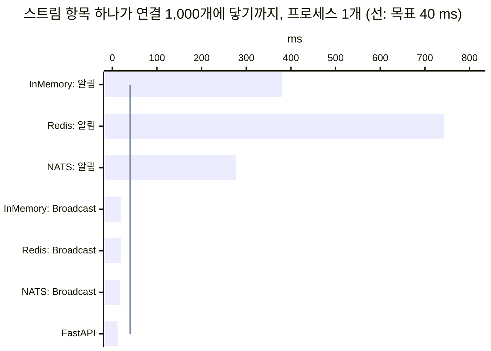

# Broadcast - 렌더 없는 브로드캐스트

> 스트림 항목·훅 이벤트·JS 명령을 발행하는 곳에서 한 번 렌더하고, 구독한 연결마다 그대로 쓴다.

---

## 개요

### 문제: 모두에게 같은 항목을 연결마다 다시 그린다

피드·채팅·알림 목록에 항목 하나가 들어오면 지금까지는 알림을 보냈다. 받은 연결마다 `notification()`이 돌고,
`stream_insert()`가 항목 템플릿을 렌더하고, 그 연산을 채널 레이어로 자기 세션에 다시 보낸다. 모두가 같은 HTML을
받는데도 연결 1,000개면 같은 `<li>`를 1,000번 렌더하고 채널 레이어를 2,000번 오간다.

### 해결: 발행하는 곳에서 한 번

```python
from wireview import Broadcast, Component


class Feed(Component):
    class Meta:
        template_name = "feed/feed.html"
        subscriptions = {"feed"}

    async def joined(self):
        await self.stream("items", await self._latest())

    async def publish(self, text: str):
        post = await Post.objects.acreate(text=text)
        await Broadcast(Feed, "feed").stream_insert("items", post, at=0, limit=50).asend()
```

`Broadcast(Feed, "feed")`가 받을 대상이다. `Feed` 클래스의 인스턴스 가운데 `get_subscriptions()`에 `"feed"`가 있는 것이
받는다. 항목은 여기서 한 번 렌더되고, 프레임도 한 번 직렬화된다. 채널 레이어는 그것을 프로세스마다 한 번 나르고, 받는
연결은 아무 코드도 돌리지 않고 그 프레임에 자기 컴포넌트 id만 끼워 쓴다. 브라우저가 받는 바이트는 각 연결이 `self.stream_insert()`를 했을 때와 같다.

알림과 함께 쓸 수 있다. 목록에는 `Broadcast`로 항목을 넣고, 머리의 "새 글 N개" 같은 필드는 알림으로 바꾼다.

---

## API

```text
Broadcast(target, topic)
    .stream_insert(name, item, *, at=-1, limit=0, template=None, dom_id=None)
    .stream_delete(name, dom_id)
    .push_event(event, payload=None, *, hook_id=None)
    .js(js)

await broadcast.asend()   바로 렌더하고 보낸다
broadcast.send()          동기 코드에서. 트랜잭션이 커밋된 뒤에 렌더하고 보낸다
```

| 연산 | 같은 일을 하는 컴포넌트 메서드 |
|---|---|
| `stream_insert` | `stream_insert()`. 기본 템플릿(`<template_name>_item.html`)과 DOM id(`"<name>-<pk>"`)를 대상 클래스에서 얻는다 |
| `stream_delete` | `stream_delete()`. 정수를 주면 `"<name>-<정수>"` |
| `push_event` | `push_event()`. `payload`는 JSON이어야 하고, 아니면 연산을 더할 때 `TypeError` |
| `js` | `push_js()` |

- 연산은 더한 순서대로, 한 메시지로 간다. 그래서 받는 페이지에서도 그 순서로 적용된다.
- `target`은 **정확히 그 클래스**다. 하위 클래스는 받지 않는다 — 항목을 다르게 그릴 수 있기 때문이다.
- `topic`이 대상 클래스의 `Meta.subscriptions`에 없으면(`get_subscriptions()`를 오버라이드하지 않았을 때) 만들 때
  `ValueError`다. 오타 하나로 모든 패치가 조용히 사라지는 일을 막는다.
- 토픽은 84자까지, 영숫자·`-`·`_`·`.`만 쓴다. 패치 그룹 `wireview.patch.<토픽>`이 채널 레이어 그룹 이름(100자 미만)이어야 하기 때문이다.

### 동기 코드에서: `send()`

신호 수신자처럼 동기인 곳에서는 `send()`를 쓴다. `broadcast()`처럼 트랜잭션이 커밋된 뒤에 보낸다. 항목 렌더도 커밋
뒤에 하므로 커밋된 행을 읽고, 롤백된 트랜잭션의 항목은 렌더하지 않는다.

```python
@receiver(post_save, sender=Post)
def post_saved(sender, instance, created, **kwargs):
    if created:
        Broadcast(Feed, "feed").stream_insert("items", instance, at=0, limit=50).send()


@receiver(post_delete, sender=Post)
def post_deleted(sender, instance, **kwargs):
    Broadcast(Feed, "feed").stream_delete("items", instance.pk).send()
```

같은 항목을 `mutation()`의 `stream_insert()`로도 넣으면 일을 두 번 한다(결과는 같다). 한쪽만 쓴다.

---

## 무엇을 보낼 수 있나

**서버가 추적하지 않는 것만 렌더 없이 바꿀 수 있다.** 서버는 컴포넌트마다 마지막 렌더를 diff 기준으로 들고 있고,
필드는 `data-state`로 서명해 둔다. 렌더 없이 그것을 바꾸면 다음 diff나 다음 join이 되돌린다.

| 보낼 수 있다 | 보낼 수 없다 |
|---|---|
| 스트림 삽입·삭제 (`wire-stream` 컨테이너는 morph에서 빠진다) | 필드 변경, 컴포넌트 렌더 — 알림과 [shared_render](./shared-render.md)로 |
| 훅 이벤트 (`push_event`) | 스트림 초기화(`stream()` reset) — 연결마다 필터가 다른 목록을 덮는다 |
| JS 명령 (`js`) — 다음 morph가 서버 HTML로 되돌리는 것은 `push_js()`와 같다 | 플래시·제목·이동 |

---

## 사람마다 다른 내용은 쓸 수 없다

항목은 한 번 렌더되어 **모든 구독자에게 같은 HTML**로 간다. 그래서 항목 템플릿의 컨텍스트에는 `item`뿐이다.
`this`·`user`·`request`·`perms`·`csrf_token`을 읽으면 발행한 곳에서 `ImproperlyConfigured`가 난다. 오류는 읽은
변수 이름을 말한다. 운영에서도 언제나 그렇다 — 빈 값으로 조용히 넘어가면 남의 정보가 나가거나 화면이 틀린 채 남는다.

```django
{# feed/feed_item.html #}
<li id="items-{{ item.pk }}">
  {{ item.text }}
     {# 됨: 핸들러는 대상 클래스에서 확인한다 #}
  …      {# 오류: user #}
</li>
```

- ``처럼 태그가 오류를 삼켜도(그 ``은 피연산자의 예외를 거짓으로 친다) 읽은 것은
  기록되어, 렌더가 끝난 뒤 같은 오류가 난다.
- ``은 쓸 수 있다. 핸들러가 있는지는 대상 클래스에서 확인한다. `myself=True`는 인스턴스의 id를 읽으므로 오류다.
- 항목은 `LANGUAGE_CODE`와 기본 시간대로 렌더된다. 발행한 요청이 켠 언어나 시간대가 모두에게 새지 않는다. 사용자마다
  시각을 달리 보여 주려면 `<time datetime="…">`로 보내고 훅에서 바꾸거나, 언어별 토픽(`feed.ko`, `feed.en`)으로 나눈다.
- **잡지 못하는 것**: 항목 객체의 property가 thread-local이나 contextvar로 "현재 사용자"를 읽는 경우(django-crum류).
  발행한 사람의 값이 모두에게 간다. 그런 값은 항목에 넣지 않는다.

사람마다 내용이 달라야 하면 토픽을 나누거나(`inbox.{user_id}`), 알림을 보내 각 컴포넌트의 `notification()`이 그리게 한다.

---

## 누가 받나: 구독이 곧 권한이다

받는 쪽 코드가 없으므로 받는 쪽에서 걸러 낼 수 없다. 누가 받는지는 구독으로만 정해진다.

- 구독은 서버의 `get_subscriptions()`가 정하고, 그 인스턴스는 [live_session](./live-session.md)의 `authorize`와
  `on_mount`를 통과한 것이다. 클라이언트가 토픽을 고를 수 없다.
- 토픽 이름에 받을 사람을 담는다(`room.{id}`). 그 방의 멤버인지는 `on_mount`나 `joined()`에서 확인한다.
- join이 실패한 컴포넌트, 떠난 컴포넌트, 예외로 버려진 컴포넌트는 받지 않는다(`repo.reachable`). 쓰기 직전에 다시 묻는다.
- 로그아웃은 소켓을 닫는다. 그 연결의 장부도 함께 사라진다.

---

## 순서와 유실

- **한 Broadcast의 연산들은 쌓은 순서대로** 적용된다. 한 프로세스가 한 토픽에 보낸 Broadcast들은 채널 레이어가
  순서를 지키는 한 같은 순서로 간다. 다른 프로세스가 보낸 것끼리는 순서가 없다. 알림과 같다.
- **join 직후.** 컴포넌트는 `joined()`를 시작하기 전부터 패치를 받고, `joined()`가 보낸 작업(스트림 reset 등)이
  나간 뒤에 그 사이에 온 패치를 쓴다. 그래서 `joined()`가 목록을 읽은 뒤 커밋된 항목도 사라지지 않는다. 둘 다에 든
  항목은 DOM id가 같아 제자리에서 바뀔 뿐이다. `get_subscriptions()`가 `joined()`에서 정하는 토픽은 첫 렌더부터 받는다 —
  그 사이의 틈은 알림의 것과 같다.
- **join 밖의 스트림 reset.** 이벤트 핸들러·`params_changed`·`notification()`·LiveComponent의 `update()`가 `stream()`으로
  목록을 다시 보낼 때도 같다. reset은 연결의 채널을 한 번 돌아 나가고 패치는 오는 대로 쓰이므로, 그대로 두면 먼저 쓰인
  패치를 reset이 지운다. 그래서 `stream()`이 시작할 때부터 그 컴포넌트의 패치를 잡아 두고 reset이 나간 뒤에 쓴다.
  한 핸들러에서 `stream()`을 여러 번 불러도 잡아 둔 패치는 마지막 reset 뒤에 나간다.
  `stream()`에 QuerySet(또는 다른 async iterable)을 그대로 넘기면 읽기가 잡은 뒤에 일어나 빈틈이 없다. **목록을 미리
  읽어 리스트로 넘기면** 읽기와 `stream()` 호출 사이에 쓰인 패치는 여전히 지워질 수 있다 — 그 틈은 템플릿을 그리는
  시간만큼이지만, 순서가 중요하면 QuerySet을 넘긴다.
- **잡아 둔 패치를 놓는 것은 reset 자신이다.** reset이 연결의 채널을 돌아 소켓에 쓰이는 순간 그 reset이 잡은 패치가
  풀린다(join은 `joined()`의 작업 뒤를 따르는 표식 메일로). 연결은 메시지를 하나씩 처리하므로, 핸들러가 길거나 그 앞에 다른
  메시지가 쌓여 있으면 reset은 늦을 뿐이다 — 그동안은 기다린다.
- **reset이 끝내 오지 않으면 연결을 닫는다.** 채널 레이어가 꽉 차 reset 메일을 버렸으면, 메일이 채널로 나간 뒤 처리할
  메시지가 없는 채로 10초(`HOLD_SECONDS`)가 지났을 때 잡아 둔 패치를 쓰지 않고 연결을 닫는다(1013, 경고 로그). 그때
  패치를 쓰면 늦게 온 reset이 지울 수 있고, reset이 없는 화면은 이미 틀렸다. 페이지가 다시 연결해 join하며 목록을 다시
  읽는다. `joined()`와 `update()`의 작업은 렌더가 나갈 때까지 큐에 있으므로 기한은 채널로 나갈 때부터 잰다.
- **최대 한 번이다.** 끊긴 동안, 채널 레이어가 버렸을 때, 롤링 배포 중 옛 프로세스의 연결은 놓친다. 다시 join하면
  `joined()`가 목록을 다시 보내 바로잡는다. DB에 없는 항목(저장하지 않는 채팅)은 재연결 뒤 사라진다. `push_event`와
  JS 명령은 다시 보내지 않는다 — 훅은 `reconnected()`에서 필요한 것을 다시 읽는다.
- **느린 연결은 자기만 늦는다.** 프로세스는 메시지를 한 번 받아 연결마다의 큐에 넣고, 각 연결이 자기 큐를 쓴다. 한 연결에서
  쓰지 못한 프레임 — 소켓이 받지 못해 큐에 쌓인 것, 또는 `joined()`의 작업을 기다리며 잡아 둔 것 — 이 1,000개를 넘으면
  버리지 않고 그 소켓을 닫는다(코드 1013). 페이지가 다시 연결해 join하면서 목록을 바로잡는다. 텔레메트리
  `broadcast_overflowed`가 알린다.
- **그 상한은 소켓 쓰기가 기다리는 서버에서만 듣는다.** uvicorn(websockets·wsproto)은 소켓이 받지 못하면 쓰기를
  기다리게 하므로 프레임이 연결의 큐에 쌓이고 1,000개에서 닫힌다. daphne는 쓰기가 기다리지 않는다 — 프레임은 큐가 아니라
  서버의 전송 버퍼에 쌓이고 이 상한에 걸리지 않는다. 일반 렌더 메시지도 같다. daphne에서 느린 연결의 메모리를 묶으려면
  프록시나 서버의 타임아웃에 맡긴다.
- **닫히는 연결에는 더 쓰지 않는다.** 로그아웃 무효화(4001)로 닫거나 소켓이 쓰기를 거절하면 그 연결의 패치는 거기서
  끝난다.
- **발행한 연결도 받는다.** 발행한 컴포넌트가 그 토픽을 구독하면 자기 패치도 온다. 핸들러에서 직접 넣고 Broadcast도
  보내면 같은 항목이 두 번 온다(결과는 같다).

---

## 테스트

`wireview.testing`의 `mount()`한 컴포넌트는 같은 프로세스에서 발행한 Broadcast를 연결처럼 받는다. 받은 프레임은
`stream_ops()`·`stream_html()`·`sent_messages`에 컴포넌트 자신의 연산처럼 남는다.

```python
from wireview import Broadcast, mount


async def test_a_new_post_reaches_the_feed():
    view = await mount(Feed, id="feed")
    view.clear_messages()

    await Broadcast(Feed, "feed").stream_insert("items", post, at=0).asend()

    assert "첫 글" in view.stream_html("items")
```

항목 템플릿이 보는 사람을 읽으면 이 테스트에서도 같은 오류가 난다. 컴포넌트의 `stream()` reset이 목록을 읽는 동안 온
Broadcast는 연결에서처럼 reset 뒤에 남는다. 연결처럼 `call()`(과 `mount()`의 `joined()`)이 끝난 뒤에 나가므로, 한
핸들러에서 reset을 여러 번 해도 테스트가 보는 순서가 브라우저의 순서다.

---

## 성능

항목 `<li>` 하나를 연결 1,000개에 넣는 시간이다. uvicorn 1프로세스, 3회차의 중앙값(괄호는 회차 범위)이고,
알림을 받아 연결마다 `stream_insert()`하는 지금까지의 쓰임과 FastAPI(항목 HTML을 JSON 한 번에 담아 연결마다 같은 텍스트를
쓴다)를 같은 회차에 쟀다. Redis·NATS는 [배포 가이드](../DEPLOYMENT.md)의 `capacity` 1,500이다.

| | InMemory | Redis | NATS | 연결당 CPU (InMemory, Redis, NATS) |
|---|---:|---:|---:|---:|
| wireview, 알림 | 379.4 ms (368.4~384.9) | 742.6 ms (710.9~763.6) | 276.3 ms (273.8~278.4) | 373.7 µs / 644.0 µs / 269.0 µs |
| wireview, Broadcast | 18.8 ms (18.0~19.7) | 19.7 ms (18.4~20.5) | 18.0 ms (17.9~18.8) | 18.5 µs / 19.0 µs / 17.4 µs |
| FastAPI (레이어 없음) | 12.0 ms (11.4~12.2) | 12.0 ms (11.4~12.2) | 12.0 ms (11.4~12.2) | 11.5 µs |



Broadcast의 연결당 일은 프레임에 id를 끼워 쓰고 압축하는 것뿐이라 레이어에 따라 거의 달라지지 않는다. 채널 레이어는
Broadcast 하나를 프로세스마다 한 번 나른다. 측정 방법과 단계별 결과는 [설계](../design/broadcast-patch.md) §11, 원본은
`bench/results/3ab5818-stream-fanout.json`이다.

---

## 참고

- 설계와 다른 프레임워크와의 비교: [broadcast-patch](../design/broadcast-patch.md)
- 메시지 형태: [wire-protocol](../implementation/wire-protocol.md) §5의 `wireview.patch`
- 텔레메트리: [telemetry](./telemetry.md) — `broadcast_published`(`kind="patch"`), `broadcast_overflowed`
- 스트림 자체: [Streams 튜토리얼](../tutorials/06-streams-api.md)
